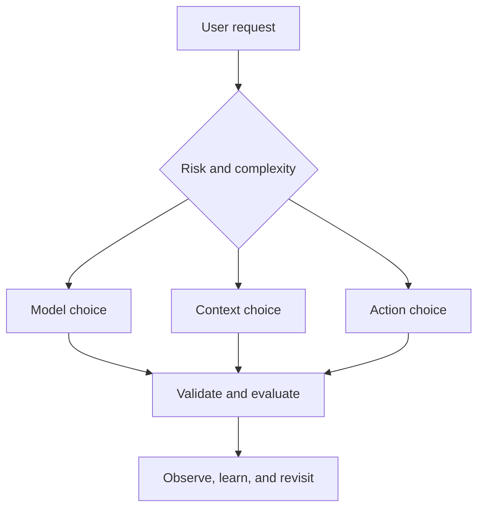

# 40 AI and LLM Production Trade-Offs

> Production AI architecture is rarely about finding the universally “best” option. It is about choosing the failure mode, cost, latency, and operational burden your product can safely carry.

This guide covers recurring decisions for LLM applications, RAG systems, AI agents, evaluation, safety, and operations. It intentionally avoids specialized model-training clusters, GPU hardware selection, and Kubernetes infrastructure.

## How to Use This Guide

For each trade-off:

1. Identify the option your design currently assumes.
2. Check whether its disadvantages are acceptable for your users and risk level.
3. Apply the decision rule as a starting point—not as an absolute law.
4. Record what would cause the team to revisit the choice.

## Trade-Off Map

| Area | Trade-offs | Main production concern |
|---|---:|---|
| Model and response design | 1-8 | Quality, latency, predictability, and portability |
| RAG and context | 9-16 | Relevance, freshness, authorization, and explainability |
| Agents and actions | 17-24 | Autonomy, permissions, state, and blast radius |
| Reliability and safety | 25-32 | Failure containment, recovery, and user trust |
| Evaluation and operations | 33-40 | Regression control, observability, rollout, and cost |



---

## 1. Model and Response Design

### TRADE-OFF 01 / 40

#### One Powerful Model vs Model Routing: Simplicity or Unit Economics?

A single capable model reduces architectural choices, while routing sends each request to a model appropriate for its difficulty and risk.

**One powerful model:**

- **Pros:** Consistent behaviour, simpler prompts and monitoring, fewer routing mistakes.
- **Cons:** High cost and latency for simple extraction, classification, or rewriting tasks.

**Model router or cascade:**

- **Pros:** Lower average cost and latency; specialized models can outperform on narrow tasks.
- **Cons:** Adds router evaluation, fallback logic, version combinations, and misrouting risk.

**Decision rule:** Start with one model while learning the workload. Add routing only when request volume, task diversity, or latency data shows a meaningful benefit. High-risk tasks should route by required assurance—not price alone.

### TRADE-OFF 02 / 40

#### Prompt Instructions vs Deterministic Rules: Flexibility or Enforcement?

Prompts can express nuanced intent, but critical business and security rules require predictable enforcement.

**Prompt-based rules:**

- **Pros:** Fast to change, easy to express, and useful for tone, reasoning guidance, and soft preferences.
- **Cons:** Probabilistic, vulnerable to conflicting context, and difficult to guarantee under adversarial inputs.

**Deterministic code or policy:**

- **Pros:** Testable, auditable, and reliable for permissions, limits, schemas, and state transitions.
- **Cons:** Requires engineering effort and cannot interpret every ambiguous situation gracefully.

**Decision rule:** Put preferences in prompts. Put permissions, financial rules, privacy controls, irreversible effects, and business invariants in deterministic code or a policy engine.

### TRADE-OFF 03 / 40

#### Structured Output vs Free-Form Response: Machine Safety or Expressiveness?

The best output format depends on whether another system or a human consumes the response.

**Structured output:**

- **Pros:** Machine-checkable, easier to test, safer for APIs, and less dependent on fragile parsing.
- **Cons:** Constrains explanation, requires schema evolution, and may trigger validation failures.

**Free-form response:**

- **Pros:** Natural for users, flexible across unexpected questions, and better for nuanced explanation.
- **Cons:** Hard to parse reliably and unsafe as direct input to tools, SQL, shells, or business workflows.

**Decision rule:** Use typed structured output for machine decisions and tool parameters. Use prose for user-facing explanation. When both are needed, return a validated data object plus a separately rendered explanation.

### TRADE-OFF 04 / 40

#### Long Context vs Selective Context: Completeness or Signal Quality?

Large context windows make it possible to send more material, but more material does not guarantee more useful attention.

**Long-context loading:**

- **Pros:** Preserves broad relationships and reduces the chance of omitting an unexpected dependency.
- **Cons:** Higher cost and latency; stale or irrelevant content can dilute important instructions and evidence.

**Selective context:**

- **Pros:** Faster, cheaper, easier to trace, and usually more focused on the current decision.
- **Cons:** Selection errors can remove a critical dependency, exception, or contradictory source.

**Decision rule:** Select the smallest sufficient context, but preserve connected evidence around contracts and side effects. Measure answer quality against context size instead of assuming the largest window is safest.

### TRADE-OFF 05 / 40

#### Streaming Responses vs Complete Responses: Responsiveness or Final Validation?

Token streaming improves perceived speed, while complete generation allows the entire answer to be checked before users see it.

**Streaming:**

- **Pros:** Faster time to first token, better experience for long answers, and visible progress.
- **Cons:** Unsafe content or incorrect claims may appear before validation; interrupted streams need recovery UX.

**Complete response:**

- **Pros:** Enables whole-response schema, safety, citation, and consistency checks before delivery.
- **Cons:** Users wait through the full generation time and may assume the application is stuck.

**Decision rule:** Stream low-risk conversational content. Buffer structured, regulated, high-impact, or externally published output until validation completes. A hybrid can stream status while withholding the final result.

### TRADE-OFF 06 / 40

#### Response Caching vs Fresh Generation: Efficiency or Freshness?

Caching can remove repeated model calls, but reused output may no longer match current data, permissions, or policy.

**Cached response:**

- **Pros:** Very low latency, predictable output, reduced model spend, and protection during provider degradation.
- **Cons:** Stale answers, permission leakage if keys are wrong, and difficult invalidation when prompts or sources change.

**Fresh generation:**

- **Pros:** Uses current context, policy, and user state; supports personalized responses.
- **Cons:** Higher cost, latency, and output variability.

**Decision rule:** Cache deterministic or low-volatility results using keys that include tenant, permission scope, model, prompt, and source versions. Do not cache sensitive personalized output without explicit isolation and expiry.

### TRADE-OFF 07 / 40

#### Pinned Model Version vs Moving Alias: Reproducibility or Automatic Improvement?

Provider aliases may receive upgrades automatically, while pinned snapshots keep behaviour stable until the team chooses to migrate.

**Pinned version:**

- **Pros:** Reproducible incidents, controlled evaluation, predictable rollback, and clearer audit records.
- **Cons:** Misses improvements and may require urgent migration when a version is retired.

**Moving alias:**

- **Pros:** Receives provider improvements with less release work and may simplify experimentation.
- **Cons:** Behaviour can change without an application deployment, creating silent regressions.

**Decision rule:** Pin production-critical workflows. Evaluate newer versions against a representative suite, then promote deliberately. Moving aliases are better suited to low-risk experimentation than contractual behaviour.

### TRADE-OFF 08 / 40

#### Single Model Provider vs Multi-Provider Support: Focus or Resilience?

Supporting one provider accelerates development, while portability can reduce outage and commercial concentration risk.

**Single provider:**

- **Pros:** Simpler prompts, tooling, observability, support, and optimization around provider-specific capabilities.
- **Cons:** Greater exposure to outages, rate limits, policy changes, price changes, and model retirement.

**Multiple providers:**

- **Pros:** Operational fallback, regional choice, workload optimization, and stronger negotiating position.
- **Cons:** Lowest-common-denominator interfaces, duplicated evaluation, inconsistent safety behaviour, and more integration work.

**Decision rule:** Begin with one provider unless continuity requirements demand otherwise. Add a second provider for a tested workload and failure scenario—not as an unverified checkbox.

---

## 2. RAG and Context

### TRADE-OFF 09 / 40

#### Dense Retrieval vs Hybrid Retrieval: Semantic Meaning or Exact Match?

Semantic embeddings capture conceptual similarity, while lexical search protects exact identifiers and specialized terminology.

**Dense retrieval:**

- **Pros:** Strong synonym, paraphrase, multilingual, and conceptual matching.
- **Cons:** Can miss codes, names, numbers, exact phrases, and rare domain vocabulary.

**Hybrid dense and lexical retrieval:**

- **Pros:** Combines semantic meaning with exact keyword coverage; often more robust for enterprise data.
- **Cons:** Requires two retrieval paths, score fusion, more tuning, and additional index storage.

**Decision rule:** Use dense retrieval for concept-heavy natural language collections. Use hybrid retrieval when queries contain product codes, filenames, legal clauses, error messages, technical symbols, or domain-specific names.

### TRADE-OFF 10 / 40

#### Fixed-Size Chunking vs Structure-Aware Chunking: Simplicity or Meaning?

Chunk boundaries determine whether retrieved text remains understandable outside its original document.

**Fixed-size chunking:**

- **Pros:** Easy to implement, consistent token sizes, predictable indexing throughput.
- **Cons:** Separates headings from content, conditions from exceptions, and code symbols from implementations.

**Structure-aware chunking:**

- **Pros:** Preserves sections, tables, functions, conversations, and parent-child relationships.
- **Cons:** Needs format-specific parsers and creates variable chunk sizes that require more tuning.

**Decision rule:** Use fixed chunks only for uniform, unstructured text or a quick baseline. Use structure-aware chunking for code, policies, contracts, tickets, tables, and documents whose hierarchy changes meaning.

### TRADE-OFF 11 / 40

#### Small Chunks vs Large Chunks: Retrieval Precision or Context Completeness?

Small chunks target precise facts, while larger chunks preserve the surrounding explanation and qualifications.

**Small chunks:**

- **Pros:** Precise matches, less irrelevant context, lower token usage per result.
- **Cons:** Lose definitions, exceptions, provenance, and relationships across nearby passages.

**Large chunks:**

- **Pros:** Better local coherence and fewer missing dependencies within a retrieved unit.
- **Cons:** Lower retrieval precision, more repeated text, and faster context-window consumption.

**Decision rule:** Retrieve small semantic units and expand to their parent section when needed. Tune using evidence coverage and final answer quality, not chunk size alone.

### TRADE-OFF 12 / 40

#### Direct Top-K Retrieval vs Retrieve and Rerank: Speed or Relevance?

Nearest-neighbour results are inexpensive, while a reranker can judge candidate relevance more carefully.

**Direct top-k:**

- **Pros:** Low latency, simple infrastructure, and predictable cost.
- **Cons:** Similarity score may not reflect the actual question, evidence coverage, or source authority.

**Retrieve and rerank:**

- **Pros:** Better ordering, stronger handling of nuanced questions, and the ability to include business relevance signals.
- **Cons:** Extra model or service call, more latency, and another component to evaluate.

**Decision rule:** Start with direct retrieval and measure it. Add reranking when relevant evidence is frequently retrieved but appears below weak candidates, or when top positions materially affect answer quality.

### TRADE-OFF 13 / 40

#### Authorization Before Retrieval vs Filtering After Retrieval: Security or Convenience?

Access control placement determines whether restricted evidence can enter model context, caches, or traces.

**Authorization before retrieval:**

- **Pros:** Prevents unauthorized candidates from entering the AI pipeline and supports tenant isolation.
- **Cons:** Requires identity-aware indexes, metadata filters, and consistent policy propagation.

**Filtering after retrieval:**

- **Pros:** Simpler shared index and easier global search implementation.
- **Cons:** Restricted content may already be exposed to the model, reranker, cache, or telemetry before filtering.

**Decision rule:** Enforce authorization during candidate selection. Post-retrieval filtering may add defence in depth, but it must never be the primary confidentiality boundary.

### TRADE-OFF 14 / 40

#### Original Passages vs Generated Summaries: Fidelity or Compression?

RAG systems can retrieve source text directly or use pre-generated summaries to reduce tokens and unify scattered information.

**Original passages:**

- **Pros:** Strong provenance, exact wording, easier verification, and lower risk of inherited summarization errors.
- **Cons:** Verbose, repetitive, and sometimes difficult for the model to combine across documents.

**Generated summaries:**

- **Pros:** Compact, normalized, faster to consume, and useful for navigation or broad questions.
- **Cons:** Can omit qualifications, introduce errors, and become stale independently of the source.

**Decision rule:** Use summaries to locate and prioritize evidence. Use original, versioned passages to support important claims and citations.

### TRADE-OFF 15 / 40

#### Synchronous Indexing vs Asynchronous Indexing: Immediate Freshness or Ingestion Resilience?

Updates can block until the retrieval index is ready, or enter a queue and become searchable later.

**Synchronous indexing:**

- **Pros:** Clear read-after-write behaviour and immediate availability after successful updates.
- **Cons:** Slower user operations and tighter coupling to embedding and index availability.

**Asynchronous indexing:**

- **Pros:** Absorbs bursts, isolates ingestion failures, and supports retries and batch efficiency.
- **Cons:** Creates a freshness gap and requires visible status, reconciliation, and deletion guarantees.

**Decision rule:** Use asynchronous indexing for most large or external sources, with explicit freshness targets. Use synchronous indexing when immediate searchability is part of the user contract and the workload is bounded.

### TRADE-OFF 16 / 40

#### Single-Pass Retrieval vs Iterative Retrieval: Predictability or Exploration?

Some questions need one evidence lookup; others require the model to refine queries after discovering new entities or gaps.

**Single-pass retrieval:**

- **Pros:** Predictable latency and cost, easier debugging, and lower risk of retrieval loops.
- **Cons:** Struggles with multi-hop questions and queries that use ambiguous or incomplete terminology.

**Iterative retrieval:**

- **Pros:** Can decompose complex questions, follow references, and fill evidence gaps dynamically.
- **Cons:** Higher latency and cost; early mistakes can send later searches in the wrong direction.

**Decision rule:** Use single-pass retrieval for lookup and common Q&A. Allow bounded iterative retrieval for investigation and multi-hop reasoning, with query, turn, and evidence limits.

---

## 3. Agents and Actions

### TRADE-OFF 17 / 40

#### Deterministic Workflow vs Autonomous Agent: Control or Adaptability?

Known processes can be encoded as states and branches, while agents choose steps dynamically from goals and observations.

**Deterministic workflow:**

- **Pros:** Predictable, testable, auditable, and easier to make idempotent.
- **Cons:** Brittle when inputs vary widely or the correct sequence cannot be known in advance.

**Autonomous agent:**

- **Pros:** Adapts to unfamiliar situations, selects tools dynamically, and handles open-ended investigation.
- **Cons:** Variable cost and behaviour, harder testing, loops, and a larger security surface.

**Decision rule:** Use a workflow when the valid states and transitions are known. Use an agent only for decisions that genuinely require runtime interpretation or exploration.

### TRADE-OFF 18 / 40

#### Single Agent vs Specialized Agents: Shared Context or Separation of Concerns?

One agent can own the entire task, or several agents can handle architecture, implementation, testing, and review separately.

**Single agent:**

- **Pros:** No handoff loss, simpler orchestration, and one coherent task history.
- **Cons:** Large instructions and toolsets, weaker specialization, and unclear responsibility boundaries.

**Specialized agents:**

- **Pros:** Focused context, narrower permissions, independent evaluation, and clearer ownership.
- **Cons:** Handoff errors, duplicated work, coordination overhead, and increased total model calls.

**Decision rule:** Keep one agent for tightly coupled tasks. Split only when responsibilities, permissions, context, or evaluation criteria differ enough to justify an explicit handoff contract.

### TRADE-OFF 19 / 40

#### Narrow Typed Tools vs General-Purpose Tools: Safety or Flexibility?

An agent can receive focused business functions or broad capabilities such as shell, browser, SQL, and generic HTTP access.

**Narrow typed tools:**

- **Pros:** Smaller blast radius, clear schemas, easier authorization, and reliable validation.
- **Cons:** More functions to design and maintain; novel tasks may require new tooling.

**General-purpose tools:**

- **Pros:** Flexible, fast for exploration, and capable of solving unanticipated tasks.
- **Cons:** Broad permissions, harder validation, prompt-injection exposure, and unpredictable effects.

**Decision rule:** Use narrow tools for production business operations. Reserve general-purpose tools for isolated engineering environments with strict filesystem, network, credential, and approval boundaries.

### TRADE-OFF 20 / 40

#### Immediate Execution vs Plan and Preview: Speed or Reviewability?

Agents can execute each selected action immediately or first produce a plan, diff, or transaction preview.

**Immediate execution:**

- **Pros:** Fewer model turns, lower latency, and smoother automation for routine reversible tasks.
- **Cons:** Mistakes become effects before users or policies can inspect the complete intention.

**Plan and preview:**

- **Pros:** Enables validation, cost estimation, approval, comparison, and cancellation before mutation.
- **Cons:** Adds steps and can become stale if underlying state changes before execution.

**Decision rule:** Execute low-risk, idempotent operations directly. Require a bound preview for consequential actions, and revalidate state before applying an approved plan.

### TRADE-OFF 21 / 40

#### Automatic Action vs Human Approval: Throughput or Accountability?

Human review can reduce impact risk, but unnecessary approvals make automation slow and eventually become rubber stamps.

**Automatic action:**

- **Pros:** Fast, scalable, always available, and suitable for frequent low-risk operations.
- **Cons:** Model or tool errors can propagate without intervention.

**Human approval:**

- **Pros:** Adds accountability and contextual judgment for financial, external, privileged, or irreversible effects.
- **Cons:** Queue delays, reviewer fatigue, inconsistent judgment, and limited after-hours availability.

**Decision rule:** Gate actions by impact, reversibility, confidence, and policy—not by whether AI was involved. Approval must occur immediately before the exact effect and expire if inputs change.

### TRADE-OFF 22 / 40

#### Stateless Agent vs Persistent Memory: Isolation or Continuity?

Memory can preserve preferences and past work, but it also creates privacy, staleness, and cross-task contamination risks.

**Stateless agent:**

- **Pros:** Clean task boundaries, simpler privacy controls, reproducibility, and fewer stale assumptions.
- **Cons:** Repeated onboarding and lost continuity across sessions.

**Persistent memory:**

- **Pros:** Personalized assistance, reduced repetition, and continuity for long-running work.
- **Cons:** Incorrect memories persist; ownership, consent, expiry, deletion, and tenant isolation become operational requirements.

**Decision rule:** Keep working memory task-scoped by default. Persist only information with a defined owner, purpose, reader set, source, expiry rule, and deletion path.

### TRADE-OFF 23 / 40

#### Sequential Tool Calls vs Parallel Tool Calls: Dependency Safety or Speed?

Independent operations can run concurrently, while dependent or side-effecting actions usually require an ordered sequence.

**Sequential execution:**

- **Pros:** Clear causality, simpler recovery, and safe handling of shared state and dependencies.
- **Cons:** Higher end-to-end latency when operations are independent.

**Parallel execution:**

- **Pros:** Faster research, retrieval, validation, and read-only analysis across independent sources.
- **Cons:** Race conditions, conflicting writes, resource bursts, and more complex partial-failure handling.

**Decision rule:** Parallelize independent, read-only, bounded operations. Serialize writes to the same resource and any step whose input depends on another step's result.

### TRADE-OFF 24 / 40

#### Fixed Termination Limits vs Model-Decided Completion: Bounded Cost or Flexible Effort?

Open-ended agents may continue until satisfied, while hard budgets force a stop even when useful progress remains possible.

**Fixed limits:**

- **Pros:** Predictable maximum turns, tokens, time, tool calls, and cost; prevents runaway loops.
- **Cons:** May stop just before completing a difficult but valid task.

**Model-decided completion:**

- **Pros:** Adapts effort to task complexity and can pursue unexpected evidence paths.
- **Cons:** Unbounded consumption, repeated actions, and weak guarantees about completion time.

**Decision rule:** Always impose hard outer budgets. Let the model finish earlier, and allow explicit, observable budget extensions only when progress and expected value justify them.

---

## 4. Reliability and Safety

### TRADE-OFF 25 / 40

#### Retry the Same Call vs Change the Recovery Strategy: Simplicity or Adaptation?

Retries help transient failures but waste resources when the underlying problem is deterministic or contextual.

**Same-call retry:**

- **Pros:** Simple and effective for rate limits, network errors, and temporary provider failures.
- **Cons:** Repeats cost, latency, malformed requests, missing evidence, or unsafe side effects.

**Adaptive recovery:**

- **Pros:** Can repair schemas, reduce context, use a fallback, request evidence, or escalate appropriately.
- **Cons:** More branches to design, evaluate, and observe.

**Decision rule:** Classify the failure before retrying. Retry transient errors with backoff and jitter; repair validation errors deliberately; abstain or escalate when the required evidence or permission is missing.

### TRADE-OFF 26 / 40

#### Fail Open vs Fail Closed: Availability or Protection?

When an AI control, moderation check, or dependency is unavailable, the product must decide whether to continue.

**Fail open:**

- **Pros:** Preserves availability and user progress during control-plane failures.
- **Cons:** Allows unverified content or actions through when safeguards are weakest.

**Fail closed:**

- **Pros:** Protects sensitive data, privileged actions, and regulated workflows.
- **Cons:** Blocks legitimate users and can turn a safety dependency into a complete outage.

**Decision rule:** Fail closed for authorization, privacy, payments, irreversible actions, and high-impact publication. Degrade safely for low-risk assistance—for example, disable actions while preserving read-only functionality.

### TRADE-OFF 27 / 40

#### Strict Timeout vs Wait for Better Output: Responsiveness or Completion?

Long model and tool calls may improve complex results, but they also consume capacity and degrade user experience.

**Strict timeout:**

- **Pros:** Predictable latency, resource protection, and quicker recovery from stuck dependencies.
- **Cons:** Cancels useful work and may bias the system toward shallow answers.

**Longer wait:**

- **Pros:** Supports difficult reasoning, large documents, and slow external tools.
- **Cons:** Poor interactive UX, larger concurrency footprint, and uncertain completion.

**Decision rule:** Set deadlines by product interaction. Use short budgets for synchronous UX and move long tasks to cancellable background jobs with progress, checkpoints, and a clear completion notification.

### TRADE-OFF 28 / 40

#### Simple Writes vs Idempotent Operations: Fast Implementation or Duplicate Safety?

Model calls, network failures, and resumed agent runs make duplicate tool delivery normal rather than exceptional.

**Simple side effect:**

- **Pros:** Less state and easier initial implementation.
- **Cons:** Retries can duplicate charges, messages, tickets, deployments, or records.

**Idempotent operation:**

- **Pros:** Safe retries, reliable recovery, and easier reconciliation after ambiguous timeouts.
- **Cons:** Requires operation keys, state tracking, deduplication windows, and business-specific semantics.

**Decision rule:** Require idempotency for externally visible or financially meaningful writes. If the target cannot guarantee it, build deduplication and reconciliation around the operation.

### TRADE-OFF 29 / 40

#### Synchronous Validation vs Asynchronous Audit: Immediate Blocking or Low Latency?

Controls can run before an answer or action is released, or review activity later without delaying the user.

**Synchronous validation:**

- **Pros:** Prevents invalid or unsafe outcomes before exposure and gives immediate feedback.
- **Cons:** Adds latency, cost, and a new availability dependency to every request.

**Asynchronous audit:**

- **Pros:** Minimal user-facing latency, richer analysis, and economical sampling of low-risk traffic.
- **Cons:** Detects problems after exposure and requires remediation workflows.

**Decision rule:** Validate critical schemas, permissions, and high-risk content synchronously. Audit quality trends and low-risk policy adherence asynchronously, with clear incident and correction paths.

### TRADE-OFF 30 / 40

#### Full Capability or Graceful Degradation: Product Completeness or Availability?

AI features often depend on model providers, retrieval stores, tools, and policy services that fail independently.

**Full capability only:**

- **Pros:** Consistent experience and fewer degraded-mode branches to maintain.
- **Cons:** One dependency can make the entire feature unavailable.

**Graceful degradation:**

- **Pros:** Preserves partial value through cached, read-only, smaller-model, or non-AI fallbacks.
- **Cons:** More states to test and a risk that users misunderstand reduced quality or freshness.

**Decision rule:** Define the minimum safe useful mode for each dependency failure. Label degraded output clearly and never degrade by silently removing a security or authorization control.

### TRADE-OFF 31 / 40

#### Reject Invalid Output vs Attempt Schema Repair: Purity or Completion Rate?

Structured generation occasionally violates syntax or domain constraints even when the model understands the task.

**Reject immediately:**

- **Pros:** Simple, predictable, and prevents ambiguous data from reaching downstream systems.
- **Cons:** Poor completion rate for minor, safely repairable formatting defects.

**Repair loop:**

- **Pros:** Recovers missing fields, formatting errors, and small contract mismatches without user intervention.
- **Cons:** Adds latency and cost; repeated repair can conceal bad schemas or prompt regressions.

**Decision rule:** Repair syntax and low-risk formatting within a strict attempt limit. Never invent missing business data, permissions, identifiers, or evidence during repair.

### TRADE-OFF 32 / 40

#### Deterministic Safety Filters vs Semantic Guardrails: Speed or Contextual Judgment?

Safety controls range from exact allowlists and pattern checks to model-based interpretation of intent and output.

**Deterministic filters:**

- **Pros:** Fast, cheap, explainable, and reliable for known prohibited values and formats.
- **Cons:** Brittle against paraphrase, obfuscation, and context-dependent meaning.

**Semantic guardrails:**

- **Pros:** Detect nuanced intent, contextual policy violations, and previously unseen phrasing.
- **Cons:** Additional latency and cost, probabilistic false positives and negatives, and another model to evaluate.

**Decision rule:** Layer both. Use deterministic controls for hard boundaries and known patterns; add semantic review where meaning matters. Do not let the same model both request and authorize a consequential action.

---

## 5. Evaluation and Operations

### TRADE-OFF 33 / 40

#### Curated Evaluation Set vs Production Sampling: Repeatability or Realism?

Static test cases support comparison, while production samples expose unexpected language, workflows, and user behaviour.

**Curated evaluation set:**

- **Pros:** Repeatable, version-controlled, fast to run, and suitable for release gates.
- **Cons:** Becomes stale and may overrepresent known failures or easy-to-label cases.

**Production sampling:**

- **Pros:** Reflects current users, changing data, long-tail requests, and real operational conditions.
- **Cons:** Privacy concerns, noisy labels, selection bias, and slower review.

**Decision rule:** Use a stable curated set for regression control and a privacy-safe production sample for discovery. Promote important production failures into the curated suite.

### TRADE-OFF 34 / 40

#### Deterministic Grader vs LLM Judge: Precision or Semantic Coverage?

Evaluation can compare exact outputs and executable outcomes or ask another model to assess nuanced quality.

**Deterministic grader:**

- **Pros:** Fast, reproducible, inexpensive, and ideal for schemas, tests, citations, and known facts.
- **Cons:** Cannot easily judge usefulness, completeness, tone, or valid alternative answers.

**LLM judge:**

- **Pros:** Handles open-ended quality, explanations, comparisons, and multiple acceptable outputs.
- **Cons:** Judge bias, nondeterminism, position effects, cost, and possible agreement with confident errors.

**Decision rule:** Use deterministic checks wherever an objective outcome exists. Use calibrated LLM judges for semantic dimensions, with clear rubrics, blinded ordering, and periodic human agreement checks.

### TRADE-OFF 35 / 40

#### Offline Evaluation vs Online Experiment: Safety or Behavioural Truth?

Offline tests estimate quality before release, while online experiments reveal how users actually interact with the system.

**Offline evaluation:**

- **Pros:** Safe, fast, reproducible, and able to test adversarial or rare cases before exposure.
- **Cons:** Cannot fully predict user adaptation, real latency, abandonment, or business impact.

**Online experiment:**

- **Pros:** Measures actual user behaviour, task success, retention, and production performance.
- **Cons:** Exposes users to regressions and needs guardrails, sample sizing, and rollback.

**Decision rule:** Require offline gates first. Use limited online experiments for changes whose value depends on human behaviour, with exposure caps, health metrics, and automatic rollback conditions.

### TRADE-OFF 36 / 40

#### Aggregate Metrics vs Per-Run Tracing: System Health or Incident Explanation?

Metrics reveal trends across traffic, while traces reconstruct one request across models, retrieval, tools, and policies.

**Aggregate metrics:**

- **Pros:** Efficient dashboards and alerts for latency, errors, tokens, cost, and throughput.
- **Cons:** Hide the sequence and context behind an individual failure.

**Per-run tracing:**

- **Pros:** Explains model calls, evidence, tool arguments, handoffs, retries, guardrails, and outcomes.
- **Cons:** Higher storage and privacy burden; content-heavy traces can be expensive and sensitive.

**Decision rule:** Use metrics to detect and prioritize problems, then traces to diagnose them. Correlate both with a run ID and apply content minimization, access control, and retention limits.

### TRADE-OFF 37 / 40

#### Raw Content Logs vs Redacted Operational Metadata: Debuggability or Privacy?

Prompts and responses make debugging easier, but they can contain source code, secrets, personal data, and confidential business information.

**Raw content logging:**

- **Pros:** Rich incident reconstruction, prompt analysis, and evaluation-data discovery.
- **Cons:** Creates a high-risk secondary data store with broad access and difficult deletion obligations.

**Redacted metadata:**

- **Pros:** Lower privacy and security exposure; supports operational metrics and correlation.
- **Cons:** May remove the exact evidence needed to diagnose a quality failure.

**Decision rule:** Log metadata by default. Enable narrowly scoped, access-controlled, time-limited content capture for approved debugging, and redact before persistence rather than relying only on restricted access afterward.

### TRADE-OFF 38 / 40

#### Maximum Answer Quality vs Explicit Latency and Cost Budget: Capability or Sustainability?

Additional context, reasoning, retrieval, validation, and model calls may improve answers but produce diminishing returns.

**Maximize quality:**

- **Pros:** Better performance on difficult tasks and fewer compromises for high-value decisions.
- **Cons:** High and unpredictable cost, slower UX, and reduced throughput.

**Optimize to a budget:**

- **Pros:** Predictable unit economics, capacity, and user experience.
- **Cons:** Some complex requests receive less reasoning or evidence than they could use.

**Decision rule:** Define quality, latency, and cost targets together for each task class. Spend more only when expected error cost or user value justifies it, and expose an explicit deeper-analysis mode when appropriate.

### TRADE-OFF 39 / 40

#### Big-Bang Release vs Gradual Rollout: Speed or Containment?

AI behaviour changes can come from models, prompts, retrieval, tools, policies, or orchestration—even when application code barely changes.

**Big-bang release:**

- **Pros:** Simple operations, fast adoption, and immediate removal of old behaviour.
- **Cons:** Large blast radius and weak comparison when regressions appear.

**Gradual rollout:**

- **Pros:** Limits exposure, enables side-by-side metrics, and supports early rollback.
- **Cons:** Requires version routing, cohort tracking, compatibility, and temporary dual operation.

**Decision rule:** Gradually roll out any change affecting model behaviour or consequential actions. Expand only when quality, safety, latency, and cost remain within predefined thresholds.

### TRADE-OFF 40 / 40

#### Forced Automation vs Human Escalation: Completion Rate or Honest Uncertainty?

An AI system can always produce a best-effort result, or admit that evidence, authorization, confidence, or capability is insufficient.

**Forced automation:**

- **Pros:** High apparent completion rate, immediate responses, and fewer support handoffs.
- **Cons:** Confident errors, invented details, unsafe actions, and hidden operational debt.

**Human escalation or abstention:**

- **Pros:** Contains uncertainty, protects high-impact decisions, and creates feedback for improving the system.
- **Cons:** Slower resolution, staffing requirements, and an incomplete automated experience.

**Decision rule:** Design abstention as a valid successful state. Escalate when required evidence, permission, policy certainty, or safe recovery is missing; provide the human with the trace and evidence already collected.

---

## Production Decision Record

For any important trade-off, record:

```markdown
### Decision: <trade-off and chosen option>

- Context:
- Selected option:
- Why this option fits now:
- Disadvantages accepted:
- Controls added:
- Metrics and evaluation:
- Revisit trigger:
- Owner:
```

## Final Review

- [ ] Have we named the downside of the selected option?
- [ ] Does the choice match the risk and reversibility of the task?
- [ ] Are permissions and data access enforced outside the model?
- [ ] Can retries occur without duplicating consequential effects?
- [ ] Are latency and cost bounded per request or run?
- [ ] Can the system abstain, degrade, or escalate safely?
- [ ] Can we reproduce the model, prompt, retrieval, tools, and policy versions?
- [ ] Do offline evaluations cover normal, edge, adversarial, and degraded cases?
- [ ] Can one run be traced without exposing unnecessary sensitive content?
- [ ] Is there a measured rollout, rollback, and ownership plan?

## Selected References

- [OpenAI Agents SDK](https://github.com/openai/openai-agents-python): tools, handoffs, guardrails, sessions, human approval, and tracing.
- [OpenAI Evals](https://github.com/openai/evals): repeatable evaluation and regression testing for model and application behaviour.
- [OWASP GenAI LLM Top 10](https://github.com/GenAI-Security-Project/GenAI-LLM-Top10): prompt injection, excessive agency, unsafe output handling, data exposure, and resource risks.
- [Model Context Protocol - Tools](https://github.com/modelcontextprotocol/modelcontextprotocol/blob/main/docs/specification/2025-11-25/server/tools.mdx): typed tool schemas, validation, confirmation, errors, timeouts, and audit considerations.
- [OpenTelemetry Specification](https://github.com/open-telemetry/opentelemetry-specification): correlated traces, metrics, logs, and resource context.
- [Google Site Reliability Engineering](https://sre.google/books/): availability, incident response, gradual change, monitoring, and operational risk.

---

**UnvibeCode rule:** Choose trade-offs explicitly. Bound the downside. Measure the result. Revisit when the workload changes.
