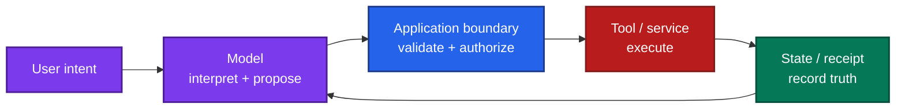

# Start Here: From Code-First to Responsibility-First AI System Design

Most developers begin the same way:

> **“What code should I write?”**

That is the natural place to start. You learn a framework, an API, a database, a model SDK, and enough syntax to make something work.

There is nothing wrong with that phase. Every developer needs it.

The problem begins when **code remains the primary way you think about problems** even after the systems become larger.

Khalil Stemmler describes this progression as moving from **Code-First** toward **Pattern-First**, **Responsibility-First**, and eventually **Value-First** engineering. His central observation is that implementation skill alone becomes less valuable as tools—including AI—make code generation easier. The harder skill is learning how to decompose a system and decide what should own each responsibility.

Reference: [The Code-First Developer](https://khalilstemmler.com/articles/the-phases-of-craftship/code-first/) and [The 5 Phases of Craftship](https://khalilstemmler.com/articles/the-phases-of-craftship/the-5-phases/).

This distinction matters even more in AI engineering.

AI can generate an API handler, a vector-search function, an agent loop, a retry wrapper, or a tool schema in seconds.

It cannot remove the need to answer:

- What should this component be responsible for?
- Which information is authoritative?
- Which decisions should be deterministic?
- Where should state live?
- Who owns permissions?
- What happens after a partial failure?
- Which failures should stop execution?
- Which component should recover the system?

Those are system-design questions, not coding questions.

---

## Code-first asks “how do I implement this?”

Suppose you are building a support agent.

A code-first decomposition might quickly become:

```text
React UI
   ↓
FastAPI
   ↓
LangGraph
   ↓
Vector DB
   ↓
LLM
   ↓
Tools
```

The architecture looks reasonable because every component is familiar.

Then production questions arrive:

- Which layer decides whether the user can access a document?
- Who determines whether retrieved evidence is sufficient?
- Where does the refund approval live?
- What happens if the refund succeeds but the tool call times out?
- Which component prevents the agent from retrying forever?
- Does conversation history represent workflow state?
- Can a fallback model use the same tools?
- What happens if memory contains an outdated approval?

You can add code for every one of these problems.

But if ownership was unclear from the beginning, each fix creates another conditional, middleware layer, prompt instruction, or callback.

The system becomes larger without becoming clearer.

That is the limit of code-first thinking:

> **It solves the implementation in front of you before establishing the shape of the problem.**

---

## The framework is rarely the real architecture

A common question is:

> “What is the correct React / LangChain / Kubernetes / FastAPI way to do this?”

The question feels architectural, but it is usually still code-first.

Frameworks give you mechanisms.

They do not decide your application's responsibilities.

LangGraph can checkpoint state. It cannot decide whether a checkpoint is sufficient evidence that a payment completed.

A vector database can return similar documents. It cannot decide which document is authoritative.

An LLM can call a tool. It cannot establish whether the current user owns the resource being modified.

A model router can choose a model. It cannot decide whether that model is allowed to receive the customer's data.

Those decisions belong to the system you are designing.

---

## Pattern-first asks “what kind of problem is this?”

The first useful shift is from implementation to **patterns**.

Instead of immediately asking which library to install, ask:

> **What recurring system problem am I looking at?**

For example:

| Situation | Pattern |
| --- | --- |
| Work may outlive the HTTP request | Durable job / queue |
| Remote write may have succeeded before timeout | Idempotency + reconciliation |
| Many users share infrastructure | Tenant isolation |
| Model may choose among tools | Tool gateway |
| Evidence may be insufficient | Abstention / evidence-sufficiency gate |
| Provider may fail | Circuit breaker + qualified fallback |
| State must survive restart | Durable checkpoint |
| Same data exists in several places | Authoritative-source pattern |
| Expensive model is not always necessary | Model allocation / routing |
| Long workflow can repeat actions | Operation identity + replay protection |

This changes the development conversation.

Instead of:

```text
Which retry library should I use?
```

you ask:

```text
What failure are we recovering from?

Did the operation definitely fail,
or is the outcome unknown?
```

That second question leads to a much better design.

---

## Patterns help because production failures repeat

Applications look different on the surface, but many production failures have the same underlying shape.

A payment system, email agent, ticketing workflow, and deployment agent can all suffer from:

```text
external write
     ↓
remote system commits
     ↓
response is lost
     ↓
application retries
     ↓
duplicate action
```

The business domains are different.

The engineering pattern is the same:

**stable operation identity + idempotency where possible + reconciliation when the outcome is uncertain**

Pattern-first thinking lets you recognize that class of problem before writing the second retry.

This is especially powerful in AI engineering because model behavior can distract us into treating every failure as an “AI problem.”

Often it is not.

An infinite agent loop is a bounded-execution problem.

Cross-tenant RAG leakage is an authorization problem.

An old policy retrieved from the index is a freshness/versioning problem.

A duplicate refund is a distributed-systems recovery problem.

A hallucinated calculation is often a responsibility-allocation problem: arithmetic should have belonged to deterministic code.

---

## Responsibility-first asks “who owns this decision?”

Patterns help identify the shape of the solution.

Responsibility-first thinking goes one level deeper:

> **Which component should own this responsibility?**

This is one of the most useful questions in system design.

Consider a tool-calling agent.

The model can reasonably own:

- interpreting the user's request,
- choosing among allowed actions,
- extracting arguments,
- explaining the result.

The model should usually **not** own:

- identity,
- resource authorization,
- credential scope,
- destination restrictions,
- transaction state,
- idempotency,
- or confirmation that an external action actually committed.

Those responsibilities belong elsewhere.

A healthier design looks like:



The important design decision is not the framework.

It is the ownership boundary.

---

## Responsibilities make architecture easier to reason about

Once responsibilities are explicit, component choices become easier.

### Retrieval service

Owns:

- finding eligible evidence,
- preserving source identity,
- applying access filters,
- returning retrieval metadata.

Does not own:

- final authorization decisions,
- business calculations,
- deciding whether the answer is correct.

### Calculation service

Owns:

- formula,
- units,
- rounding,
- deterministic computation,
- formula version.

Does not own:

- interpreting the user's question,
- deciding which customer the caller may access.

### Model

Owns:

- interpretation,
- synthesis,
- classification where appropriate,
- language generation.

Does not own:

- database truth,
- permissions,
- workflow completion status.

### Workflow engine

Owns:

- state transitions,
- durable progress,
- retry limits,
- resume behavior.

Does not automatically own:

- truth about external side effects.

### Authorization service

Owns:

- identity,
- tenant,
- resource,
- operation permission.

Does not ask the LLM whether the action “seems allowed.”

When these responsibilities are clear, architecture stops being a diagram of technologies and becomes a map of **who is responsible for knowing and doing what**.

---

## Pattern-first without responsibility-first can still fail

There is another trap.

Developers can learn patterns and start applying them everywhere:

- repository pattern,
- event sourcing,
- CQRS,
- microservices,
- agents,
- queues,
- vector databases,
- knowledge graphs.

That can become a different form of implementation-first thinking.

The question is no longer:

> “Which framework should I use?”

It becomes:

> “Which pattern should I use?”

But a pattern is still only useful when it solves an actual responsibility or failure mode.

A queue makes sense when work needs durable asynchronous execution.

It does not make sense because “production systems use queues.”

A knowledge graph makes sense when relationships across entities materially improve retrieval or reasoning.

It does not make sense because the architecture looks more sophisticated.

Responsibility-first thinking keeps pattern-first engineering honest.

---

## The practical progression

A useful way to think about development maturity is:

```text
CODE-FIRST
How do I implement this?
        ↓
PATTERN-FIRST
What kind of system problem is this?
        ↓
RESPONSIBILITY-FIRST
Which component should own this decision or state?
        ↓
VALUE-FIRST
What is the simplest system that solves the real problem?
```

Each level still uses the previous one.

Responsibility-first developers still write code.

Pattern-first developers still know frameworks.

The difference is **what drives the design**.

---

## Why this matters more with AI-generated code

AI has dramatically reduced the cost of implementation.

That makes architectural mistakes cheaper to create too.

A developer can now generate:

- another service,
- another agent,
- another abstraction,
- another retry loop,
- another classifier,
- another database,
- another prompt layer

before deciding whether any of them should exist.

AI therefore increases the value of the skill above coding:

> **knowing what should be built, where it belongs, and what must remain true when it fails.**

If the developer thinks code-first, AI can produce code-first systems faster.

If the developer thinks in patterns and responsibilities, AI becomes leverage for implementing a design that already has clear boundaries.

Stemmler makes a similar argument in his discussion of the Craftship phases: AI amplifies the developer's existing way of decomposing problems rather than automatically supplying architectural judgment.

---

## A simple design exercise before writing code

Before implementing a component, write down five things:

### 1. Responsibility

What does this component **do** and what does it **know**?

### 2. Inputs

Which information is it allowed to trust?

### 3. Outputs

What guarantee does it provide to the next component?

### 4. Failure

What happens if it is wrong, unavailable, duplicated, or slow?

### 5. Ownership boundary

Which decisions must explicitly **not** belong to this component?

For example:

```text
Component: RAG retriever

Does:
- retrieve evidence
- enforce document access filters
- return source IDs

Does not:
- decide payment authorization
- perform arithmetic
- claim retrieval is sufficient unless that contract is defined

Failure:
- no evidence
- stale evidence
- inaccessible evidence
- conflicting evidence
```

That small exercise often prevents more complexity than another architecture framework.

---

## How this AI System Design guide helps you make that transition

This guide is deliberately ordered around **responsibilities and failure boundaries**, not frameworks.

| Step | Guide | What it teaches you to think about |
| --- | --- | --- |
| 01 | [AI System Design Foundations](./01_AI_SYSTEM_DESIGN_FOUNDATIONS.md) | What responsibilities exist in a production AI system? |
| 02 | [RAG](./02_RAG/README.md) | Where should evidence come from, and which retrieval path owns it? |
| 03 | [Context, Memory, and State](./03_CONTEXT_MEMORY_STATE_ENGINEERING.md) | What should the model see now, what should persist, and what is workflow truth? |
| 04 | [Agent Engineering](./04_AGENT_ENGINEERING.md) | When does an agent add value, and how should autonomy be bounded? |
| 05 | [Guardrails](./05_GUARDRAILS/README.md) | Which control belongs at which trust boundary? |
| 06 | [Evaluation Engineering](./06_EVALUATION_ENGINEERING.md) | How do you prove components and end-to-end behavior work? |
| 07 | [LLM Routing](./07_LLM_ROUTING_STRATEGY.md) | Which qualified model should own each task? |
| 08 | [Production Serving and Cloud Architecture](./08_PRODUCTION_SERVING_AND_CLOUD_ARCHITECTURE.md) | How should the application behave under real traffic and provider failures? |
| 09 | [AI Observability](./09_AI_OBSERVABILITY_IMPLEMENTATION.md) | Can you reconstruct what happened and identify the failing layer? |
| 10 | [AI Operations](./10_AI_OPERATIONS_IMPLEMENTATION.md) | How do you release, recover, migrate, and operate the system continuously? |

The progression is intentional:

```text
understand responsibilities
        ↓
choose evidence and state boundaries
        ↓
add agents only where needed
        ↓
add controls
        ↓
evaluate behavior
        ↓
allocate models
        ↓
serve under production constraints
        ↓
observe
        ↓
operate and recover
```

Use each guide to ask:

1. What is the responsibility?
2. What information is authoritative?
3. Which decisions can be probabilistic?
4. Which decisions must remain deterministic?
5. What state must survive failure?
6. What must never happen?
7. How will we evaluate it?
8. How will we observe and recover it?

Only then should framework and library selection become the main implementation discussion.

## The goal is not less code

Pattern-first and responsibility-first engineering are not arguments against coding.

They are arguments for writing code **after understanding what the code is responsible for**.

A mature developer still needs implementation skill.

But the sequence changes:

> **understand the problem → recognize the pattern → assign responsibility → define failure behavior → choose technology → write code**

instead of:

> **choose technology → write code → discover responsibilities through production incidents**

That change is subtle.

It is also one of the biggest differences between building something that merely works and building something other developers can understand, operate, change, and trust.
