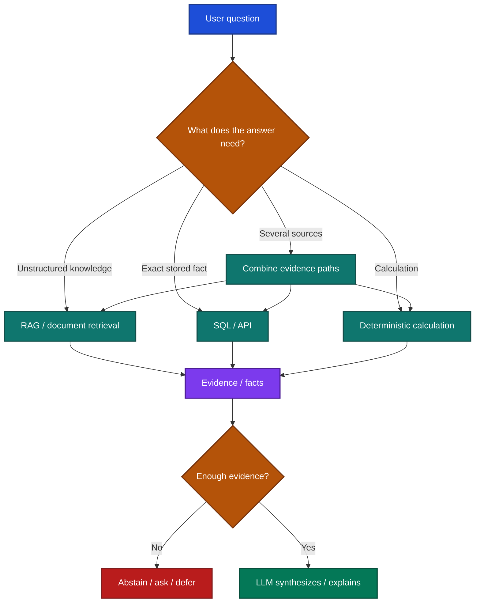
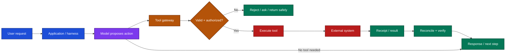

# AI System Design Foundations
## Architecture, Data, Retrieval, Models, and Deterministic Facts

## Scope

This guide explains how to assemble the core of a production AI application: data, parsing, web extraction, retrieval, structured data, deterministic calculations, models, workflows, tools, guardrails, serving, observability, evaluation, and operations.

It is intended for developers moving from a working AI feature to a system that can be reasoned about, tested, and operated. Model training, fine-tuning, GPU scheduling, kernel optimization, and advanced inference-server engineering are outside scope.

The central design rule is:

> **Use models for interpretation and synthesis; databases for authoritative facts; code for calculations; deterministic services for permissions and execution boundaries.**

For deeper implementation detail, use the dedicated UnvibeCode guides for [RAG](./02_RAG/README.md), [guardrails](./05_GUARDRAILS/README.md), [LLM routing](./07_LLM_ROUTING_STRATEGY.md), [AI observability](./09_AI_OBSERVABILITY_IMPLEMENTATION.md), and [AI operations](./10_AI_OPERATIONS_IMPLEMENTATION.md).

---

## 1. Complete system


A useful mental model is:

**Data → Parsing / Extraction → Retrieval / Structured Facts → Deterministic Computation → Model → Workflow → Guardrails / Tools → Response**

Across the whole system sit five foundational concerns:

**Security · Reliability · Latency · Cost · Governance**

A request does not need every layer. A classification endpoint may call only a model. A financial research assistant may combine internal documents, SQL, deterministic calculations, web search, and several tools.

Design the system as a set of controlled paths rather than forcing every request through the same pipeline.

---

## 2. Core AI system-design principles

### Bound non-determinism

Put explicit limits around:

- model output tokens,
- workflow steps,
- tool calls,
- recursion,
- retries,
- total execution time,
- and spend.

A probabilistic component should never have an unlimited path through production infrastructure.

### Keep deterministic work deterministic

| Requirement | Prefer |
| --- | --- |
| Interpretation, extraction, synthesis | LLM |
| Exact stored facts | SQL / API |
| Arithmetic and formulas | Python / SQL / calculation service |
| Authorization | Deterministic application service |
| Known workflow transitions | State machine / code |
| External side effects | Authorized tool gateway |

This distinction removes a large class of avoidable AI failures.

### Separate decision from execution

The model may decide that the user intends an action. A deterministic layer must still validate:

**identity → tenant → resource → permission → operation → arguments → destination**

before execution.

### Treat external context as untrusted

User uploads, retrieved documents, web pages, emails, tool outputs, and search results are data. Instructions inside them must not automatically become system policy.

### Design for abstention

“No sufficient evidence” is a valid result. If evidence is required and retrieval fails, do not silently ask the model to improvise from memory.

### Make state explicit

Persist the workflow state that matters for recovery. Conversation history alone should not be the source of truth for completed actions, approvals, or external side effects.

### Design for recovery

Every dependency should have a defined timeout, retry policy, fallback or degradation path, and recovery test.

---

## 3. Data layer

The data layer defines what the application can know.

Typical sources include:

- relational databases,
- object storage,
- internal APIs,
- documents,
- event streams,
- code repositories,
- user uploads,
- and third-party data.

### Production controls

- **Authority:** define the source of truth when several systems contain the same fact.
- **Freshness/versioning:** record effective time, update time, and version where they matter.
- **Permissions:** preserve tenant/user/resource access rules downstream.
- **Deletion:** propagate deletion into chunks, indexes, embeddings, caches, and derived stores.
- **Conflict handling:** detect duplicate or contradictory source data instead of asking the model to resolve it blindly.

### Common production failure

A technically healthy RAG system answers from an obsolete document because ingestion succeeded but source freshness was never modeled.

---

## 4. Parsing and extraction layer

Raw files should not be treated as clean model context.

PDFs, Office files, scanned images, HTML, spreadsheets, presentations, and source code require extraction appropriate to their structure.

### Production controls

- Choose parsers by source type rather than one parser for everything.
- Preserve headings, sections, tables, page numbers, links, code boundaries, and metadata.
- Use OCR where required and validate OCR quality.
- Reject or quarantine empty, malformed, or obviously corrupted extraction results.
- Record parser version and extraction timestamp.

### Common production failure

A parser upgrade silently changes table extraction, the index is rebuilt, and retrieval quality deteriorates while every infrastructure health check remains green.

---

## 5. Web search and external extraction

Web-enabled systems introduce information the application does not control.

Typical flow:

```text
Search
  ↓
Select result
  ↓
Fetch page
  ↓
Extract useful content
  ↓
Clean / normalize
  ↓
Attach provenance
  ↓
Retrieval / model
```

### Production controls

- Store URL, title, retrieval timestamp, and published/effective date when available.
- Separate **relevance** from **source authority**.
- Treat instructions found on webpages as untrusted content.
- Detect partial extraction caused by JavaScript rendering, paywalls, anti-bot systems, or layout changes.
- Restrict generated URLs and outbound access so the model cannot reach internal or forbidden network resources.

### Common production failure

Search returns a relevant result, but the extracted page is stale, incomplete, or malicious; the application treats it as authoritative because source trust was never modeled.

---

## 6. Retrieval layer

Retrieval answers:

> **What evidence should reach the model?**

Possible mechanisms include:

- vector retrieval,
- keyword search,
- hybrid retrieval,
- metadata filtering,
- reranking,
- SQL/API lookup,
- graph traversal,
- and code-aware retrieval.

### Production controls

- Apply access filters before evidence reaches the model.
- Evaluate retrieval independently from generation.
- Tune top-k and reranking against representative cases.
- Keep source identity attached to retrieved evidence.
- Define an explicit insufficient-evidence path.

### Diagnose failures correctly

| Failure | What happened |
| --- | --- |
| Retrieval failure | Required evidence never reached the model |
| Context-assembly failure | Evidence was found but dropped by reranking/truncation |
| Generation failure | Correct evidence reached the model, but the answer was still wrong |

Treating all three as “hallucination” makes diagnosis and repair harder.

---

## 7. Structured data and deterministic computation

This layer is important enough to design explicitly.

> **Documents retrieve meaning. Databases retrieve facts. Code performs calculations.**

Do not ask the model to infer values that already exist as structured fields, or to perform business-critical arithmetic that deterministic code can perform.

### Which path should answer the question?



### Route by question type

| Requirement | Preferred mechanism |
| --- | --- |
| Explain a policy | RAG |
| Customer balance | SQL/API |
| Number of orders | SQL |
| Account status | API/DB |
| Revenue growth | SQL + deterministic calculation |
| Portfolio return | Structured data + computation |
| Explain why revenue changed | Metrics + documents + LLM synthesis |
| Summarize research | Retrieval + LLM |

The LLM should explain the calculation, not become the calculator.

---

## 8. AI-friendly semantic schema

Do not expose hundreds of raw operational tables and ambiguous field names directly to the model.

Raw schema might contain:

```text
cust_v2
acct_mstr
txn_hdr
txn_line
prod_ref
ledger_jnl
```

Prefer an AI-facing semantic layer:

```text
customers
accounts
transactions
orders
portfolio_positions
daily_revenue
```

or approved analytical views such as:

```text
customer_360
portfolio_summary
enterprise_revenue
product_performance
```

### Every important field should carry meaning

Example:

```yaml
field: portfolio_value
type: decimal
meaning: Current marked portfolio value
currency: INR
source: portfolio_daily
effective_time: as_of_date
freshness: daily
```

### Production controls

- Stable semantic names and descriptions.
- Explicit type, unit, and time semantics.
- Known relationships instead of guessed joins.
- Only fields the AI actually needs.
- Resource/tenant permissions enforced before values become model context.

---

## 9. Canonical metrics

Do not let each conversation invent a new definition of a business metric.

Example:

```yaml
metric: gross_margin
formula: (revenue - cost_of_goods_sold) / revenue
unit: percentage
required_inputs:
  - revenue
  - cost_of_goods_sold
formula_version: gross_margin_v3
```

The model can identify the requested metric. The calculation service owns the formula.

### Production controls

- Version formulas.
- Define allowed inputs and missing-value behavior.
- Keep units and rounding policy explicit.
- Test formulas independently from the LLM.
- Preserve the formula version with the result.

---

## 10. SQL and structured retrieval

For common production facts, prefer predefined or parameterized queries.

```sql
SELECT portfolio_value, currency, as_of_date
FROM portfolio_summary
WHERE customer_id = ?
ORDER BY as_of_date DESC
LIMIT 1;
```

The model may identify:

```text
intent = portfolio_value
customer_id = 48392
```

The application maps that intent to an approved query.

### If generated SQL is necessary

Use:

- read-only credentials,
- approved tables/views,
- approved columns,
- tenant filters,
- SQL parsing and validation,
- row limits,
- query timeout,
- and audit logging.

Never execute arbitrary model-generated SQL against a privileged production database.

---

## 11. Deterministic calculation service

A production calculation path can look like:

```text
LLM identifies requested metric
        ↓
Calculation service
        ↓
formula + units + rounding + business rules
        ↓
{
  value: 0.0827,
  display: "8.27%",
  formula_version: "portfolio_return_v2"
}
        ↓
LLM explains result
```

The calculation layer owns:

- formula,
- rounding,
- unit conversion,
- missing values,
- applicable business rules,
- and formula version.

The model explains the result; it does not become the calculator.

---

## 12. Preserve provenance for important facts

Avoid passing only:

```text
Revenue = 14.7M
```

Prefer:

```yaml
metric: revenue
value: 14723452.00
currency: INR
period: 2026-Q3
source: finance.invoice_fact
query_id: q_483
calculation_version: revenue_v2
retrieved_at: 2026-09-28T08:32:00Z
```

For important facts retain:

**value + unit + source + effective time + retrieval time + query/calculation version**

This makes answers reproducible and incidents diagnosable.

---

## 13. Model layer

The model performs generation, extraction, classification, reasoning, or structured output.

### Production controls

- Select models by task requirement rather than one model globally.
- Enforce input/context/output token budgets.
- Validate structured responses before downstream use.
- Maintain qualified fallback configurations.
- Version model, prompt, and generation settings together.

### Common production failure

A provider alias or model upgrade changes structured-output behavior while the application assumes the contract is unchanged.

---

## 14. Reasoning and workflow layer

Do not start with autonomous agents when a deterministic workflow is sufficient.

A typical bounded workflow is:

```text
Classify request
      ↓
Retrieve evidence
      ↓
Fetch structured facts
      ↓
Calculate
      ↓
Generate
      ↓
Verify
```

### Production controls

- Define explicit states and transitions.
- Bound workflow depth, retries, and total execution time.
- Persist state needed for resume/recovery.
- Use deterministic branches for known business rules.
- Add human approval before selected high-impact actions.

### Common production failure

An agent repeatedly calls the same failing tool because neither the workflow nor the model has a hard step limit.

---

## 15. Tools

Tools allow the AI system to read or change external systems.

Examples include databases, CRM, search, Python, email, ticketing, payments, file systems, and internal APIs.

The important boundary is not whether the model *wants* to call a tool. It is whether the application authorizes the specific operation.



### Production controls

- Validate tool name and arguments.
- Authorize against the real user and resource.
- Separate read tools from write/action tools.
- Give side effects stable operation IDs.
- Define timeout, retry, and reconciliation behavior per tool.

### Common production failure

A tool succeeds remotely but the API call times out. The agent retries and performs the action twice.

---

## 16. Guardrails

Guardrails should live where the relevant risk occurs.

Possible boundaries:

| Boundary | Example control |
| --- | --- |
| Input | intent, PII, prompt-injection screening |
| Retrieval | tenant/source permissions |
| Model context | evidence and instruction separation |
| Tool execution | authorization and argument validation |
| Output | policy / evidence checks |
| Memory write | provenance and write eligibility |
| Logging | masking and retention policy |

### Production controls

- Do not use prompts as authorization.
- Treat retrieved instructions as untrusted.
- Choose fail-open or fail-closed behavior explicitly.
- Measure false positives and false negatives.
- Version guardrail configurations and policies.

For implementation detail, see the [UnvibeCode guardrails pack](./05_GUARDRAILS/README.md).

---

## 17. Serving layer

Serving turns the AI pipeline into an application.

```text
User
 ↓
API Gateway
 ↓
Authentication / quotas
 ↓
Application service
 ↓
AI workflow
 ↓
Response / durable job
```

### Production controls

- Authenticate and authorize before expensive work.
- Apply request, token, and file limits.
- Use bounded concurrency and queues.
- Give every request an overall deadline.
- Propagate request identity and cancellation downstream.

Long-running jobs such as OCR, repository analysis, indexing, and batch evaluation should generally become asynchronous jobs.

Cloud and API implementation is covered in [Production Serving and Cloud Architecture](./08_PRODUCTION_SERVING_AND_CLOUD_ARCHITECTURE.md).

---

## 18. Observability

An AI request should be traceable across:

```text
Request
 ↓
Retrieval / structured facts
 ↓
Model
 ↓
Workflow
 ↓
Tools / guardrails
 ↓
Response
```

Capture appropriate versions and diagnostics:

- trace ID,
- model and prompt version,
- retrieval sources,
- query/calculation version,
- tool calls,
- guardrail decisions,
- tokens,
- cost,
- latency,
- and failure state.

Mask sensitive information before telemetry is persisted.

For deeper implementation, see the [AI Observability guide](./09_AI_OBSERVABILITY_IMPLEMENTATION.md).

---

## 19. Evaluation

Evaluate components separately before relying on one overall score.

| Component | Question to evaluate |
| --- | --- |
| Retrieval | Did necessary evidence reach the system? |
| Grounding | Did the output follow that evidence? |
| Structured facts | Were the correct rows, values, periods, and units retrieved? |
| Calculations | Was the correct formula/version used? |
| Tools | Was the correct tool called with valid arguments? |
| Workflow | Did the task reach the intended terminal state? |
| Safety | Were restricted operations blocked? |

Confirmed production failures should gradually become permanent regression cases.

---

## 20. Operations

The production unit is larger than a model.

Treat a release approximately as:

```text
Application code
+ model
+ prompt
+ parser
+ retrieval/index version
+ semantic schema
+ calculation version
+ workflow
+ tool contracts
+ guardrails
```

Changes should move through qualification, controlled release, monitoring, and rollback.

For the operating lifecycle, see the [AI Operations guide](./10_AI_OPERATIONS_IMPLEMENTATION.md).

---

## 21. Foundational concerns across every layer

### Security

- Least-privilege credentials.
- Tenant and resource-level authorization.
- Secrets outside prompts, logs, and source control.
- Controlled external/network access.
- Audit sensitive reads and writes.

### Reliability

- Explicit deadlines and bounded retries.
- Circuit breakers for unstable dependencies.
- Idempotency or reconciliation for side effects.
- Graceful degradation.
- Tested recovery paths.

### Latency

- Set stage-level latency budgets.
- Parallelize independent work.
- Cache only where freshness semantics are known.
- Avoid unnecessary LLM calls.
- Monitor p50, p95, and p99 rather than average latency only.

### Cost

- Measure cost per completed task.
- Cap tokens, workflow steps, and tool calls.
- Route simple tasks to cheaper qualified models.
- Reuse embeddings and stable computations.
- Alert on abnormal token/cost growth.

### Governance

- Named owner for important components.
- Approval process for high-impact changes.
- Complete version and audit history.
- Defined retention/compliance rules.
- Controlled permissions for model, prompt, tool, and guardrail changes.

---

## 22. Architecture review questions

For every component ask:

1. **What can it read?**
2. **What can it decide?**
3. **What can it change?**
4. **What happens when it is wrong or unavailable?**
5. **How will we detect and reproduce the failure?**

These questions often reveal missing boundaries faster than starting with a framework choice.

---

## 23. Part 1 implementation checklist

### Data and extraction

- [ ] Authoritative sources are identified.
- [ ] Freshness and version semantics are explicit.
- [ ] Permissions survive ingestion and retrieval.
- [ ] Parsing quality is validated before indexing.
- [ ] Web/external content is treated as untrusted.
- [ ] Deletion propagates through derived stores.

### Retrieval and structured facts

- [ ] Retrieval is evaluated independently from generation.
- [ ] Insufficient evidence has an explicit path.
- [ ] Structured facts use SQL/API where appropriate.
- [ ] AI-facing semantic schema exists for important structured data.
- [ ] Units, period, and effective time accompany important values.
- [ ] Business metrics and formulas are centrally versioned.
- [ ] Calculations run deterministically.
- [ ] Important values retain provenance.

### Model, workflow, and tools

- [ ] Model output schemas are validated.
- [ ] Model/prompt/settings are versioned.
- [ ] Workflow steps, retries, time, and cost are bounded.
- [ ] Critical workflow state is persisted.
- [ ] Tool authorization occurs outside the model.
- [ ] Write tools have idempotency/reconciliation.
- [ ] Guardrails exist at the boundary where the risk occurs.

### Quality

- [ ] Complete requests can be traced.
- [ ] Retrieval, generation, calculations, and tools have separate tests.
- [ ] Important production failures become regression cases.

Continue with [Part 2: Serving, Cloud Architecture, and Production Reliability](./08_PRODUCTION_SERVING_AND_CLOUD_ARCHITECTURE.md).