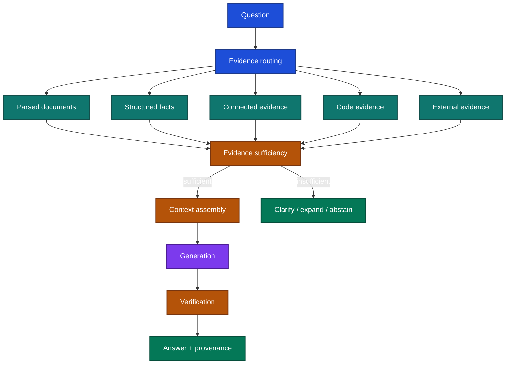

# RAG System Design

RAG is best understood as a system for **finding, qualifying, assembling, and using evidence**.

The model is only one component.

## 1. Start from the evidence need

Before choosing a vector database or chunking strategy, ask:

> **What evidence is needed to answer this question correctly?**

Different questions imply different evidence paths.

| Question | Better evidence path |
| --- | --- |
| “What is the return policy?” | Document retrieval |
| “What is this customer's current balance?” | SQL / API |
| “How much did revenue grow?” | Structured data + deterministic calculation |
| “Why did revenue grow?” | Metrics + documents + LLM synthesis |
| “Which services call this function?” | AST / symbol / dependency retrieval |
| “How are these entities connected?” | Graph traversal |
| “What changed today?” | Current external/web source |

A system that sends every question to the same vector index is not a flexible RAG architecture. It is a single retrieval mechanism.

## 2. The responsibility map

Each layer should have one clear responsibility.

| Layer | Responsibility |
| --- | --- |
| Source | Define authoritative data and validity |
| Parsing | Preserve meaning and structure |
| Representation | Make evidence searchable without losing scope/version |
| Retrieval | Find candidate evidence |
| Evidence routing | Choose the right retrieval mechanism |
| Sufficiency | Decide whether enough evidence exists |
| Computation | Produce exact derived values |
| Context assembly | Decide what actually reaches the model |
| Generation | Explain/synthesize the evidence |
| Verification | Check claims, citations, and required coverage |

## 3. Separate source authority from retrieval relevance

A high similarity score does not make a source authoritative.

A relevant policy from 2024 may be wrong for a 2026 question.

For important sources preserve:

- source identity,
- tenant/resource scope,
- effective date,
- update/version,
- parser version,
- retrieval timestamp,
- and deletion/revocation status.

A retriever should not resolve authority conflicts by nearest-neighbor rank.

## 4. Separate retrieval failure from generation failure

Two very different failures are often called “hallucination.”

### Retrieval failure

Required evidence never reached the model.

### Generation failure

Required evidence was present, but the model ignored, contradicted, or misinterpreted it.

There is also a third failure:

### Context-assembly failure

Evidence was successfully retrieved but later removed by reranking, compression, truncation, or token-budget decisions.

Measure these separately.

## 5. Evidence sufficiency is its own decision

Relevant evidence may still be incomplete.

Example:

Question:

> “Can I return opened headphones after 20 days?”

Retrieved passage:

> “Headphones may be returned within 30 days.”

The passage is relevant but insufficient if the decisive condition is:

> “only if unopened.”

A production RAG system therefore needs a path for:

- enough evidence,
- partial evidence,
- conflicting evidence,
- stale evidence,
- and no authorized evidence.

The answer should not become more confident merely because retrieval returned something.

## 6. Keep deterministic responsibilities outside the LLM

Prefer:

| Responsibility | Owner |
| --- | --- |
| Current database value | DB/API |
| Arithmetic | Python/SQL/calculation service |
| Tenant authorization | application/data service |
| Formula definition | versioned calculation code |
| Retrieval ranking | retriever/reranker |
| Semantic explanation | LLM |
| External writes | authorized tool boundary |

The LLM may decide that a user is asking for revenue growth. It should not invent the operands or arithmetic.

## 7. Design for failure, not only the happy path

For every stage ask:

1. What can be missing?
2. What can be stale?
3. What can be unauthorized?
4. What can be contradictory?
5. What happens when the dependency is unavailable?
6. Can the system detect the failure before answering?

Typical production failures include:

- parser corrupts tables,
- stale document remains indexed,
- correct evidence is dropped during context compression,
- tenant filter is applied after retrieval,
- source update races with an active request,
- cache survives policy revision,
- citation points to a source that does not support the claim.

## 8. The design review questions

For each component ask:

- What can it read?
- What evidence does it trust?
- What version does it operate on?
- What does it guarantee to the next stage?
- What does it do when evidence is incomplete?
- How will we know which stage failed?

That is the system-design foundation for the implementation guides in the rest of this folder.
