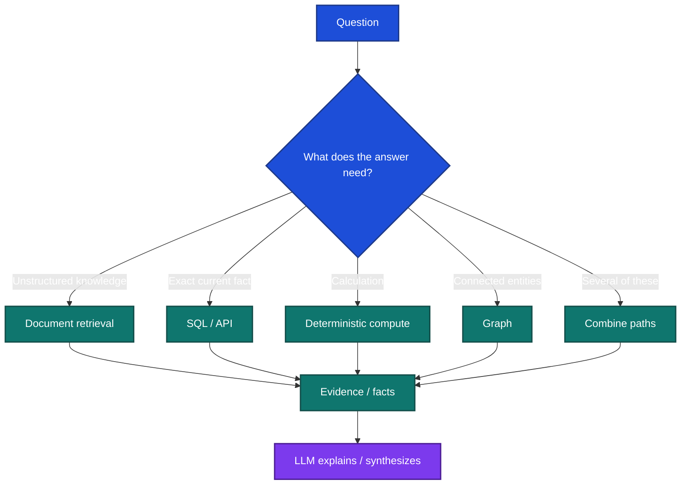

# Structured Facts and Deterministic Computation

One of the most important RAG design decisions is knowing when **not** to use RAG.

> **Documents retrieve meaning. Databases retrieve facts. Code performs calculations.**

## 1. Route by question type

## 2. Use semantic schemas for model-facing data

Raw operational schemas often contain names such as:

~~~text
acct_mstr
txn_hdr
cust_v2
~~~

Expose only approved semantic views the application actually needs:

~~~text
customers
accounts
transactions
portfolio_summary
daily_revenue
~~~

Document:

- meaning,
- type,
- unit,
- time semantics,
- allowed joins,
- source authority,
- access scope.

## 3. Keep formulas canonical

Do not let each model call reinvent business metrics.

Example:

~~~yaml
metric: gross_margin
formula: (revenue - cost_of_goods_sold) / revenue
unit: percentage
formula_version: gross_margin_v3
~~~

The model can identify that the user asked for gross margin.

The calculation service owns the formula.

## 4. Preserve provenance

For important values keep:

**value + unit + source + effective time + query/calculation version**

Example:

~~~yaml
metric: revenue
value: 14723452.00
currency: INR
period: 2026-Q3
source: finance.invoice_fact
query_id: q_483
calculation_version: revenue_v2
~~~

This makes answers reproducible and incidents diagnosable.

## 5. A practical mixed answer

Question:

> “Why did enterprise revenue grow 18%?”

A good evidence path may be:

1. SQL retrieves current and previous revenue.
2. Python calculates the percentage.
3. Document retrieval finds relevant product/contract events.
4. The LLM explains the relationship.
5. The answer cites both structured and documentary evidence.

The LLM should not guess the revenue, perform the critical arithmetic, and then search for a narrative that matches.

## 6. Common failure modes

### Correct document, wrong number

The answer cites a report but copies the wrong table row.

**Control:** structured extraction or exact DB lookup for protected values.

### Correct operands, wrong formula

The LLM performs arithmetic differently across runs.

**Control:** versioned calculation service.

### Correct value, wrong period

Quarterly and annual figures are mixed.

**Control:** explicit time semantics.

### SQL retrieves unauthorized rows

The model generated a syntactically valid query but bypassed tenant scope.

**Control:** authorization and row filtering outside the model.

Structured facts are part of RAG architecture because the final answer often needs both **retrieved meaning** and **authoritative data**.
