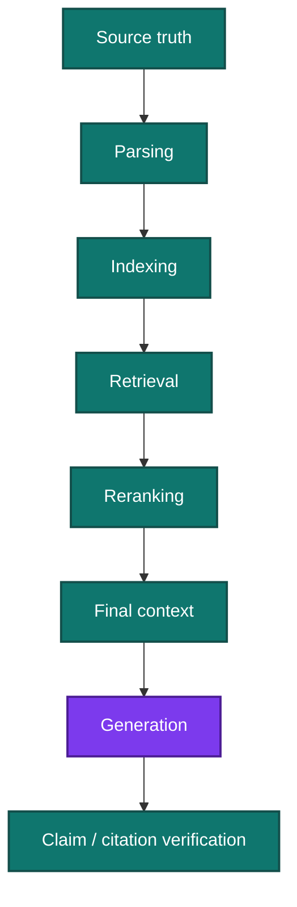

# RAG Reliability and Evaluation

The most useful production question is not:

> “Did the final answer look good?”

It is:

> **Where was the first point at which required information was lost or misused?**

## 1. Evaluate stage by stage

| Stage | Example measurement |
| --- | --- |
| Parsing | critical-field accuracy, table relationships |
| Indexing | expected coverage, freshness, deletion propagation |
| Retrieval | evidence recall@k, complete-evidence success |
| Reranking | required evidence retained |
| Final context | required evidence still present |
| Generation | correctness, completeness |
| Grounding | claim-to-evidence support |
| Abstention | false answerability / false rejection |

## 2. Use RAGChecker as one implementation tool

The existing skill pack recommends [RAGChecker](https://github.com/amazon-science/RAGChecker) for fine-grained diagnostics.

Use it as part of the evaluation stack, not as the definition of RAG quality.

Also test:

- parser behavior,
- exact structured facts,
- authorization,
- source versioning,
- context retention,
- production-specific failure cases.

## 3. Controlled counterfactual tests

Useful tests deliberately change the evidence:

- policy value A → B,
- remove required exception,
- delete document,
- revoke access,
- introduce conflict,
- change table unit,
- replace current document with stale version.

The answer should change accordingly.

If it does not, the model may be relying on prior knowledge or the system may be serving stale evidence.

## 4. Critical production failures

### Parser succeeds but meaning is corrupted

Tables or footnotes are wrong while ingestion health remains green.

**Test:** compare critical fields and relationships against original pages.

### Correct evidence is retrieved but lost before generation

Reranking or compression removes the decisive condition.

**Test:** measure evidence retention after each stage.

### Model prior knowledge hides retrieval failure

The model answers correctly even though retrieval is broken.

**Test:** use controlled fictional or changed facts and require the answer to track the source.

### Citation is present but unsupported

The cited page is related but does not establish the claim.

**Test:** claim-to-evidence support, not citation presence.

### ACL filter is applied too late

Unauthorized content enters candidate retrieval or context.

**Test:** cross-tenant and revoked-access cases with production-equivalent identity.

### Cache survives source update

Old answer remains available after policy/index change.

**Test:** include source/index/version identity in cache behavior and invalidate correctly.

### Relevant evidence is incomplete

The retriever finds the rule but not its exception.

**Test:** complete-evidence success, not only passage relevance.

## 5. Production debugging rule

When a case fails, walk the chain:

**source → parse → index → retrieve → rerank → context → generate → verify**

Fix the first broken responsibility rather than compensating later with a stronger model.

## 6. Keep production and stress sets separate

Maintain:

- production-like traffic sample,
- targeted challenge cases,
- incident regressions,
- untouched holdout.

This prevents rare adversarial cases from being mistaken for normal prevalence while still ensuring serious failures remain visible.

The existing [RAG Review skill](../../../skills/unvibecode-rag-review/README.md) contains runnable review guidance and a synthetic regression example.
