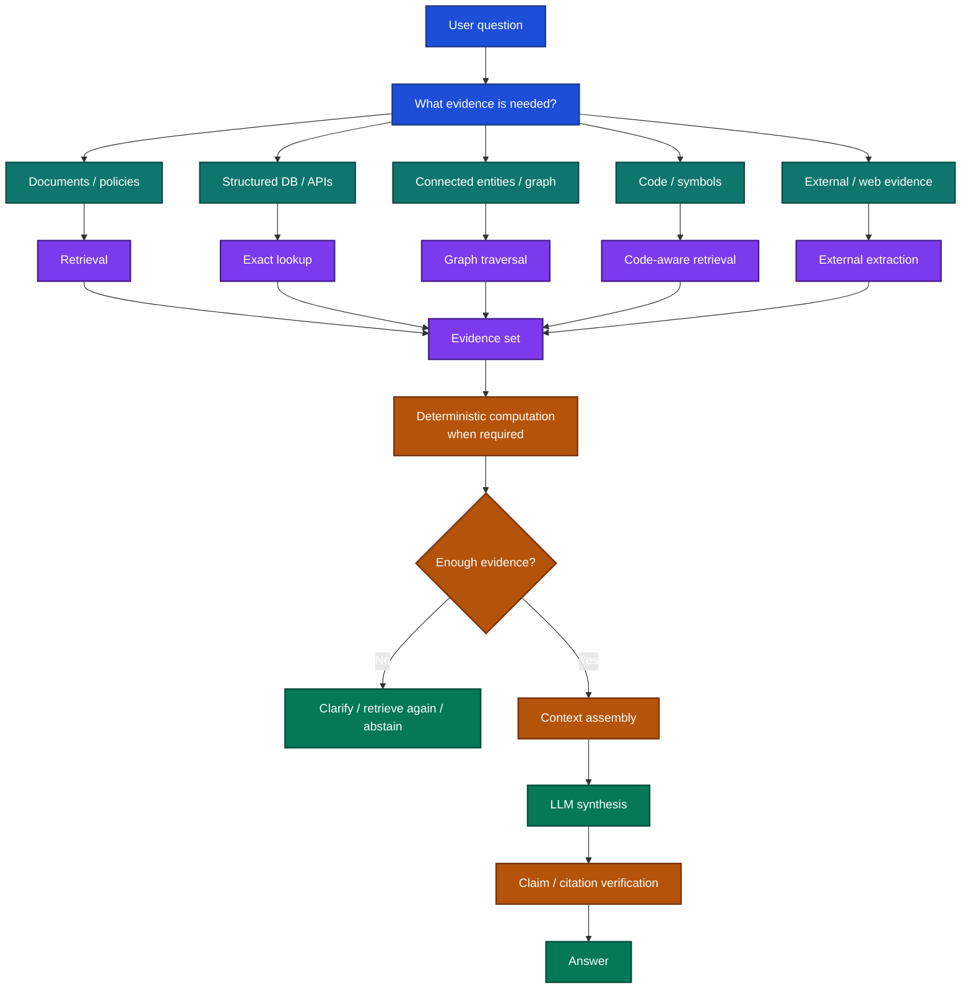

# RAG for AI System Design

RAG often starts as a simple recipe:

**parse documents → chunk them → create embeddings → retrieve top-k → send context to an LLM**

That is enough for a demo.

Production systems become harder because the real question is not merely *how to retrieve text*. The system has to decide:

- which source should answer which part of the question,
- whether that source is current and authorized,
- whether the evidence is complete enough,
- which facts should come from a database instead of a document,
- which calculations should be deterministic,
- and whether the final answer actually follows the evidence.

A more useful mental model is:

> **RAG is an evidence-routing system.**

The point is not to add every retrieval mechanism. It is to choose the **smallest evidence path that fits the question**.

## Read this folder in order

| File | What it teaches |
| --- | --- |
| [01_RAG_SYSTEM_DESIGN.md](01_RAG_SYSTEM_DESIGN.md) | The complete RAG architecture and responsibility boundaries |
| [02_DATA_PARSING_AND_KNOWLEDGE.md](02_DATA_PARSING_AND_KNOWLEDGE.md) | Source authority, parsing, OCR, metadata, versioning, and indexing |
| [03_RETRIEVAL_AND_EVIDENCE_ROUTING.md](03_RETRIEVAL_AND_EVIDENCE_ROUTING.md) | Vector, lexical, graph, SQL/API, code, and external evidence routing |
| [04_STRUCTURED_FACTS_AND_COMPUTATION.md](04_STRUCTURED_FACTS_AND_COMPUTATION.md) | Databases, semantic schemas, formulas, deterministic calculations, provenance |
| [05_CONTEXT_GENERATION_AND_CITATIONS.md](05_CONTEXT_GENERATION_AND_CITATIONS.md) | Evidence sufficiency, context assembly, generation, citations, abstention |
| [06_RAG_RELIABILITY_AND_EVALUATION.md](06_RAG_RELIABILITY_AND_EVALUATION.md) | Stage-by-stage evaluation, failure diagnosis, production reliability |
| [07_RAG_REVIEW_CHECKLIST.md](07_RAG_REVIEW_CHECKLIST.md) | Practical review checklist and regression scenarios |

## What stays in the skill folder

The existing [UnvibeCode RAG Review skill](../../../skills/unvibecode-rag-review/README.md) remains the implementation/review pack.

It contains:

- the practical research-backed RAG guide,
- the AI review skill,
- the review checklist,
- and a runnable Python example.

This folder answers:

> **How should a developer think about RAG as a system?**

The skill folder answers:

> **How do I review, test, or implement those responsibilities?**

## The core principle

A production RAG system should not ask an LLM to do work that another component can do more reliably.

**Documents retrieve meaning.  
Databases retrieve authoritative facts.  
Code performs calculations.  
Graphs retrieve connected relationships.  
The LLM synthesizes evidence into language.**

That separation is the foundation for the rest of this folder.
