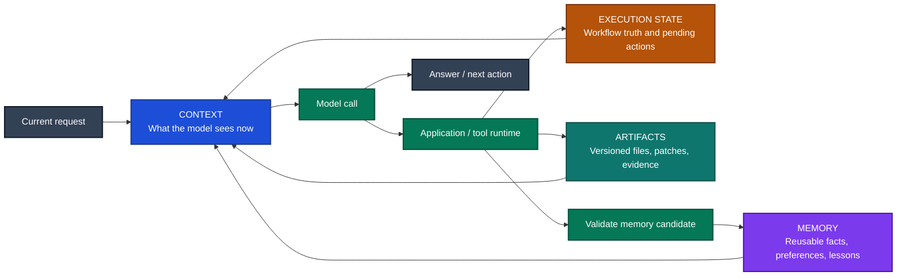
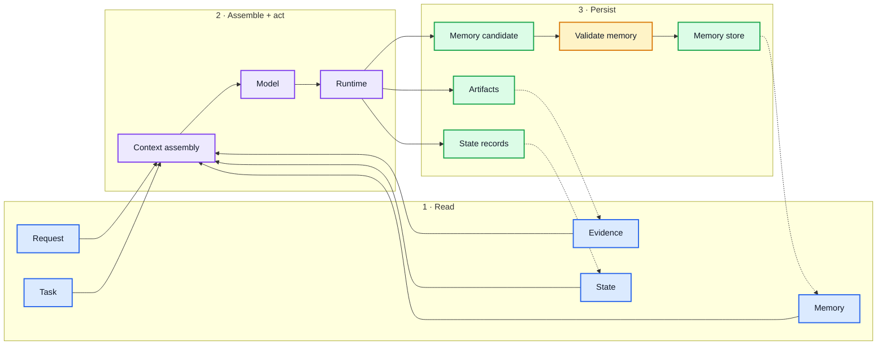

# Context, Memory, and State Engineering

A practical guide for developers building applications with model APIs.

## 1. Help the application remember the right things

A useful AI application needs continuity. It should remember a requirement you already clarified, find the right project information, and continue work after an interruption. But remembering more is not always better. An outdated preference can misdirect an answer, a summary can lose an important exception, and a conversation can suggest that an action completed when the external service never confirmed it.

Reliable continuity comes from deciding what to retain, where it applies, when to retrieve it, and what counts as evidence. You can start with a database, recent conversation history, and a compact task record. More sophisticated memory becomes useful when a specific failure justifies it.

Consider a coding assistant asked to prepare a database migration, follow the team's runbook, and wait for approval before deployment. It needs the current code, earlier clarifications, relevant past incidents, and the actual approval status. Each has a different owner and lifetime. Putting all of them in one growing prompt makes those differences harder to enforce.



## 2. Four responsibilities to keep separate

| Component | Responsibility | Migration example |
| --- | --- | --- |
| Context | Information supplied for the current model call | Task instructions, selected code, relevant runbook steps |
| Memory | Retained information available for later reuse | Project conventions and lessons from previous migrations |
| Execution state | Application records of workflow progress and outcomes | Waiting for approval; deployment operation awaiting confirmation |
| Artifacts | Actual inputs and outputs with stable identity and versions | Patch, test report, migration script, approved deployment plan |

**Stored information is not automatically available to the model.** Your application selects and renders it into context. **A model-generated statement is not confirmation of an external action.** The runtime should record completion from a tool result or subsequent reconciliation.

Frameworks sometimes call persisted thread state “short-term memory.” That terminology is useful, but keep its operational fields distinct from free-text recollections. LangGraph separates thread checkpoints from stores used across threads [1].

### What can enter a model call?

| Context type | Contents | Handling |
| --- | --- | --- |
| Application instructions | Role, output contract, operating constraints | Version explicitly; keep retrieved text separate |
| Current task | Objective, acceptance criteria, latest corrections | Maintain a compact task record |
| Conversation | Exchanges needed to interpret the request | Keep recent turns; compact older material carefully |
| Evidence | Documents, code, database results | Check access, source version, freshness, and relevance |
| Execution context | Pending calls, confirmed outcomes, current step | Render from application state |
| Personalization | Applicable preferences and conventions | Include selectively and support overrides |

## 3. Classify information before choosing storage

Memory has three independent dimensions:

- **Meaning:** fact, experience, procedure, preference, or intention.
- **Lifetime:** one invocation, one session, or across sessions.
- **Scope:** task, project, user, or organization.

An incident can be episodic memory, retained long-term, and restricted to one project. “Long-term” does not imply a vector database.

| Type | Example | Practical implementation | Failure to prevent |
| --- | --- | --- | --- |
| Working memory | Candidate files and intermediate calculations | Invocation state or scratchpad | Guesses becoming permanent facts |
| Session memory | Clarifications and selected options | Thread messages, structured fields, checkpoints | Losing corrections during summarization |
| Semantic memory | “This service uses PostgreSQL” | Scoped fact records with provenance and validity | Contradictory versions remaining active |
| Episodic memory | A previous deployment failure and its resolution | Incident records containing situation, action, outcome, and evidence | Generalizing an exceptional incident |
| Procedural memory | An approved deployment runbook | Versioned instructions, skills, or executable workflow | Rewriting a procedure after one unverified success |
| Preference memory | “Use British English for this publication” | Scoped settings with explicit overrides | Applying a local preference everywhere |
| Prospective memory | “Deploy after approval” | Durable pending task with a trigger | Remembering an intention without executing or rechecking it |

Preferences are often grouped under semantic memory. Keeping them separately addressable makes corrections and exceptions easier. Prospective memory needs a scheduler or workflow engine when action is expected; semantic retrieval alone does not provide reliable triggering.

MemGPT explores moving information between memory tiers [5]. Mem0 studies extracting and consolidating reusable information from conversations [6]. These approaches help manage information, but do not establish which source is authoritative for your application.

### Match the approach to the task

| Application | Start with | Add when needed |
| --- | --- | --- |
| Independent extraction or classification | Current input, schema, versioned instructions | Usually no cross-session memory |
| Chat assistant | Recent conversation, session state, explicit preferences | Cross-session retrieval for demonstrated continuity needs |
| Coding assistant | Current repository reads, task record, versioned artifacts | Past incidents and project decisions |
| Tool-using workflow | Typed state, operation records, durable checkpoints | Reusable facts that improve decisions |
| Content generation | Versioned brief, source evidence, document specification | Scoped style preferences and relevant examples |
| Long-running agent | Durable progress, artifacts, recovery logic | Compaction and structured decision history |

## 4. Eight engineering principles

### 1. Keep operational truth in explicit records

“The deployment succeeded” in a summary is insufficient. Store the operation ID, confirmed result, artifact version, and time. The agent may propose a state transition; application code validates the evidence required for it.

For example, `ready_for_review` may require a patch artifact and a test report for that patch. `deployed` requires confirmation from the deployment system.

**Test:** Replace a tool result with a timeout. The workflow must not mark the operation successful based on the assistant's narration.

### 2. Attach scope, provenance, and validity

“Use Python” might apply to one migration rather than every future task. Store that boundary explicitly. Resolve tenant and user identity from authentication; never accept model-selected identity as authorization.

Record when a fact was learned separately from when it became valid. A document received today may describe last year's policy. Expiry is useful for temporary facts, while explicit supersession is better for revised requirements.

ADK exposes session, user, application, and temporary invocation scopes [2]. Those scopes help organize data; they do not replace access-control checks.

**Test:** Ask similar questions in two projects with different requirements. Neither should inherit the other's facts.

### 3. Validate memory writes

Distinguish assertions, proposals, hypotheticals, corrections, and verified outcomes. “Perhaps we should migrate” must not become “we migrated.”

Use a write path such as:

1. Extract a candidate with its source.
2. Classify its meaning and scope.
3. Check for conflicts and duplicates.
4. Accept, supersede, reject, or retain as unresolved.

Apply explicit corrections needed by the next turn synchronously. Background consolidation can follow. Attach a source revision to background jobs so an old job cannot restore information the user just corrected.

**Test:** Edit a message while extraction is running. Reject the result derived from the obsolete revision.

### 4. Check applicability before similarity

Semantic similarity does not establish permission, freshness, or authority. Filter by authorized scope and validity before ranking relevant candidates. Resolve version precedence before assembling the prompt.

Use exact lookups for known entities and canonical configuration. Use semantic retrieval for experiences or documents whose wording varies. Keep important current constraints in the task record rather than relying on their discovery through search.

**Test:** Place an obsolete, highly similar memory beside a current requirement. The obsolete record must not govern the answer.

### 5. Compact history without discarding decision-critical details

Compaction should preserve objectives, constraints, decisions and reasons, blockers, rejected approaches, pending actions, and evidence identifiers. Anthropic describes compaction and structured notes as ways to continue long tasks, while warning about losing details needed later [4].

Store exact operation IDs and artifact versions outside free-text summaries. Treat tool calls and their results as protocol units when trimming; provider requirements differ. Claude, for example, requires corresponding tool results immediately after tool-use messages [11].

**Test:** Force compaction immediately before a tool result arrives. Verify both protocol validity and preservation of the pending operation.

### 6. Design recovery for replay and uncertain outcomes

A timeout means the caller lacks a confirmed outcome. It does not prove the external action failed. Allocate a durable operation ID before execution, use idempotency keys where supported, and reconcile uncertain results before retrying.

LangGraph interrupts restart the containing node on resume, so preceding side effects may run again [9]. Separating approval from execution helps, but a crash after an external service commits still requires idempotency or reconciliation.

**Test:** Terminate the worker after external success but before the local receipt is saved. Recovery must not blindly repeat the action.

### 7. Define ownership and merge rules

Concurrent workers should not independently overwrite canonical decisions. Use private working state, uniquely identified findings, and an explicit owner for final decisions. Protect editable records with version checks where needed.

LangGraph reducers define how concurrent updates combine [10]. Appending values may be correct for findings but wrong for mutually exclusive approval states. A technically valid merge can still be semantically wrong.

**Test:** Submit conflicting updates concurrently. Verify that the conflict is resolved or exposed according to an explicit rule, rather than arrival order.

### 8. Evaluate memory separately from answer quality

The model may answer correctly without retrieving the required memory, or answer incorrectly despite retrieving it. Measure extraction, selection, updating, compaction, and recovery separately.

LongMemEval evaluates conversational abilities including knowledge updates, temporal reasoning, and abstention [7]. Add application-specific tests for authorization, edited messages, deletion propagation, and replay.

**Test:** Pair a question requiring an old decision with one that must ignore it. Successful recall and appropriate non-use are both necessary.

## 5. Start with a small implementation

### Four starting guidelines

1. Separate the current task, reusable memory, and execution records.
2. Save confirmed facts and explicit decisions selectively, with scope and source.
3. Build each prompt from current requirements, recent exchanges, applicable evidence, and relevant state.
4. Test corrections, project isolation, compaction, and crash recovery before adding automatic learning.

These responsibilities can share one database. Add separate services only when their benefits justify the operational cost.



### Minimal record shapes

The following records illustrate responsibilities; choose fields based on your application's requirements.

```json
{
  "memory_id": "mem_42",
  "tenant_id": "tenant_a",
  "scope_type": "project",
  "scope_id": "billing_migration",
  "kind": "semantic",
  "content": "The migration must preserve compatibility with service v3.",
  "source_id": "message_81",
  "source_revision": 2,
  "recorded_at": "2026-09-27T10:00:00Z",
  "status": "active",
  "supersedes_id": "mem_39"
}
```

```json
{
  "run_id": "run_12",
  "task_revision": 3,
  "phase": "awaiting_approval",
  "artifact_id": "migration_patch",
  "artifact_version": "v4",
  "verification_id": "test_report_18",
  "operation_id": null,
  "state_schema_version": 1
}
```

Bind approvals to the relevant artifact and action parameters. If the patch or deployment target changes, determine whether a new approval is required. A generic `approved=true` can accidentally authorize different work.

## 6. Manage the full information lifecycle

### Read and assemble

Authenticate the request, load its task revision, select authorized records, resolve superseded versions, and retrieve supporting evidence. Reserve context space for current constraints and pending operations before adding optional history. Count tokens and leave capacity for the response and tool interactions.

Maintain source labels so retrieved document text cannot silently become application instructions. Recheck permissions when retrieving old memories; permission to read the original source last month does not imply permission today.

### Execute and record

Validate tool arguments and permissions in code. Record planned operations before external side effects when recovery requires it. Persist confirmed results and artifact identities. Use an explicit uncertain state when reconciliation is necessary.

### Consolidate

Extract reusable information only after checking what the source actually establishes. Background jobs need deduplication, source revisions, and conflict handling. Keep short-lived search results out of permanent profiles unless there is a specific reason to retain them.

### Correct and delete

Corrections should supersede relevant records without rewriting unrelated history. Deletion must cover derived summaries, extracted memories, and search indexes that could otherwise reintroduce the information. Track derivation links and apply retention policies to checkpoints and logs as well as memory stores.

When asynchronous deletion is necessary, exclude tombstoned records immediately from retrieval and define a completion deadline. Prevent background jobs from recreating deleted records. Handle backups according to the application's retention policy.

### Resume and upgrade

On resume, validate artifact availability, external operation status, credentials, and source freshness. Persist schema and workflow versions. For a deployment that changes the workflow, either migrate existing state, continue compatible runs on the old version, or stop them with a clear recovery path.

## 7. Choose a framework by the responsibility you need

| Option | Use it for | Avoid introducing it for | Responsibility you retain |
| --- | --- | --- | --- |
| LangChain and LangGraph | A refund workflow that pauses for approval and resumes later | A single independent product-description request | State schema, external-action reconciliation, memory policy |
| Google ADK | An ADK travel assistant with trip state and user preferences | Adding a second runtime merely to remember a language preference | Correct scopes, persistent backend, freshness and permissions |
| Mem0 | Adding cross-session learning preferences to an existing tutoring assistant | Recording whether payment or inventory operations completed | Extraction quality, applicable scope, authoritative records |
| Letta | A persistent project assistant with evolving working memory | Independent invoice extraction against a fixed schema | Canonical document versions, memory permissions, update validation |
| Model SDK and existing database | Stateless generation or a simple chat with explicit preferences | Complex recovery implemented through ad hoc flags | Context assembly and any workflow logic you add |

LangChain provides short-term memory through checkpointers and context-management middleware [3]. LangGraph provides thread checkpoints and cross-thread stores [1]. ADK offers scoped state with tracked updates [2]. Mem0 focuses on reusable memory extraction and retrieval [6]. Letta provides structured memory blocks for persistent agents [8].

A small starting stack is one agent runtime and one persistent database. In-memory examples are useful for development but do not survive worker restarts. A hosted service can reduce infrastructure work, while adding service dependency, cost, and data-governance decisions.

Do not expect a memory service to replace transaction records, permissions, or workflow recovery. Framework choice should follow those requirements.

## 8. Production failures by task

The following scenarios are useful regression cases. Adapt the examples to the data and side effects in your application.

### Coding

**Outdated code remains in context.** A worker reads a function, another worker changes its signature, and the first worker edits against the old version. Associate reads with file hashes or revisions. Refresh changed dependencies before applying the edit. Test by changing a dependency between inspection and modification.

**Verification outlives the code it tested.** A summary says tests passed, but subsequent edits invalidate the result. Bind test outcomes to code and environment versions. Test by modifying the implementation after a passing run and restarting the agent. It should recognize that verification is outdated.

### Agents and multi-agent workflows

**Handoffs lose qualifications.** A worker finds that a supplier is cheapest only when migration fees are excluded. The coordinator receives “supplier is cheapest.” Pass findings with evidence, assumptions, unresolved questions, and validity dates. Test whether a decision-changing exception survives delegation.

**Updates appear locally but are not persisted.** Directly mutating a retrieved session object can bypass the framework's persistence lifecycle. ADK documents this distinction: use tracked context updates or events [2]. Test persistence by restarting and reading through a fresh service instance.

### Tool calling

**History trimming breaks the protocol.** A retained result refers to a removed call, or a parallel call loses one result. Preserve complete call/result groups and pending calls. Validate the final provider-specific message structure. Test compaction at tool boundaries [11].

**Recovery repeats a committed operation.** A ticket is created but the receipt is lost. Use operation IDs and reconcile with the external system. Test a crash after remote success and before local persistence. When the service cannot provide idempotency or lookup, surface the uncertainty rather than promising duplicate-free recovery.

### Chat applications

**The user saw text that was never committed.** A disconnect interrupts streaming before normal completion. Track generation and message IDs with statuses such as streaming, completed, cancelled, and failed. Persist action receipts independently of assistant text. Test disconnects after tool execution. AI SDK documents persistence and abort/resumption considerations [12].

**Edited messages leave active memories from an abandoned branch.** Link memories to message revisions and branches. Invalidate derived records when the source changes. Test edits while a background extraction job is in flight.

### Content generation

**Drafts become evidence.** An unsupported claim from an early draft survives summarization and becomes background for the next writer. Label generated content and retain claim-to-source links. Test by injecting an unsupported number into a draft; later stages should not treat repetition as verification.

**Sections use different fact versions.** A revised price reaches the body but not the summary. Maintain canonical facts and identify dependent sections. Test a late change to a number, date, or definition across the complete document. Use deterministic checks where possible.

### Long-running agents

**The checkpoint survives but its environment does not.** Temporary files, signed URLs, and browser sessions expire. Persist durable artifact IDs and hashes, then revalidate resources at resume. Test on a fresh worker without the previous temporary directory.

**Compaction forgets rejected approaches.** The agent repeatedly tries an API already found unsuitable. Preserve the attempt, failure reason, and conditions for reconsideration. Force several compactions and measure repeated disqualified actions. Structured progress and environment reconstruction are also central to Anthropic's long-running-agent harness [13].

## 9. Evaluate and observe the system

### Measure the stages

| Stage | Measurement | Practical test |
| --- | --- | --- |
| Extraction | Supported retained facts divided by inspected retained facts | Compare extracted facts with source assertions and corrections |
| Scope enforcement | Unauthorized or wrong-scope records returned | Similar questions across isolated projects and tenants |
| Updating | Correctly superseded records divided by required supersessions | Repeated changes to one requirement |
| Retrieval | Required evidence recall and irrelevant-record rate | Questions requiring specific past facts, plus questions requiring none |
| Compaction | Preserved required items divided by required items | Compare explicit constraints before and after compaction |
| Deletion | Deleted facts resurfacing after deletion completion | Search, summary, and background-job paths |
| Recovery | Duplicate operations and lost confirmed progress | Inject failures around side-effect boundaries |
| Overall utility | Task success, latency, tokens, and storage growth | Compare recent-history baseline against added memory |

Define denominators and evaluate by task type. A low average error rate can hide severe isolation failures. For natural-language facts, manually verify a sample of labels and use anchored criteria; structural and operational checks can often be automated exactly.

### Distinguish selection failure from reasoning failure

Run the same cases with:

1. The normal memory-selection process.
2. Verified necessary evidence supplied directly.
3. A recent-history-only baseline where appropriate.

If verified evidence improves results, investigate selection and context assembly. If errors remain, investigate interpretation, instructions, or model capability. If adding memory reduces performance, inspect irrelevant and outdated records before adding more retrieval machinery.

LongMemEval supplies useful conversational-memory tasks [7]. Supplement it with your own workflow events and failure injection.

### Keep a compact trace

Record task revision, model and prompt versions, selected memory IDs and revisions, evidence versions, compaction version, checkpoint ID, operation IDs, and outcomes. Record selection reasons when practical. Protect or redact sensitive content and use access-controlled retention. Avoid duplicating full private conversations in every trace.

## 10. Worked example: prepare and deploy a migration

### Request

“Prepare the billing migration. Follow the approved runbook and wait for approval before deployment.”

### Step 1: establish the task

Create a task record with the repository, target environment, acceptance criteria, and approval requirement. Read current repository versions and the applicable runbook. Retrieve a prior incident only if its conditions matter to this migration.

The earlier incident says an old service could not read the new schema. Preserve that condition and its evidence; do not turn it into a blanket rule against migrations.

### Step 2: assemble context and work

Supply the current objective, relevant schema and code, runbook steps, and incident details. Keep exploratory file lists in working memory. Save the patch as a versioned artifact. Record test results against that exact patch and environment.

### Step 3: apply a correction

The user adds: “The old service will remain live for another week.” Increment the task revision and update compatibility requirements. Supersede any incompatible assumption. Invalidate affected design and verification results. Reject background memory writes derived from the older task revision.

### Step 4: compact and request approval

Preserve the new compatibility constraint, design decision, outstanding risks, patch version, and test references during compaction. Approval must identify the patch, target, and action being approved. If those change afterward, re-evaluate approval validity.

### Step 5: execute with recovery

Persist a deployment operation ID before execution and use it as an idempotency key if supported. Suppose the deployment service accepts the operation, but the worker crashes before recording the response.

On restart, load the checkpoint and query the deployment service using the operation ID. If completed, save the receipt and verify the resulting deployment. If still running, continue tracking. If the outcome cannot be established, keep it uncertain and use the application's reconciliation process.

### Step 6: retain useful knowledge

Persist the confirmed deployment record as execution history. Save any reusable incident or lesson with its evidence and scope. A suggested runbook improvement becomes a proposed change requiring review and tests. Avoid saving transient debugging guesses as project facts.

## 11. Frequently asked questions

### Do I need a vector database?

No. Exact preferences, project configuration, and operation status fit structured storage. Add semantic retrieval when users refer to relevant material in varied language or when searching a large collection of experiences or documents.

### Is storing chat history enough?

It preserves source material, but does not resolve scope, corrections, relevance, or execution status. Use history alongside explicit task and operation records.

### Are session memory and short-term memory the same?

Frameworks often use those terms interchangeably for thread continuity. A session can still be persisted for months. Specify actual retention and scope rather than relying on the label.

### When should I summarize instead of retrieve?

Summarize to preserve continuity across a long interaction. Retrieve to bring in particular evidence when needed. A useful combination is a compact progress summary with links to detailed sources.

### What should remain exact?

Identifiers, approval targets, artifact versions, critical constraints, and confirmed operation outcomes should live in explicit records. Summaries can explain them without becoming their only representation.

### Can I let the agent write its own memory?

Yes, within a controlled scope and validated schema. Preserve sources and distinguish proposals from verified facts. Restrict changes to permissions, approvals, and authoritative workflow status through application code.

### Should every conversation create long-term memory?

No. Independent extraction, one-off classification, hypotheticals, and temporary debugging often provide little reusable value. Retain information with a clear future use and an appropriate retention policy.

### How should conflicting memories be handled?

Use applicable scope, source authority, explicit corrections, and validity periods. A newer timestamp alone is insufficient. Preserve unresolved conflicts when neither source clearly supersedes the other.

### Can a confidence score solve stale memory?

No. A highly confident old fact can still be obsolete. Freshness, provenance, applicability, and confirmation are separate properties.

### Does deleting the source delete its memories?

Only if your application propagates the deletion. Track derived records and prevent pending background jobs from recreating them. Include indexes, summaries, and caches in the deletion design.

### Can multiple agents share memory?

Yes, but define read permissions, write ownership, and conflict handling. Shared findings are easier to merge than shared approvals or canonical decisions. Keep scratch work private unless another worker needs it.

### Does a checkpoint prevent duplicate tool actions?

No. It records workflow state. Duplicate prevention depends on the boundary between that state and external side effects, including idempotency and reconciliation.

### Can I switch models without rebuilding memory?

Plain structured records are easier to reuse than provider-specific histories. Validate tool-message conversion, token limits, summarization behavior, and retrieval quality. An embedding-model change may require re-embedding indexed content.

### Should procedural memory update automatically?

Treat learned improvements as proposals first. Validate them against regression cases and publish a new procedure version. One successful attempt does not establish a generally safe procedure.

### Which framework should I start with?

Use your existing runtime's persistence features first. Choose LangGraph for explicit resumable workflows, ADK state facilities for ADK applications, Mem0 when reusable conversational memory is the missing component, or Letta when persistent agent memory is central. A simple SDK and database may be sufficient.

### What is the first sign that memory is hurting quality?

The application repeatedly introduces irrelevant preferences, resurrects corrected facts, or performs worse than a recent-history baseline. Inspect the selected records and their versions before expanding storage or retrieval.

### What must be checked after a restart?

Load the right task and schema versions, confirm artifact availability, reconcile uncertain operations, and revalidate changed external conditions. Resuming the conversation is only one part of recovering the work.

## 12. Implementation checklist

- [ ] Current requirements, reusable memories, and execution state have explicit owners.
- [ ] Records carry scope and source identity; corrections can supersede them.
- [ ] Retrieval enforces permissions before supplying content to the model.
- [ ] Compaction preserves constraints, pending operations, and evidence references.
- [ ] Tool-message history remains valid after trimming and model conversion.
- [ ] Background writers cannot restore obsolete or deleted information.
- [ ] Approvals identify the action and artifact version they authorize.
- [ ] External actions have an idempotency or reconciliation strategy.
- [ ] Concurrent updates have defined ownership and merge behavior.
- [ ] Checkpoints and artifacts survive the intended failure scenarios.
- [ ] Traces identify selected records without unnecessarily copying sensitive data.
- [ ] Tests cover corrections, isolation, compaction, deletion, and crash recovery.
- [ ] Added memory improves measured outcomes relative to a simpler baseline.

## References

1. LangChain. [LangGraph persistence](https://docs.langchain.com/oss/python/langgraph/persistence).
2. Google Agent Development Kit. [State](https://google.github.io/adk-docs/sessions/state/).
3. LangChain. [Short-term memory](https://docs.langchain.com/oss/python/langchain/short-term-memory) and [prebuilt middleware](https://docs.langchain.com/oss/python/langchain/middleware/built-in).
4. Anthropic. [Effective context engineering for AI agents](https://www.anthropic.com/engineering/effective-context-engineering-for-ai-agents). September 29, 2025.
5. Charles Packer et al. [MemGPT: Towards LLMs as Operating Systems](https://arxiv.org/abs/2310.08560). 2023; revised 2024.
6. Prateek Chhikara et al. [Mem0: Building Production-Ready AI Agents with Scalable Long-Term Memory](https://arxiv.org/abs/2504.19413). 2025. See also [Mem0 documentation](https://docs.mem0.ai/open-source/overview).
7. [LongMemEval: Benchmarking Chat Assistants on Long-Term Interactive Memory](https://github.com/xiaowu0162/LongMemEval). ICLR 2025.
8. Letta. [Memory blocks](https://docs.letta.com/v1-sdk/memory/memory-blocks) and [Letta repository](https://github.com/letta-ai/letta).
9. LangChain. [Interrupts and replay behavior](https://docs.langchain.com/oss/python/langgraph/interrupts).
10. LangChain. [Concurrent graph updates](https://docs.langchain.com/oss/python/langgraph/errors/INVALID_CONCURRENT_GRAPH_UPDATE).
11. Anthropic. [Handle tool calls](https://platform.claude.com/docs/en/agents-and-tools/tool-use/handle-tool-calls).
12. Vercel AI SDK. [Chatbot message persistence](https://ai-sdk.dev/docs/ai-sdk-ui/chatbot-message-persistence) and [abort behavior with resumable streams](https://ai-sdk.dev/docs/troubleshooting/abort-breaks-resumable-streams).
13. Anthropic. [Effective harnesses for long-running agents](https://www.anthropic.com/engineering/effective-harnesses-for-long-running-agents). November 26, 2025.
