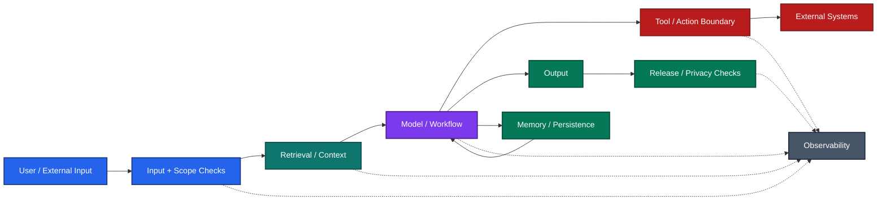

# Guardrails for Production AI

Guardrails often start as an afterthought.

When an AI application is small, it is tempting to rely on the prompt, trust the model, and fix edge cases as they appear. That can work for a prototype. It becomes harder once the application starts reading private data, retrieving documents, calling tools, writing memory, streaming responses, or serving many users.

At that point, guardrails are not one classifier or one safety prompt.

They are the **boundaries that decide what the system is allowed to read, believe, say, store, and change**.

This pack is a practical implementation guide for developers building:

- RAG applications,
- conversational chatbots,
- tool-calling agents,
- multi-agent systems,
- and production AI workflows that combine several of these.

The goal is not to add the maximum number of checks. The goal is to put the **right control at the boundary where the failure can actually happen**.

---

## A simple mental model

The key idea is simple:

> **A control should live where the relevant risk occurs.**

A prompt cannot authorize a payment.  
An output checker cannot undo an email already sent.  
A retrieval filter cannot replace tenant authorization.  
A memory service should not decide what counts as confirmed workflow state.  
A PII filter before the model is not enough if raw values are later stored in traces.

Guardrails are therefore an **application and systems-design problem**, not only a model-safety problem.

---

## Start with the guide that matches your application

You do not need to read every file before starting.

| If you are building... | Start here | Add when needed |
| --- | --- | --- |
| RAG / document Q&A | [01_RAG_GUARDRAILS_IMPLEMENTATION.md](01_RAG_GUARDRAILS_IMPLEMENTATION.md) | Tool-agent guide if the system can take actions |
| Conversational chatbot | [02_CHATBOT_GUARDRAILS_IMPLEMENTATION.md](02_CHATBOT_GUARDRAILS_IMPLEMENTATION.md) | RAG guide for retrieval; tool-agent guide for actions |
| Tool-calling agent | [03_TOOL_AGENT_GUARDRAILS_IMPLEMENTATION.md](03_TOOL_AGENT_GUARDRAILS_IMPLEMENTATION.md) | RAG guide when tools depend on retrieved evidence |
| Multi-agent workflow | [04_MULTI_AGENT_GUARDRAILS_IMPLEMENTATION.md](04_MULTI_AGENT_GUARDRAILS_IMPLEMENTATION.md) | Tool-agent and RAG controls for participating agents |

If your application combines capabilities, combine the relevant guides. A chatbot that retrieves private documents and can update a CRM needs **chatbot + RAG + tool-action controls**.

---

## What each guide is trying to protect

### RAG guardrails

RAG failures are not only hallucinations.

A retrieved document can be:

- relevant but insufficient,
- stale,
- unauthorized,
- contradictory,
- incorrectly parsed,
- or carrying instructions that should never become application policy.

The RAG guide separates:

**retrieval access → evidence sufficiency → generation → answer verification**

so the system can distinguish “we did not find enough evidence” from “the model ignored evidence we already had.”

---

### Chatbot guardrails

Conversation introduces ambiguity and state.

For example:

> “Cancel it.”

That may require clarification.

> “Cancel another customer's order.”

That is an authorization problem.

Those should not receive the same generic refusal.

The chatbot guide covers scope, intent, ambiguity, privacy, streaming, conversation state, and how to prevent old or untrusted conversational content from silently becoming authority.

---

### Tool and agent guardrails

The moment an AI system can change external state, the risk changes.

The important boundary becomes:

**model proposes → application validates → authorized tool executes**

The guide focuses on:

- tool allowlists,
- argument validation,
- resource ownership,
- destination checks,
- approvals,
- idempotency,
- retries,
- uncertain external outcomes,
- and reconciliation after partial failure.

The model may decide what it wants to do. It should not decide whether it is allowed to do it.

---

### Multi-agent guardrails

Multi-agent systems add another problem: one model can now pass bad assumptions, untrusted instructions, or excessive authority to another.

The guide covers:

- delegation limits,
- agent-to-agent trust,
- shared state,
- permission inheritance,
- handoff validation,
- conflicting updates,
- loops,
- and ownership of final decisions.

More agents do not automatically create more reliability. They create more boundaries that need to be explicit.

---

## Production failures and anti-patterns

After designing the application-specific controls, use:

[05_GUARDRAILS_PRODUCTION_ANTIPATTERN_FAQ.md](05_GUARDRAILS_PRODUCTION_ANTIPATTERN_FAQ.md)

This is the practical failure catalogue.

It covers issues such as:

- PII leaking through observability,
- checks happening after external transmission,
- streaming content before validation,
- stale approvals,
- duplicate actions after retry,
- asynchronous paths bypassing synchronous controls,
- unsafe caches,
- memory poisoning,
- unbounded tool calls,
- delegation loops,
- and controls that exist in a design but are not actually enforced at runtime.

This file is useful both **before launch** and **after an incident**.

---

## Verify what is really implemented

A design document saying “we validate permissions” is not evidence that the production path actually does it.

Use:

[06_VERIFY_GUARDRAILS.md](06_VERIFY_GUARDRAILS.md)

The verification guide separates evidence levels:

**DESIGN → CONFIGURATION → IMPLEMENTATION → RUNTIME**

That distinction matters.

A design can be correct while implementation is incomplete.  
A configuration can look correct while one code path bypasses it.  
A successful HTTP response does not prove that a forbidden side effect did not occur.

The verification guide includes stable checklist IDs, evidence requirements, and failure-injection scenarios so reviewers can distinguish **specified**, **implemented**, and **actually observed** controls.

---

## Pre-configured guardrail programs

The folder:

[Pre-configured guardrail programs](../../../skills/unvibecode_gaurdrails_implemenataion_pack/Pre-configured_gaurdrails_programs/)

contains working examples and starter configurations for common controls:

- geography-configurable PII detection,
- intent / scope / clarity classification,
- prompt-injection and jailbreak screening,
- common configuration checks,
- and example guardrail configurations for chatbot, RAG, agent, and multi-agent applications.

These are starting points, not universal production defaults.

Detector choice, threshold, latency, false positives, language coverage, and failure behavior should be validated on the actual application traffic.

---

## Use the cheapest adequate control

Not every guardrail needs another LLM call.

A useful order of preference is:

| Method | Good use |
| --- | --- |
| Deterministic code | permissions, ownership, schemas, quotas, destinations, idempotency |
| Semantic matching / embeddings | intent and supported-scope matching |
| Specialized detector | PII, prompt injection, narrow content risks |
| Small learned decision model | bounded semantic classifications |
| Evaluator LLM | ambiguous contextual checks that simpler methods cannot handle |
| Human review | high-impact uncertainty and unresolved policy decisions |

The important rule is:

> **Probabilistic checks may inform a decision. They should not replace deterministic authority.**

For example, a classifier can decide that a request *looks like* a refund request. It should not decide whether the user owns the order or whether the refund is allowed.

---

## Guardrails are a trade-off

Guardrails add:

- latency,
- cost,
- operational complexity,
- false positives,
- and new failure modes of their own.

So the right question is not:

> “How many guardrails can we add?”

It is:

> **“Which failures matter here, where can they happen, and what is the cheapest reliable control at that boundary?”**

A useful mental model is:

- **internal-facing, low-impact systems** can often use lighter controls;
- **external-facing systems** need stronger scope, privacy, and abuse handling;
- **systems handling uploads, external content, tools, or writes** need stronger boundary enforcement;
- **high-impact actions** need deterministic authorization and recovery regardless of how capable the model is.

---

## A practical way to use this pack

For a new application:

1. Pick the application guide that matches the system.
2. Identify users, data sources, tools, external actions, memory, streaming, and privacy constraints.
3. Design controls at each trust boundary.
4. Define what happens when each control fails.
5. Add production anti-pattern checks.
6. Verify the design against configuration and implementation.
7. Run failure-injection tests in a safe environment.
8. Convert real incidents into regression tests.

For an existing application, start from incidents and known weak points rather than redesigning everything at once.

---

## Use this pack with an LLM

You can give the relevant guide to an LLM with your application context and ask it to act as an implementation reviewer.

A useful prompt is:

> Use the attached guardrails guide to review our application. First summarize the workflow, users, data sources, tools, memory, streaming behavior, privacy constraints, and consequential actions already known. Then ask only the specific unanswered questions that change where a control should live or how it should fail. Do not invent business rules or approvals. After clarification, produce a control matrix, failure paths, acceptance tests, and unresolved decisions. Use deterministic enforcement for permissions and exact constraints. Do not write production code until the design is agreed.

For applications with several capabilities, attach the relevant guides together and ask for one merged design rather than separate duplicated control stacks.

---

## One final principle

Good guardrails should make the AI system **more predictable without pretending the model itself is predictable**.

The model can interpret, classify, retrieve, reason, and propose.

The application should still own:

**identity · permissions · evidence boundaries · execution · state · recovery · observability**

That separation is what turns guardrails from a collection of safety prompts into production engineering.
