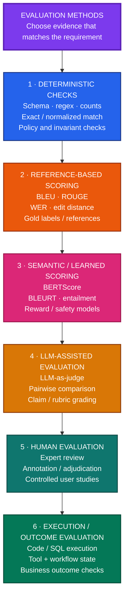

# Evaluation Engineering for Developers

A practical guide to evaluating AI applications: models, RAG, agents, tools, code, data, writing, and chat.

## 1. Start with a failure you need to catch

A cleaner prompt, a cheaper model, or a successful demo does not tell you whether an AI system is ready to ship.

An evaluation turns a requirement into a repeatable experiment:

**case → run application → inspect output/state → score evidence → make a release decision**

For a refund assistant, a fluent answer is not enough. You may need to verify the policy condition, the exact refund amount, authorization, and whether a retry created a second refund.

Start with a small suite built around real requirements:

- normal successful cases,
- boundary and missing-information cases,
- failures that would block release,
- production incidents converted into regressions,
- and a separate holdout that fixes have not been tuned against.

The most important evaluation question is:

> **What failure would matter in production, and what independent evidence would prove that it happened?**

---

## 2. Define the evaluation contract

A useful evaluation is not just a dataset plus a score. Define the contract between the application, scorer, and release decision.

| Field | Define explicitly |
| --- | --- |
| Scope | Task, intended outcome, included/excluded behavior |
| Cases | Representative, boundary, and failure cases |
| Expected outcome | Independent facts, required outputs, permitted/prohibited effects |
| Scorer | What evidence is checked and how |
| Metric | Formula, denominator, aggregation, slices |
| Acceptance | Thresholds and critical failures |
| Execution | Versions, permissions, retries, budgets |
| Result | PASS, FAIL, or INCONCLUSIVE with evidence |

Keep these distinctions clear:

- **metric** — a measurement;
- **scorer** — produces a criterion result;
- **benchmark** — cases plus scoring protocol;
- **evaluation harness** — runs the tests;
- **agent harness** — runs the application being tested.

### Rules that keep scores interpretable

- Define expected outcomes independently of the candidate answer.
- Separate correctness, grounding, completeness, compliance, and usefulness.
- Do not let style scores compensate for critical failures.
- Preserve timeouts, exclusions, evaluator errors, and failed runs.
- Compare candidates on the same cases, permissions, budgets, and versions.
- Use `INCONCLUSIVE` when grading evidence is insufficient.
- Protect hidden tests and gold answers from the system under test.

---

## 3. Choose the evaluation method that matches the requirement

### A practical map of evaluation methods



> These are independent evaluator families, not sequential processing steps. The vertical layout is only for readability.

| Method | Best use | Main limitation |
| --- | --- | --- |
| Deterministic checks | JSON, required fields, counts, invariants | Valid structure does not prove correct meaning |
| Ground-truth / reference | Labels, extraction, constrained outputs | Gold labels can be wrong; many tasks allow alternatives |
| Semantic / learned | Similarity, entailment, safety signals | Needs domain calibration |
| LLM-as-judge | Grounding, completeness, rubric criteria | Bias and judge errors |
| Human evaluation | Ambiguity, expert correctness, usefulness | Cost and disagreement |
| Execution / outcome | Code, SQL, tools, workflow state | Does not grade explanation quality |

A production suite usually combines several methods. For example:

**authorization check + ledger assertion + grounding check + completeness judge**

Critical hard requirements should gate the result before softer aggregation.

---

## 4. Evaluate semantic quality without collapsing everything into one score

Separate the criteria.

| Criterion | Question |
| --- | --- |
| Correctness | Is the statement true? |
| Grounding | Is it supported by the allowed evidence? |
| Completeness | Are required facts/conditions present? |
| Instruction compliance | Were explicit instructions followed? |
| Usefulness | Can the user act on the answer? |

Example: policy says unopened headphones can be returned within 30 days, no fee, with refund five–seven business days after inspection.

Answer: “Yes, returns are free within 30 days.”

That answer may mention true facts while still failing because it omits the unopened condition and refund timing.

### A stronger judge procedure

1. Build the required-information checklist before reading candidate answers.
2. Extract claims while preserving negation, quantity, date, condition, exception, and modality.
3. Check each claim against adequate evidence.
4. Use `SUPPORTED`, `CONTRADICTED`, `INSUFFICIENT`, or `CONFLICTED`.
5. Score omissions separately from claim support.
6. Apply critical-failure gates before aggregation.
7. Record the criterion, evidence ID, verdict, and concise reason.

### Calibrate LLM judges

Use reviewed challenge cases:

- fluent but wrong answers,
- correct but awkward answers,
- missing exceptions,
- changed numbers or negations,
- irrelevant citations,
- short vs verbose variants,
- judge-injection attempts.

Measure false acceptance and false rejection by criterion. Freeze judge model, prompt, preprocessing, and threshold during a comparison.

Agreement with humans helps, but it does not prove truth if humans and the judge share the same misconception.

---

## 5. Check evaluator bias

Common judge biases:

| Bias | Useful diagnostic |
| --- | --- |
| Verbosity | Same facts, different lengths |
| Position | Judge the same pair in both orders |
| Model identity | Hide provider/model names |
| Polish | Compare awkward-correct vs polished-wrong |
| Reference similarity | Accept valid unfamiliar wording |
| Anchoring | Remove candidate-provided scores/verdicts |
| Omission blindness | Delete one required exception |
| Claim-count dilution | Add many easy true claims around one critical error |
| Judge injection | Candidate tells evaluator to ignore rubric |

Preference is not factual correctness. Report preference separately from correctness, grounding, critical failures, cost, and latency.

---

## 6. Apply task-specific checks

### Code

- Run hidden tests, edge cases, invariants, and large inputs.
- For repository repair, check issue-specific behavior plus regressions.
- Score correctness before performance.
- Do not let the solution generator write the only tests that verify itself.

Useful external protocols include LiveCodeBench and SWE-bench, but your own repositories and failure modes still need application-specific tests.

### Agents and workflows

Define:

- initial state,
- permissions,
- available tools,
- required final state,
- prohibited actions,
- budgets,
- and required communication.

Inspect real state, not the assistant's “done” message.

Test failures:

- before commit,
- after external commit but before acknowledgement,
- after acknowledgement but before checkpoint persistence.

Check intermediate actions as well as final state. An unauthorized action that was later reversed is still a failure.

### Data and computation

- Classification: per-class precision/recall plus unknown intent.
- Extraction: critical-field and whole-record accuracy.
- SQL: controlled variants with NULLs, duplicates, date boundaries, and misleading joins.
- Calculations: independently verify operands, units, formula version, and result.

Do not use the same buggy helper to calculate both production output and expected answer.

### Documents and RAG

Evaluate separately:

**parsing → retrieval → reranking → final context → generation**

Measure:

- required evidence recall,
- complete-evidence success,
- unsupported citations,
- omitted exceptions,
- answerability/abstention,
- and final-context evidence retention.

Gold evidence should anchor back to original page/section regions, not unstable chunk IDs.

### Writing and chat

Use deterministic checks for measurable format constraints, verified facts for fidelity, independent checklists for coverage, and calibrated human/model review for usefulness.

For chat, include corrections, ambiguous references, missing facts, conflicts, escalation, and necessary clarification.

---

## 7. Likelihood and probability scoring

Likelihood is useful when the task genuinely requires ranking supplied candidates.

Do not treat high token probability as proof that an answer is true.

When using logprobs:

- follow declared tokenization and normalization,
- verify the API supports scoring the required continuation,
- do not assign zero probability merely because a token is absent from top-k output,
- keep free-form answer accuracy separate from likelihood accuracy.

Calibration and discrimination are different. A well-calibrated model can still have poor accuracy.

---


## 8. Critical production evaluation failures engineers miss

### 1. Evaluator and application share the same bug

The application parser reads `₹18,000` as `₹13,000`. The evaluator uses the same parser, so both agree and the case passes.

**Control:** Build important expected values through an independent verification path.

**Test:** Inject a known parser or calculation defect. The evaluator must still detect the wrong result.

### 2. Judge sees evidence the application never received

Production RAG drops a decisive exception, but the evaluator sees the full source document. The answer is marked wrong, but the report hides whether retrieval, context assembly, or generation failed.

**Control:** Separate:

- **source correctness** — answer vs authoritative truth;
- **context grounding** — answer vs evidence actually supplied to the model.

**Test:** Remove one critical fact between retrieval and final context. The component evaluation should identify that stage.

### 3. Retries make an unstable system look reliable

A model fails first attempt but succeeds after repeated retries. Final task success looks excellent while latency, cost, and duplicate-action risk deteriorate.

**Control:** Track first-attempt success, eventual success, attempts, cost, and latency separately.

**Test:** Inject transient provider failures and compare first-attempt vs eventual success.

### 4. Cases contaminate each other through memory or state

One eval case leaves preferences, cache entries, checkpoints, files, or external state that improve the next case.

**Control:** Define and reset the isolation boundary: messages, memory, cache, checkpoints, temp files, browser/tool state, and external fixtures as required.

**Test:** Run a case alone and after a conflicting case. The result should be identical unless cross-case memory is intentionally tested.

### 5. Agent evaluation checks only final state

The agent performs an unauthorized action and later reverses it. Final state looks correct, so a terminal-state-only evaluator passes.

**Control:** Check trajectory invariants and prohibited intermediate actions as well as final state.

**Test:** Reach the correct final state through one forbidden action. The case must fail.

### 6. Gold answers become stale

Policies, prices, database records, or formulas change while expected answers stay fixed.

**Control:** Version gold outcomes with source revision, effective date, fixture version, and formula/policy version.

**Test:** Change authoritative value A → B and verify the relevant cases update or remain explicitly historical.

### 7. Aggregate scores hide critical failures

A candidate improves style and preference but occasionally duplicates a refund or violates authorization. A weighted average can still rise.

**Control:** Separate critical gates, quality dimensions, and diagnostics. Critical failures should not be averaged away.

**Test:** Give an otherwise excellent answer one deliberate critical violation. Final verdict must remain `FAIL`.

### 8. Evaluator failures disappear from the denominator

Long or difficult cases cause judge timeouts and are silently excluded, making quality appear better.

**Control:** Report attempted, graded, evaluator-failed, excluded, and inconclusive cases separately.

**Test:** Force evaluator failure on a known subset. The apparent application score must not improve automatically.

### Production debugging rule

For a failed case, find the first point where required information or required behavior was lost:

**source → parsing → retrieval → reranking → final context → generation → tool execution → real state**

That is usually more actionable than labelling every wrong answer a hallucination.

---

## 9. Upstream evaluation: parsing, retrieval, and context

A correct final answer can hide a broken retrieval pipeline when the model already knows the answer. Measure each stage directly.

| Stage | Useful measurement |
| --- | --- |
| OCR | CER/WER + critical-field exact match |
| Layout | Reading order and heading/footnote attachment |
| Tables | Correct row/column/value/unit relationships |
| Chunking | Whether required evidence remains jointly available |
| Metadata | Accuracy, missing fields, access labels |
| Indexing | Coverage, update delay, stale/deleted retrieval |
| Query rewrite | Retained/dropped/invented constraints |
| Retrieval | recall@k, precision@k, complete-evidence success |
| Reranking | retained required evidence |
| Context assembly | final-context evidence retention |

Important traps:

- Average OCR accuracy can hide one wrong amount, unit, negation, or row.
- Gold evidence should refer to stable source locations, not chunk IDs.
- Compare retrieval methods under the same token budget.
- Measure evidence after retrieval, reranking, and final context assembly.
- Unauthorized retrieval is a failure even if recall improves.

---

## 10. Use Jev as a fast learned evaluator from TypeScript

Jev is TypeSafe AI's System One model. It is useful when the evaluation question is **bounded but semantic**: grounded/not grounded, which failure category applies, how severe a problem is, or whether a case needs human review.

It exposes three typed primitives:

| Primitive | Best eval use |
| --- | --- |
| `noul` | Calibrated yes/no check |
| `choice` | Pick one label from a closed set |
| `score` | Rate an ordered scale |

Use Jev for **semantic judgment**, not for facts that code can verify exactly.

Good uses:

- Is this answer grounded in the supplied evidence?
- Which failure class best describes this agent run?
- How severe is the policy violation?
- Does this case need human review?
- Which route should handle this evaluation case?

Prefer deterministic checks for:

- exact amounts,
- schema validity,
- authorization,
- duplicate side effects,
- database state,
- execution success,
- and formula correctness.

A practical pattern is:

**deterministic checks first → Jev for semantic criteria → human review below a calibrated confidence threshold**

TypeSafe's workflow evals use the same idea: decompose a larger task into narrow `Noul`, `Choice`, and `Score` judgments, then combine them with ordinary code rather than asking one model to grade everything in a single prompt.

### Install

```bash
npm install @typesafe-ai/sdk
```

Set the API key server-side:

```bash
export TYPESAFE_API_KEY="..."
```

### TypeScript example: grade one RAG answer

```ts
import {
  choice,
  noul,
  score,
  TypeSafeClient,
} from "@typesafe-ai/sdk";

const client = new TypeSafeClient();

type EvalInput = {
  question: string;
  evidence: string;
  answer: string;
};

export async function evaluateAnswer(input: EvalInput) {
  const { answers, usage, model } = await client.systemOne({
    // Pin an explicit model version in a real release gate
    // after calibrating thresholds on your labelled set.
    model: "jev-latest",

    state: {
      question: input.question,
      allowed_evidence: input.evidence,
      candidate_answer: input.answer,
    },

    questions: {
      grounded: noul(
        "Is every material factual claim in the candidate answer supported by the allowed evidence?"
      ),

      completeness: score(
        "How complete is the answer relative to the question and allowed evidence?",
        [
          "misses critical required information",
          "partially complete",
          "mostly complete",
          "complete",
        ]
      ),

      failureType: choice(
        "What is the most important evaluation outcome?",
        {
          pass: "No material correctness, grounding, or completeness failure",
          unsupported: "Contains a material claim not supported by the evidence",
          incomplete: "Misses information required to answer the question",
          conflicting: "The evidence itself is materially conflicting",
          review: "The case is too ambiguous for an automatic verdict",
        }
      ),
    },
  });

  return {
    model,

    groundedProbability: answers.grounded.noul,

    completenessScore: answers.completeness.score,
    completenessConfidence: answers.completeness.confidence,

    verdict: answers.failureType.choice,
    verdictConfidence: answers.failureType.confidence,
    verdictProbabilities: answers.failureType.probabilities,

    usage,
  };
}
```

The output is typed rather than free-form prose. For a `choice`, Jev returns one of the criteria keys plus per-option probabilities. `score` returns a position on the ordered scale and a confidence value. `noul` returns the probability of a yes answer.

### Turn the judge into an evaluation gate

Do not pick thresholds from intuition. Fit them on a labelled calibration set.

For example:

```ts
const result = await evaluateAnswer({
  question: "Can opened headphones be returned after 20 days?",
  evidence:
    "Headphones may be returned within 30 days only if unopened. Refunds take 5-7 business days after inspection.",
  answer:
    "Yes. Headphones can be returned within 30 days with no additional condition.",
});

const hardFail =
  result.verdict === "unsupported" ||
  result.groundedProbability < 0.85;

const needsHuman =
  result.verdict === "review" ||
  result.verdictConfidence < 0.70;

if (hardFail) {
  console.log("FAIL", result);
} else if (needsHuman) {
  console.log("INCONCLUSIVE / HUMAN REVIEW", result);
} else {
  console.log("PASS", result);
}
```

The threshold values above are only examples. Production thresholds should come from your own reviewed labels.

### Calibrate Jev like any learned evaluator

Before using it in a release gate:

1. Create a frozen human-reviewed calibration set.
2. Include fluent wrong answers, omissions, contradictions, long answers, and ambiguous cases.
3. Measure false acceptance and false rejection.
4. Inspect performance by task, language, context length, and failure type.
5. Choose thresholds based on the cost of each error.
6. Pin the Jev model version used for the calibrated release gate.
7. Recalibrate when the model, rubric, preprocessing, or data distribution changes.

Jev probabilities are useful because they let application code distinguish high-confidence automation from uncertain cases. They are still **model outputs**, not ground truth.

### Where Jev fits in the evaluator stack

```text
Exact requirement?
    ↓
Code / DB / execution check
    ↓
Semantic requirement?
    ↓
Jev Noul / Choice / Score
    ↓
Low confidence or high consequence?
    ↓
Human adjudication
```

A strong evaluation harness may therefore use:

**database assertion + authorization check + Jev grounding judgment + Jev completeness score + human review for uncertain cases**

This keeps deterministic truth deterministic while using a learned evaluator only where semantic judgment is genuinely required.

TypeSafe API and SDK references:

- [TypeSafe System One API](https://api.typesafe.ai/docs)
- [Official TypeSafe JavaScript/TypeScript SDK](https://github.com/typesafe-ai/typesafe-sdk-js)
- [TypeSafe workflow evaluations](https://evals.typesafe.ai/)

## 11. Frequently asked questions

### I have exact checks, an LLM judge, and human review. How should they be combined?

Do not immediately collapse them into one weighted score.

Separate:

- **mandatory gates** — authorization, exact amounts, prohibited actions;
- **quality dimensions** — correctness, grounding, completeness, usefulness;
- **diagnostics** — style, preference, latency, cost.

A mandatory failure stays visible even when softer scores improve.

### My LLM judge agrees with humans. What else should I test?

Challenge it with fluent-wrong answers, awkward-correct answers, omissions, changed numbers/negations, length variants, irrelevant citations, and judge-injection text.

Measure false acceptance and false rejection by criterion.

### Two evaluators disagree. Which one wins?

Check what evidence each uses. A deterministic ledger assertion should generally outweigh a preference judgment about the transaction result.

For consequential disagreement, retain both and adjudicate against the authoritative source. Do not average incompatible signals.

### When should I use exact match, semantic similarity, or an LLM judge?

Use the cheapest method that measures the requirement:

- exact/normalized match for constrained values;
- execution for code, SQL, calculations, and state;
- semantic similarity for supplementary wording comparison;
- LLM judge for semantic criteria such as grounding or completeness.

### When are BLEU, ROUGE, or BERTScore useful?

As supplementary signals when reference wording matters. They are weak proxies when many answers are valid.

For release decisions, pair them with requirement-level correctness, grounding, or execution checks.

### How do I know whether the failure is the model or the surrounding system?

Trace the first place the required evidence disappeared: parser, retrieval, reranking, context assembly, generation, or tool execution.

Keep component-level scores alongside final task success.

### Benchmark A says one model is better, but my application eval disagrees. Is one wrong?

Not necessarily. Public benchmarks measure their own tasks and protocol. Your application may differ in language, tools, context length, latency, or failure cost.

Use benchmarks to find candidates; use application evals for qualification.

### How do I evaluate agents with multiple valid trajectories?

Score required final state, prohibited actions, authorization, communication, duplicate effects, budgets, and critical intermediate invariants.

Do not require one exact action sequence unless sequence itself is part of the requirement.

### How do I evaluate RAG when the model already knows the answer?

Measure retrieval separately. Change or remove the authoritative source in controlled cases and require the answer to change or abstain.

Otherwise prior model knowledge can hide retrieval failure.

### How do I test abstention without rewarding refusal everywhere?

Include both answerable and unanswerable cases. Measure false answerability and false rejection separately.

### My average score improved. What slices should I inspect?

Inspect task type, language, context length, source, provider/model route, tool use, answerability, and high-impact actions.

Average improvement can hide a severe regression in a small important slice.

### How should retries be scored?

Declare the retry policy. Report first-attempt success and eventual success separately, plus attempts, latency, and cost.

For side effects, verify logical exactly-once behavior through idempotency or reconciliation.

### When should a case be INCONCLUSIVE rather than FAIL?

Use `INCONCLUSIVE` when grading evidence is unreliable: evaluator outage, corrupted fixture, missing authoritative evidence, or unresolved source conflict.

A known application violation remains `FAIL`.

### What should be stored from an evaluation run?

Keep enough to reproduce the decision:

- case/fixture version,
- application/model/prompt versions,
- provider route,
- evidence IDs,
- tool trajectory and final state,
- scorer/judge versions,
- criterion results,
- evaluator errors/exclusions,
- cost and latency,
- final verdict.

The final aggregate score alone is not enough.

---

## Further reading

1. [LM Evaluation Harness](https://github.com/EleutherAI/lm-evaluation-harness)
2. [Promptfoo](https://github.com/promptfoo/promptfoo)
3. [Inspect AI](https://github.com/UKGovernmentBEIS/inspect_ai)
4. [LiveCodeBench](https://github.com/LiveCodeBench/LiveCodeBench)
5. [SWE-bench](https://github.com/SWE-bench/SWE-bench)
6. [Berkeley Function Calling Leaderboard](https://github.com/ShishirPatil/gorilla/tree/main/berkeley-function-call-leaderboard)
7. [τ-bench](https://github.com/sierra-research/tau2-bench)
8. [RAGChecker](https://github.com/amazon-science/RAGChecker)
9. [SQuAD 2.0](https://github.com/huggingface/evaluate/blob/main/metrics/squad_v2/squad_v2.py)
10. [LongBench](https://github.com/THUDM/LongBench)
11. [IFEval](https://github.com/google-research/google-research/tree/master/instruction_following_eval)
12. [Scikit-learn metrics](https://github.com/scikit-learn/scikit-learn/tree/main/sklearn/metrics)
13. [smolagents](https://github.com/huggingface/smolagents)
14. [AlpacaEval](https://github.com/tatsu-lab/alpaca_eval)
15. [ALCE](https://github.com/princeton-nlp/ALCE/blob/main/eval.py)
16. [Text-to-SQL test-suite evaluation](https://github.com/taoyds/test-suite-sql-eval)
17. [EvalPerf](https://github.com/evalplus/evalplus/blob/master/docs/evalperf.md)
