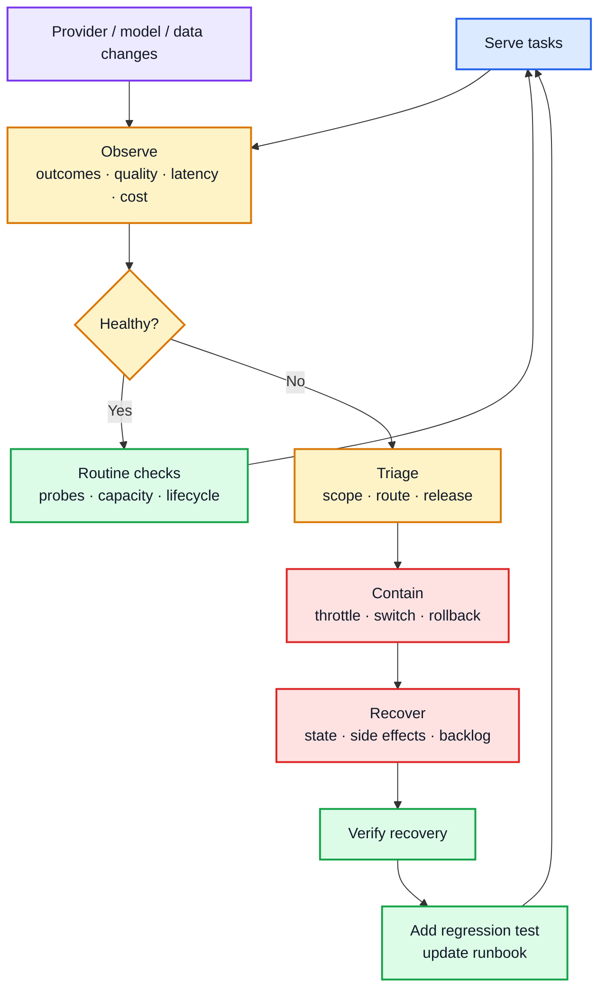
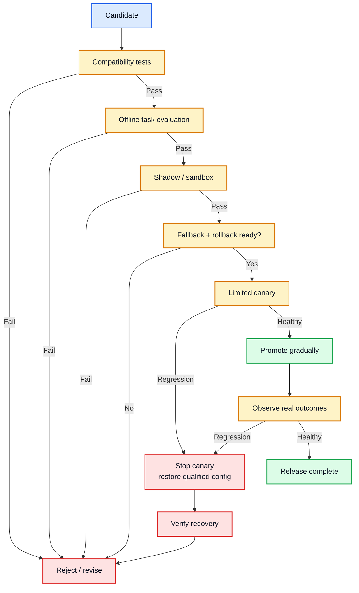
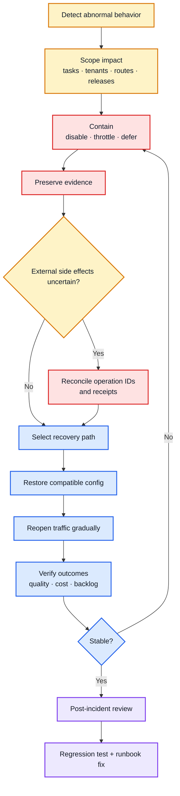

# AI Operations: Running AI Systems in Production

## Scope

This guide covers the day-to-day operation of applications that use model APIs or managed inference endpoints: serving, provider dependencies, routing, releases, recovery, RAG refreshes, long-running agents, and changes to models, tools, and evaluators.

**Training, fine-tuning, and low-level inference optimization—such as GPU scheduling, quantization, kernel tuning, tensor parallelism, and KV-cache engineering—are outside scope.** Application-level token limits, quotas, latency, availability, and cost are included.

AI observability tells you **what happened and why**. AI operations decides **what to do next**: continue, throttle, defer, switch route, rollback, recover, migrate, or retire.

## Contents

1. Keep the application reliable every day
2. Define operating contracts and ownership
3. Run the live service within hard limits
4. Operate provider routes and fallbacks
5. Manage changes to models, tools, APIs, and evaluators
6. Release changes safely
7. Operate RAG, memory, and long-running agents
8. Respond to incidents and recover safely
9. Production failure playbook
10. Worked example: a small model starts underperforming
11. Operating cadence and production checklist
12. Frequently asked questions
13. References

---

## 1. Keep the application reliable every day

AI operations is the loop around a live AI application: serve work, detect meaningful change, intervene when needed, recover safely, and feed incidents back into tests and operating controls.

Typical daily work includes provider/quota issues, latency or cost spikes, index refreshes, agent stalls, uncertain external actions, model changes, and verifying that recent releases still behave correctly.

The goal is not zero change. It is **bounded change with a known recovery path**.

| Area | Daily operating question |
| --- | --- |
| Reliability | Are tasks completing within service limits? |
| Quality | Is the active configuration still meeting task criteria? |
| Capacity / cost | Can current and fallback traffic fit within capacity and budget? |
| Recoverability | Can we stop, switch, reconcile, and restore without losing state or duplicating actions? |

A small team does not need a large platform. It does need explicit limits, ownership, critical probes, a qualified fallback or degraded mode, and a recovery procedure that has been exercised.

## 2. Define operating contracts and ownership

Before production, define what “working” means and who owns each operating decision.

| Area | Define before production |
| --- | --- |
| Task | Acceptance criteria, completion evidence, allowed degradation |
| Serving | Deadline, concurrency, queue capacity, cancellation behavior |
| Providers | Approved routes, quotas, credentials, data constraints |
| Changes | Release owner, evaluation gates, canary, rollback |
| External actions | Authorization, stable operation ID, reconciliation |
| Data / RAG | Source freshness, index version, deletion/refresh ownership |
| Stateful workflows | Checkpoint version, resume/migration policy |
| Incidents | Escalation owner, emergency controls, recovery verification |
| Cost | Task budget, fallback budget, alert thresholds |

One person may own several areas; none should be ownerless.

### Define service objectives per task

Interactive chat, repository analysis, and overnight research should not share one timeout or queue policy.

Track task-level completion, p95/p99 latency, cost per successful task, fallback rate, queue age, cancellation outcome, and unresolved external actions. A cheaper model can increase total cost if it creates more retries or verification.

### Treat the release as a configuration bundle

Do not record only “Model X passed.”

| Field | Purpose |
| --- | --- |
| Configuration ID | Stable release and rollback reference |
| Task eligibility | Tasks, languages, context ranges, allowed actions |
| Model / provider | Explicit model and permitted routes |
| Prompt / settings | Instructions, token limits, generation controls |
| Tool contracts | Schemas, permissions, side-effect behavior |
| Data dependencies | Index, parser, source, embedding/memory versions |
| Guardrails | Policy and enforcement versions |
| Evaluator | Rubric, judge, threshold, sampling |
| Fallback | Qualified alternative and capacity |
| Lifecycle | Candidate, qualified, active, restricted, retired |

Pin explicit versions where available. If only an alias exists, record that limitation.

## 3. Run the live service within hard limits

The model may be probabilistic. Admission, deadlines, retries, budgets, and side effects should not be.

### 3.1 Admission, concurrency, and queues

Before expensive work:

- authenticate and authorize,
- validate input/upload size,
- check task eligibility and quotas,
- check remaining time/cost budget,
- classify work as interactive or durable.

Use bounded concurrency and queues.

| Workload | Typical treatment |
| --- | --- |
| Interactive generation | Low queue tolerance, strict deadline |
| Agent / research | Durable state, longer deadline |
| Parsing / OCR | Background worker pool |
| Embedding / index rebuild | Batch queue |
| Evaluation | Async unless blocking unsafe action |
| Recovery replay | Separate bounded recovery traffic |

Heavy background work should not starve customer-facing traffic.

### 3.2 Deadlines and retries

Give the **task** one overall deadline; each attempt consumes part of it. Avoid retry multiplication across SDK, gateway, worker, and application layers.

Retry only plausibly transient failures. Do not repeatedly retry invalid authentication, unsupported schemas, oversized contexts, permission failures, or expired work.

For sustained failure, stop adding load and restrict the route until controlled probes recover.

### 3.3 External writes require reconciliation

For consequential writes:

1. assign a stable `operation_id`,
2. record the intended action,
3. execute through the authorized tool boundary,
4. store an external receipt where available,
5. reconcile uncertain outcomes before retry.

A timeout may mean the remote action committed but the response was lost. Blind retry can duplicate refunds, messages, orders, or tickets.

### 3.4 Streaming, cancellation, and caching

Separate stopping display, stopping generation, cancelling queued work, and reconciling already-dispatched actions. A disconnected browser does not prove a remote action stopped.

For answer caching, include task scope, source/index version, and configuration version; recheck authorization before returning protected content. Avoid caching authorization decisions or volatile transaction state.

## 4. Operate provider routes and fallbacks

**Routing** chooses an eligible route during normal operation. **Fallback** defines what happens when the intended route cannot complete acceptably.

Changing provider and changing model are separate fallback layers; either can change latency, behavior, tool support, cost, or data handling.

| Situation | Operating response |
| --- | --- |
| Transient provider failure | Bounded retry or qualified fallback |
| Capacity exhaustion | Shed load, queue eligible work, or use reserved fallback capacity |
| Unsupported schema/parameter | Fix configuration; do not silently remove required behavior |
| Quality regression | Restrict affected task route and investigate |
| Safety/policy refusal | Apply application policy; do not route around required restrictions |
| No acceptable fallback | Defer, narrow the task, or escalate |

A fallback must satisfy task requirements: context capacity, schema/tool support, permissions, data policy, latency, quality, and capacity.

### Prove fallback capacity

A fallback that handles one test request may fail under full failover. Test expected concurrency, token throughput, quota, queue growth, cost, and recovery traffic.

Two providers can still share upstream dependencies; multiple names do not guarantee independent resilience.

## 5. Manage changes to models, tools, APIs, and evaluators

Classify the change before deciding the process.

| Change type | Example | Process |
| --- | --- | --- |
| Opportunity | New model or routing method | Candidate evaluation |
| Regression | Existing route degrades | Incident containment + diagnosis |
| Forced migration | Model/API retirement | Deadline-driven replacement |
| Measurement change | New judge/rubric | Evaluator qualification |
| Integration change | SDK/tool schema/API behavior | Contract + recovery testing |
| Data change | Parser/index/embedding/chunking | Retrieval qualification |

Provider-recommended replacements are candidates, not proof of compatibility.

### Use stable probes plus current production samples

Keep both:

- **stable probes** for known regressions,
- **recent production samples** for changing traffic and sources.

| Observation | First investigation |
| --- | --- |
| Probes + production deteriorate | model, route, prompt, settings, dependency |
| Probes stable; production deteriorates | traffic mix, sources, new task types |
| One provider route deteriorates | route-specific capacity/compatibility |
| Judge changes; exact outcomes stable | evaluator calibration |
| Only long inputs fail | truncation, context limits, timeout |

These patterns guide investigation; they do not establish causality.

### Qualify evaluators independently

Before a new evaluator can block releases or drive routing, compare it with human-reviewed labels on frozen outputs. Measure false positives/negatives, disagreements, coverage, cost, and failure rate. Run it in shadow mode first.

Avoid changing the answer model and judge together unless you maintain an overlapping bridge comparison.

Evaluate new models when they address a measured quality, latency, cost, capacity, feature, or lifecycle problem—not just because a benchmark improved.

## 6. Release changes safely

Use explicit gates with complete success and failure paths.

| Gate | Required evidence |
| --- | --- |
| Compatibility | Tools, schemas, limits, data policy, errors |
| Task quality | Important task groups and critical cases |
| Operations | Load, timeout, cancellation, recovery |
| Economics | Total task cost including retries/checks |
| Canary | Real outcomes remain acceptable |
| Rollback | Previous compatible configuration and capacity exist |

Shadow traffic must not create real side effects. Define canary stop conditions before launch. Required exposure depends on risk, traffic, and failure frequency—not a fixed percentage.

Retain the previous compatible configuration during observation. Rollback can restore software configuration; it cannot undo an email, payment, corrupted external record, or incompatible state migration.

## 7. Operate RAG, memory, and long-running agents

Stateful systems make releases and recovery harder than swapping one model call.

### 7.1 RAG and index updates

Build a new index beside the active one, then:

**build → validate → qualify → switch pointer → observe → retire old version**

Validate parsing, retrieval quality, source freshness, access filters, deletion behavior, embedding compatibility, and representative tasks. Keep backfills separate from interactive capacity.

### 7.2 Long-running workflow changes

Version workflow definition, tool contracts, checkpoint schema, model/prompt configuration, and memory policy.

For active tasks decide explicitly:

- finish on old version,
- migrate,
- or stop with a recovery procedure.

Do not terminate a worker casually while it may be inside an external write.

### 7.3 Checkpoints do not guarantee exactly-once side effects

A checkpoint shows workflow state; it does not prove what an external system committed.

Use stable operation identity and reconciliation. On resume, revalidate credentials, approvals, destinations, source freshness, artifact version, and resource authority.

### 7.4 Prevent stale memory from returning

Memory writers and background ingestion can race with corrections or deletions. Store source/version identity and reject obsolete writes so slow jobs cannot restore superseded information.

## 8. Respond to incidents and recover safely

An AI incident can be availability, quality, routing, data, safety, cost, or external-action failure while the API remains technically “up.”

### Incident response sequence

1. **Scope** affected tasks, tenants, routes, releases, and external actions.
2. **Contain** with the smallest effective control.
3. **Preserve** required evidence.
4. **Reconcile** uncertain side effects.
5. **Restore** a qualified compatible configuration.
6. **Reopen** traffic gradually.
7. **Verify** outcomes, quality, cost, latency, and backlog.
8. **Convert** confirmed failures into tests and operating changes.

Prefer scoped controls—one route, tool, source, worker, index, or configuration—over stopping unrelated healthy work.

### What should an AI incident report contain?

| Section | What to capture |
| --- | --- |
| Summary / impact | What failed, who was affected, duration, business/task impact |
| Detection / timeline | How it was found; release, symptom, containment, recovery |
| Trigger / root cause | Immediate trigger and evidence-supported cause |
| Contributing factors | Routing, retries, capacity, missing evals, state |
| Containment / recovery | What changed and how service/state were restored |
| Lessons / follow-ups | What to change, owner, deadline, acceptance test |
| Regression coverage | Test/monitor that should catch recurrence |

### Sample AI incident report

**[An update on recent Claude Code quality reports — Anthropic](https://www.anthropic.com/engineering/april-23-postmortem)**

It is useful because the incident involved application-level quality regressions rather than a simple outage: reasoning-effort defaults, context handling, and a system-prompt change affected different traffic slices. The postmortem explains delayed detection, rollback, and stronger release controls.

### Recovery traffic is still traffic

Queued work and automatic retries can overload a recovered dependency. Classify pending work as still useful, expired, safe to replay, needing reconciliation, or abandoned. Replay in bounded batches.

## 9. Production failure playbook

| Failure | Why the obvious response fails | Operating response / test |
| --- | --- | --- |
| Cheap model degrades on long documents | Global replacement disrupts healthy tasks | Restrict affected segment; requalify matched cases |
| Primary provider fails | Fallback may lack quota | Load-test failover; reserve capacity; shed excess |
| Retry layers amplify outage | Each layer adds attempts | One task deadline / attempt budget |
| Gateway changes provider silently | Model name hides route differences | Restrict routes; record served-route metadata |
| Guardrail service fails | Silent allow may violate policy | Predefine fail behavior; test error states |
| Tool write times out | Remote action may have committed | Reconcile by operation ID before retry |
| User cancels | Remote work may continue | Stop new dispatch; reconcile effects |
| Cross-tenant cache hit | Query text is insufficient scope | Scope-aware key + authorization recheck |
| New index retrieves poorly | Batch success ≠ retrieval quality | Qualify separately before pointer switch |
| New evaluator reports improvement | Grading standard changed | Compare on frozen reviewed outputs |
| Rollback breaks paused workflow | Old code cannot read new state | Test pause/deploy/resume/rollback |
| Fallback violates data policy | Availability expands data boundary | Pre-approve routes; defer if none qualify |
| Quality degrades while API is green | Availability misses semantic failure | Stable probes + task evaluation |
| Recovery causes second outage | Backlog overwhelms restored capacity | Bounded replay + admission control |

For each high-risk failure mode, keep both **an emergency control** and **a recovery test**.

## 10. Worked example: a small model starts underperforming

A support application uses a low-cost model for policy answers and a stronger qualified configuration for complex cases. Long-policy answers begin failing while short answers remain stable.

### Detect
Fixed long-context probes regress on one route; recent production samples show the same pattern; evaluator version is unchanged.

### Investigate
Check source/index version, truncation, provider route, generation settings, prompt/config changes, and integrations. Do not blame model weights before ruling out the surrounding system.

### Contain
Remove the route from long-policy tasks. Use the qualified fallback within tested capacity; queue, narrow, or defer excess work. Keep healthy short-policy traffic unchanged.

### Compare
Evaluate degraded route, fallback, and candidate on the same cases with unchanged grading. Compare task success, critical errors, total cost, p95 latency, and fallback capacity.

### Release
If the candidate qualifies: **offline → shadow → canary → gradual promotion**. Stop on predeclared critical failures.

### Maintain
Update eligibility, qualification records, capacity assumptions, regression cases, and lifecycle status.

## 11. Operating cadence and production checklist

### A manageable operating cadence

| Trigger | Action |
| --- | --- |
| Every release | Compatibility, regression, recovery, rollback checks |
| Scheduled probes | Verify critical behavior through active routes |
| Operational review | Failures, fallback rate, quotas, cost, backlog |
| Provider lifecycle notice | Assign migration owner/deadline |
| Candidate review | Evaluate changes tied to a concrete need |
| Index/data refresh | Build separately, qualify, switch, observe |
| Recovery exercise | Fail a dependency and verify restoration |
| Confirmed incident | Add regression coverage and owned follow-ups |

### Production checklist

#### Serving
- [ ] Task-level deadlines exist.
- [ ] Concurrency and queues are bounded.
- [ ] Interactive and batch work cannot starve each other.
- [ ] Cancellation behavior is defined.
- [ ] Retry policy distinguishes reads from uncertain writes.
- [ ] Cost/capacity are measured per completed task.

#### Providers and routing
- [ ] Eligible providers/models are explicit.
- [ ] Fallbacks passed task compatibility tests.
- [ ] Fallback capacity was load-tested.
- [ ] Safety/data restrictions cannot be bypassed.
- [ ] Sustained failures can be isolated quickly.

#### Releases
- [ ] Full configuration version is recorded.
- [ ] Compatibility and task regression tests pass.
- [ ] Shadow traffic cannot create real writes.
- [ ] Canary stop conditions are predeclared.
- [ ] Previous compatible configuration remains available.

#### Stateful systems
- [ ] RAG/index updates are built beside active versions.
- [ ] Freshness, access controls, and deletions are tested.
- [ ] Checkpoint/state schemas are versioned.
- [ ] Resume revalidates permissions and time-sensitive state.
- [ ] External writes use operation IDs and reconciliation.

#### Incident readiness
- [ ] Emergency switches are scoped.
- [ ] Required evidence can be preserved.
- [ ] Uncertain external actions can be reconciled.
- [ ] Backlog replay is bounded.
- [ ] Recovery checks task outcomes, not only HTTP health.
- [ ] Confirmed incidents create tests and owned follow-ups.

## 12. Frequently asked questions

### Our application is stable. What operating work still needs to happen every week?

Review task failures and fallback usage, provider quotas/lifecycle notices, cost per successful task, critical production probes, queue/backlog health, and recent releases or index changes.

The goal is not constant intervention. It is catching drift before customers become the monitoring system.

### A new model is cheaper and benchmarks better. What evidence do I need before switching?

Benchmark improvement is only a reason to evaluate.

Verify your own important tasks: tools, structured outputs, long context, failure handling, latency, task-level cost, guardrails, and data-policy requirements. Then shadow/canary it before broad rollout.

A cheaper call is not a cheaper task if retries or agent steps increase.

### How do I know whether my fallback is real resilience?

Test it under realistic failover load.

Check RPM/TPM/concurrency, tool/schema support, data policy, latency, cost, and which traffic will be shed if capacity is insufficient.

A fallback that handles one test request is not necessarily a production fallback.

### The provider is degraded but not down. When should I switch?

Use task-level evidence: error rate, tail latency, retries, quality probes, route-specific failures, and remaining fallback capacity.

Restrict only the affected task group when possible; do not move healthy traffic unnecessarily.

### Should the router automatically chase whichever model currently scores highest?

No. Quality scores are noisy and can create route oscillation.

Routing changes should respect task eligibility, minimum evidence, capacity, cost, and policy constraints. Service-failure routing can be fast; quality-driven model changes need stronger evidence.

### A model or API is being retired. How early should migration begin?

Start early enough to identify affected tasks, qualify replacements, test integration/state compatibility, shadow/canary the replacement, and keep recovery options.

The provider's suggested replacement is not your completed migration test.

### Can rollback be my main incident strategy?

Rollback is useful for reversible configuration/code changes, but it cannot undo an email, payment, corrupted external record, deleted data, or incompatible state migration.

Design rollback together with reconciliation and migration recovery.

### When should a long-running agent finish on the old version?

Prefer old-version completion when the run is healthy, dependencies remain available, and migrating state/tool schemas is riskier than finishing.

Migrate only with an explicit state transition and revalidation process. Otherwise stop with a recoverable terminal state.

### An index rebuild completed. Is it ready for production?

Not until parsing, retrieval, access filters, source freshness, deletion propagation, embedding compatibility, and representative end-to-end tasks are qualified.

Switch through a versioned pointer so the old index remains available during observation.

### How should we adopt a new evaluator without breaking the quality trend?

Run it on frozen, already-reviewed outputs. Compare label agreement, false positives/negatives, coverage, cost, latency, and failures.

Keep it in shadow mode first. Do not change the answer model and evaluator together without an overlap period.

### What should trigger a formal AI incident?

Use an incident process when coordinated containment/recovery is required: widespread quality degradation, data exposure, duplicate actions, unsafe outputs, fallback exhaustion, provider failure on critical tasks, runaway cost/loops, or a bad release affecting active workflows.

The dividing line is operational impact and urgency, not whether the root cause is “AI.”

### What is the minimum AI operations setup for a small team?

Start with:

1. configuration registry,
2. task deadlines/retry/cost limits,
3. qualified fallback or degraded mode,
4. stable production probes,
5. canary/rollback release process,
6. operation identity + reconciliation for writes,
7. versioned data/state for RAG and long-running workflows,
8. scoped incident controls,
9. incident → regression-test loop.

## 13. References

1. OpenRouter. [Provider routing](https://openrouter.ai/docs/guides/routing/provider-selection).
2. OpenRouter. [Model fallbacks](https://openrouter.ai/docs/guides/routing/model-fallbacks).
3. Anthropic. [Model deprecations](https://platform.claude.com/docs/en/about-claude/model-deprecations).
4. Langfuse. [Jev-as-a-judge in Langfuse Evaluators](https://langfuse.com/blog/2026-09-22-running-evals-with-jev).
5. Langfuse. [Compare experiments](https://langfuse.com/docs/evaluation/experiments/compare-experiments).
6. LangGraph. [Interrupts](https://docs.langchain.com/oss/python/langgraph/interrupts).
7. Anthropic. [An update on recent Claude Code quality reports](https://www.anthropic.com/engineering/april-23-postmortem). April 23, 2026.
8. UnvibeCode. [AI Observability in Production](https://github.com/FinanceFlash/unvibecode/blob/main/skills/unvibecode-ai-observability/AI_OBSERVABILITY_IMPLEMENTATION_GUIDE.md).
9. UnvibeCode. [Context, Memory, and State Engineering](https://github.com/FinanceFlash/unvibecode/blob/main/skills/unvibecode-context-memory-state/CONTEXT_MEMORY_STATE_ENGINEERING_GUIDE.md).
