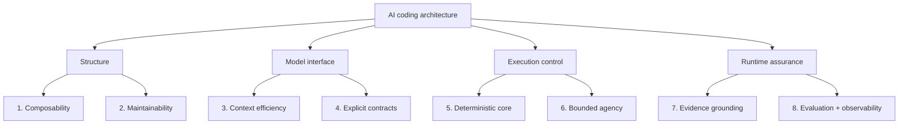
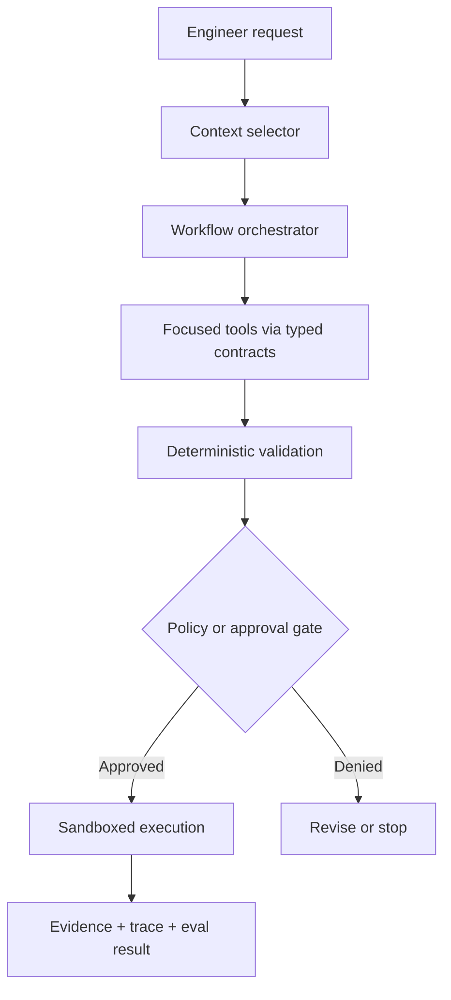

# AI Coding Design and Architecture Principles

> Build AI coding systems as controlled engineering systems—not as one large prompt with unrestricted tools.

These eight principles guide the design of coding agents, repository analyzers, LLM developer tools, plugins, and multi-agent engineering workflows.

Together, they cover how the system is assembled, how the model communicates, how actions are controlled, and how quality is proven.

## Principles at a glance

| Architectural concern | Principle | Core question |
| --- | --- | --- |
| Combining capabilities | Composability over bundling | Can this capability be selected, replaced, or reused independently? |
| Changing the system | Maintainability through single responsibility | Can one behaviour change without surprising unrelated components? |
| Supplying model input | Context efficiency | Is the model receiving the smallest sufficient context? |
| Crossing boundaries | Explicit contracts over prompt conventions | Are inputs, outputs, errors, and effects machine-checkable? |
| Enforcing correctness | Deterministic core, probabilistic edge | Which decisions must code enforce rather than ask the model to remember? |
| Controlling actions | Bounded agency and reversible actions | What can the model affect, and where must humans or policies intervene? |
| Supporting conclusions | Evidence before assertion | Can every important claim be traced to current repository evidence? |
| Proving runtime quality | Evaluation and observability by default | Can we detect regressions and explain one complete run? |

---

## 1. Composability Over Bundling

**Owns:** How capabilities are combined.

- Mix and match plugins based on the task.
- Let workflow orchestrators compose focused plugins and tools.
- Do not force unrelated features into one installation or execution path.
- Keep clear boundaries between discovery, analysis, planning, editing, validation, and publishing.
- Allow one implementation to be replaced without rewriting the complete workflow.
- Prefer capability discovery over hard-coded assumptions about every available tool.

**Avoid:** A mega-plugin that reads repositories, edits code, runs infrastructure, sends messages, and publishes changes through one broad interface.

**Architecture check:** Can a team remove or replace one plugin without changing the other plugins or the business workflow?

---

## 2. Maintainability Through Single Responsibility

**Owns:** How safely the system changes over time.

- Give every plugin, tool, agent, and service one primary responsibility.
- Make updates local: changing a code mapper should not alter deployment or messaging behaviour.
- Isolate dependencies so one provider or framework upgrade has a limited blast radius.
- Remove duplicated parsing, validation, permissions, and retry logic by giving each concern one owner.
- Record non-obvious architectural decisions and version compatibility expectations.
- Keep public interfaces smaller and more stable than internal implementations.

**Avoid:** Several components independently implementing the same rule, each with slightly different behaviour.

**Architecture check:** Can a new maintainer identify where one behaviour lives, change it once, and predict every affected consumer?

---

## 3. Context Efficiency

**Owns:** What information enters the model context.

- Smaller tools and focused context reduce processing time and token cost.
- Retrieve the most relevant files, symbols, relationships, and decisions for the current task.
- Use a concise repository map to navigate before loading complete files.
- Defer large tool descriptions and optional knowledge until the model needs them.
- Remove repeated, stale, generated, or low-signal content.
- Preserve enough surrounding context to understand contracts and side effects—small does not mean isolated.
- Install and expose only the capabilities needed for the workflow.

**Avoid:** Sending the entire repository, every tool schema, and full conversation history on every turn.

**Architecture check:** For every context item, can we explain which current decision it helps the model make?

---

## 4. Explicit Contracts Over Prompt Conventions

**Owns:** How models, tools, agents, and services communicate.

- Define typed input and output schemas for every tool.
- Separate protocol errors, validation errors, business failures, and dependency failures.
- Use stable identifiers, clear descriptions, bounded parameters, and versioned contracts.
- Validate model-generated arguments before execution and validate tool results before reuse.
- Return structured results for machine decisions; reserve prose for explanation.
- Describe material effects such as file writes, network calls, deployments, payments, or messages.
- Make retries and idempotency part of the contract rather than an undocumented caller assumption.

**Avoid:** “The model knows the expected JSON format from the prompt” or parsing critical actions from free-form prose.

**Architecture check:** Can a non-LLM client validate and safely use the same interface without interpreting natural language?

---

## 5. Deterministic Core, Probabilistic Edge

**Owns:** Which decisions are delegated to the model and which are enforced by code.

- Use LLMs for interpretation, classification, exploration, explanation, and candidate generation.
- Use deterministic code for permissions, schema validation, state transitions, financial calculations, limits, and irreversible effects.
- Treat model output as an untrusted proposal until a validator accepts it.
- Encode critical business invariants in code, tests, database constraints, or policy engines.
- Make the execution plan inspectable before applying mutations.
- Fail closed when a high-impact decision is ambiguous or cannot be validated.
- Keep deterministic fallbacks for essential workflows when the model or provider is unavailable.

**Avoid:** Asking the model to remember security rules or to decide whether its own high-impact action is authorised.

**Architecture check:** If the model returns a confident but wrong answer, which independent mechanism prevents invalid state or unsafe execution?

---

## 6. Bounded Agency and Reversible Actions

**Owns:** What the AI may do and how much damage one mistake can cause.

- Grant the minimum tools, functions, data access, and permissions required for the current task.
- Separate read, propose, write, execute, publish, and delete capabilities.
- Run code and commands inside an isolated workspace with explicit filesystem and network boundaries.
- Require human approval for high-impact, external, expensive, or irreversible actions.
- Preserve the initiating user's identity and authorisation scope across tools and delegated agents.
- Add time, turn, token, cost, invocation, and concurrency limits.
- Prefer preview, diff, draft, staged rollout, soft delete, and rollback over immediate permanent mutation.
- Rate-limit and audit actions even when they are authorised.

**Avoid:** Giving a coding agent a general shell, production credentials, unrestricted network access, and permission to publish without review.

**Architecture check:** What is the maximum credible blast radius of one incorrect tool call, compromised context item, or looping agent?

---

## 7. Evidence Before Assertion

**Owns:** How the system supports technical conclusions.

- Connect claims to exact files, symbols, call paths, configuration, tests, logs, or tool results.
- Distinguish observed facts, deterministic deductions, model inferences, and unresolved hypotheses.
- Prefer current repository evidence over generic framework expectations.
- Preserve provenance when one agent summarizes or delegates evidence to another.
- Ask for missing files or runtime evidence instead of inventing behaviour.
- Show conflicting evidence rather than silently choosing the most convenient interpretation.
- Re-check evidence after edits because line numbers, dependencies, and behaviour may have changed.
- State the review coverage and evidence boundaries alongside conclusions; never present a partial analysis as a repository-wide guarantee.

**Avoid:** Reporting a vulnerability, architecture, or completed fix based only on filenames, conventions, or plausible model reasoning.

**Architecture check:** Can a reviewer independently reproduce every high-impact conclusion from the cited repository or runtime evidence, and can they tell exactly what was and was not reviewed?

---

## 8. Evaluation and Observability by Default

**Owns:** How quality is measured and runtime behaviour is explained.

- Build fixed evals from real coding tasks, edge cases, past failures, and adversarial inputs.
- Track task success, test results, invalid edits, permission denials, recovery, latency, and cost.
- Compare prompts, models, tools, and orchestration changes against a stable baseline.
- Trace model turns, tool calls, handoffs, guardrails, retries, approvals, and final outcomes.
- Correlate logs, traces, and metrics with run, task, repository, user, and tool identifiers.
- Redact secrets and sensitive source content before recording telemetry.
- Alert on silent failures such as stuck runs, repeated tool loops, rising denial rates, or missing final artifacts.
- Turn production failures into regression evals and update runbooks with the observed recovery path.

**Avoid:** Judging system quality from a few impressive demonstrations or debugging runs from disconnected console logs.

**Architecture check:** After a model, prompt, or tool upgrade, can we prove quality did not regress and explain any failed run end to end?

---

## Reference Architecture

### How the principles appear in this design

1. The orchestrator composes focused tools instead of depending on one bundled agent.
2. Each component owns one concern and can evolve independently.
3. The context selector supplies the smallest relevant repository evidence.
4. Typed contracts connect the orchestrator and tools.
5. Deterministic validation checks model-generated plans and arguments.
6. Policy, approval, and sandbox boundaries constrain effects.
7. The final response retains evidence for important claims and changes.
8. Traces and eval results make the workflow measurable and diagnosable.

---

## Pre-Build Review

Before adopting an AI coding architecture, answer these eight questions:

- [ ] Can capabilities be composed and replaced independently?
- [ ] Does every component have one clear owner and responsibility?
- [ ] Is the model receiving the smallest sufficient context?
- [ ] Are tool inputs, outputs, errors, and effects explicitly defined and validated?
- [ ] Are critical invariants enforced outside the model?
- [ ] Are permissions, autonomy, cost, and blast radius bounded?
- [ ] Are important conclusions reproducible from current evidence?
- [ ] Can we measure regressions and explain one full production run?

If any answer is unclear, the architecture is not ready for implementation.

---

## GitHub References

The principles above are original synthesis, informed by these open-source specifications and implementations:

1. [OpenAI Agents SDK — tools](https://github.com/openai/openai-agents-python/blob/main/docs/tools.md): focused tools, agents as tools, tool discovery, and deferred loading.
2. [Aider — repository map](https://github.com/Aider-AI/aider/blob/main/aider/website/docs/repomap.md): concise repository structure and relevance-based context selection within a token budget.
3. [Model Context Protocol — tools specification](https://github.com/modelcontextprotocol/modelcontextprotocol/blob/main/docs/specification/2025-11-25/server/tools.mdx): tool discovery, input/output schemas, error separation, validation, human confirmation, and audit expectations.
4. [OpenAI Agents SDK — guardrails](https://github.com/openai/openai-agents-python/blob/main/docs/guardrails.md): checks around agent input, output, and function-tool execution.
5. [OWASP GenAI — Excessive Agency](https://github.com/GenAI-Security-Project/GenAI-LLM-Top10/blob/main/2026/final/LLM03_ExcessiveAgency.md): minimizing tool functionality, permissions, and autonomy while preserving user context and approval.
6. [OWASP GenAI — Improper Output Handling](https://github.com/GenAI-Security-Project/GenAI-LLM-Top10/blob/main/2026/final/LLM10_ImproperOutputHandling.md): treating model output as untrusted before downstream execution or rendering.
7. [OpenAI Evals](https://github.com/openai/evals): repeatable evaluation of LLMs and systems built with LLMs.
8. [OpenAI Agents SDK — tracing](https://github.com/openai/openai-agents-python/blob/main/docs/tracing.md): end-to-end traces for model generations, tool calls, handoffs, and guardrails.
9. [OpenTelemetry Specification](https://github.com/open-telemetry/opentelemetry-specification): common trace, log, metric, and correlation expectations across implementations.
