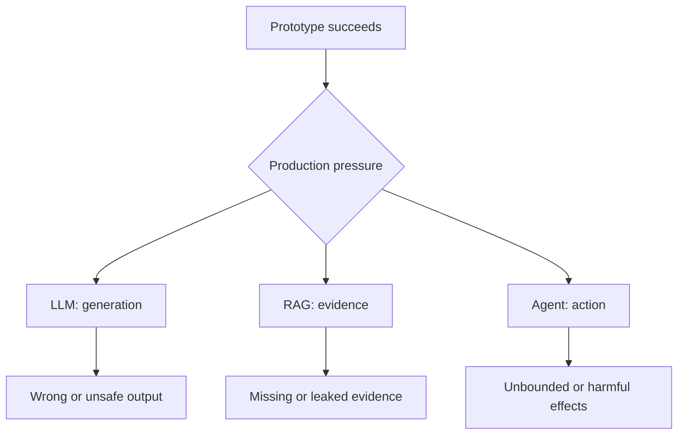
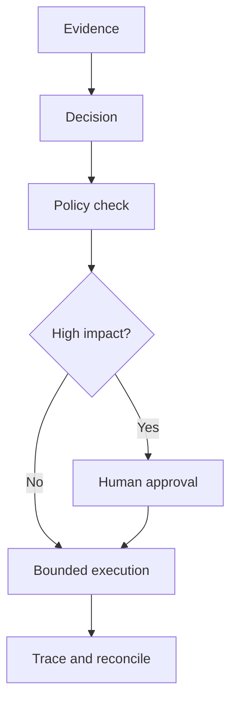

# When AI Goes for a Toss

## Production Anti-Patterns for LLMs, RAG, and AI Agents

> A demo proves that a happy path can work once. Production must prove that the system remains useful, bounded, secure, observable, and affordable when inputs, data, dependencies, and users behave unexpectedly.

Use this guide during design reviews, implementation, red-teaming, and launch readiness. An anti-pattern is not merely “bad code”; it is a shortcut that appears successful early and transfers hidden risk into production.

## The Three Failure Surfaces

These categories are intentionally separated by responsibility:

| Surface | Owns | Typical production failure |
|---|---|---|
| **LLM** | Turning supplied context into a response | Unsupported, malformed, unsafe, or unexpectedly expensive output |
| **RAG** | Selecting and preparing evidence | Missing, stale, poisoned, unauthorized, or misleading context |
| **Agent** | Choosing and executing actions over time | Loops, excessive permissions, duplicated effects, or invisible failures |

---

## 1. LLM Anti-Patterns

### LLM-1. Prompt-Only Enforcement

**Production symptom:** The prompt says “never reveal secrets,” “always return JSON,” or “do not perform forbidden actions,” yet adversarial or unusual inputs bypass the instruction.

**Why it fails:** Prompts influence probabilistic behavior; they are not authorization rules, schema validators, or security boundaries. User content and retrieved content can also conflict with system instructions.

**Use instead:** Keep instructions in the prompt, but enforce critical rules outside the model with access control, typed schemas, allowlists, output validation, guardrails, and policy checks.

**Ship check:** If the model ignores every sentence in the prompt, what deterministic control still prevents the unsafe outcome?

**Primary risk:** Security · Correctness

### LLM-2. The Mega-Prompt

**Production symptom:** Every policy, example, document, tool description, conversation, and fallback is placed into one growing prompt.

**Why it fails:** Relevant signals compete with stale and irrelevant text. Latency and cost rise, instructions contradict one another, and small prompt edits create distant regressions.

**Use instead:** Assemble context per task. Retrieve only relevant policy and evidence, load tools on demand, summarize durable state, and give each context item an owner and freshness rule.

**Ship check:** Can the team explain why every context block is present for this request?

**Primary risk:** Quality · Cost · Latency

### LLM-3. Free-Form Output as an API

**Production symptom:** Downstream code uses regexes or string matching to turn prose into database updates, tool parameters, SQL, file paths, or UI state.

**Why it fails:** Natural language is variable and untrusted. A plausible-looking response can be syntactically malformed, semantically invalid, or hostile when passed to another interpreter.

**Use instead:** Request typed structured output, validate it against a schema, apply domain constraints, encode parameters safely, and reject unknown fields. Treat prose as display content—not executable intent.

**Ship check:** Can malformed, extra, or adversarial fields reach an interpreter or side-effecting API?

**Primary risk:** Security · Reliability

### LLM-4. Vibe-Based Evaluation

**Production symptom:** A few hand-picked prompts look impressive, so the feature ships without a representative test set or explicit acceptance thresholds.

**Why it fails:** Anecdotes conceal long-tail failures. Model, prompt, tool, and retrieval changes can improve a demo while degrading important cohorts or safety cases.

**Use instead:** Maintain versioned eval sets covering normal, edge, adversarial, multilingual, empty, and degraded-dependency cases. Measure task success, groundedness, safety, latency, and cost separately.

**Ship check:** What measured regression would block this release?

**Primary risk:** Quality · Change safety

### LLM-5. Floating Behavior

**Production symptom:** Model aliases, prompts, tool schemas, decoding settings, and safety policies change independently with no recorded release unit.

**Why it fails:** The same request can behave differently without an application code change, making incidents hard to reproduce and rollbacks incomplete.

**Use instead:** Version the complete behavior bundle: model, prompt, tools, retrieval configuration, policies, and eval set. Use staged rollouts, capture the bundle ID in traces, and retain a rollback target.

**Ship check:** Can an on-call engineer reproduce yesterday’s answer using its recorded configuration?

**Primary risk:** Reliability · Operability

### LLM-6. Retry Until It Looks Right

**Production symptom:** Any refusal, invalid response, timeout, or poor answer triggers the same model call repeatedly.

**Why it fails:** Retries multiply cost and latency, may repeat side effects, and rarely correct deterministic failures such as an impossible schema or missing evidence.

**Use instead:** Classify failures. Retry only transient errors with bounded exponential backoff and jitter; repair schema errors deliberately; fall back or abstain for evidence failures; use idempotency around effects.

**Ship check:** Does every retry have a reason, a limit, a budget, and a safe terminal state?

**Primary risk:** Cost · Reliability

### LLM-7. Sensitive Data Everywhere

**Production symptom:** Raw prompts, responses, retrieved passages, tool arguments, chain state, and user identifiers are copied into logs, analytics, evals, and support systems.

**Why it fails:** Observability becomes a shadow data lake with broader access and longer retention than the source systems.

**Use instead:** Minimize context, redact before persistence, separate operational metadata from content, define retention by data class, encrypt sensitive stores, and make debug-content capture explicit and temporary.

**Ship check:** Can the team locate and delete one user’s sensitive AI data across every sink?

**Primary risk:** Privacy · Compliance

### LLM-8. One Model for Everything

**Production symptom:** The most capable model handles classification, extraction, routing, rewriting, reasoning, and every fallback.

**Why it fails:** Cost and latency scale unnecessarily, while simple tasks inherit generative variability that deterministic code or smaller models could avoid.

**Use instead:** Route by task and risk. Prefer deterministic logic first, small or specialized models for bounded tasks, and stronger models only when the expected quality gain justifies the budget.

**Ship check:** Is each model call doing work that cheaper, faster, and more predictable machinery cannot do adequately?

**Primary risk:** Cost · Latency · Predictability

---

## 2. RAG Anti-Patterns

### RAG-1. Vector Search Is the Entire Retrieval Strategy

**Production symptom:** One embedding query and top-*k* nearest neighbors are treated as sufficient for every question.

**Why it fails:** Semantic similarity can miss exact identifiers, rare names, dates, negation, structured filters, and domain-specific relevance.

**Use instead:** Choose retrieval by query type. Combine semantic and lexical search where useful, apply metadata and access filters, rerank candidates, and support exact or structured lookup paths.

**Ship check:** How does retrieval handle an exact error code, invoice number, policy version, or uncommon proper noun?

**Primary risk:** Recall · Answer quality

### RAG-2. One Chunking Rule for Every Document

**Production symptom:** Tickets, tables, API references, contracts, source code, and long-form prose all use the same character count and overlap.

**Why it fails:** Arbitrary cuts separate definitions from conditions, headers from bodies, code symbols from implementations, and table cells from meaning.

**Use instead:** Chunk around semantic structure, preserve parent-child relationships, attach useful metadata, and tune chunking with retrieval evaluations—not intuition alone.

**Ship check:** Does each retrieved unit contain enough local meaning to be interpreted correctly?

**Primary risk:** Context quality · Recall

### RAG-3. Ingest Everything, Trust Everything

**Production symptom:** Any crawled page, upload, email, or generated text enters the knowledge base with equal authority.

**Why it fails:** Untrusted or obsolete content can poison retrieval, inject instructions, impersonate policy, or silently conflict with canonical sources.

**Use instead:** Record provenance, owner, trust tier, version, effective date, and ingestion path. Quarantine untrusted content, scan it, distinguish data from instructions, and define conflict precedence.

**Ship check:** Can the answer explain where its evidence came from and why that source was trusted?

**Primary risk:** Security · Integrity

### RAG-4. Retrieve First, Authorize Later

**Production symptom:** The system retrieves across all tenants or permission levels, then asks the model not to reveal unauthorized passages.

**Why it fails:** Once restricted content enters model context, the confidentiality boundary has already been crossed; prompt wording cannot restore it.

**Use instead:** Enforce tenant, user, document, and field permissions during candidate selection. Propagate identity and policy through the entire retrieval pipeline and test for cross-tenant leakage.

**Ship check:** Can an unauthorized chunk ever enter the prompt, trace, cache, or reranker?

**Primary risk:** Security · Privacy

### RAG-5. Top-K Stuffing

**Production symptom:** When answers are weak, the team increases *k* and fills the context window with more passages.

**Why it fails:** More context is not more evidence. Duplicates, near-matches, and contradictions dilute strong sources, increase cost, and can make the model less decisive.

**Use instead:** Optimize for evidence coverage and diversity. Deduplicate, rerank, cap context by value, detect contradictions, and abstain when evidence is insufficient.

**Ship check:** Can each included passage be tied to a specific information need in the question?

**Primary risk:** Quality · Cost · Latency

### RAG-6. The Index Never Forgets

**Production symptom:** Updates arrive slowly, deletions do not propagate, expired documents remain searchable, and caches outlive source permissions.

**Why it fails:** The system confidently answers from information that the source of truth has changed, revoked, or deleted.

**Use instead:** Define freshness service levels, incremental update and deletion paths, tombstones, cache invalidation, re-crawl policies, and reconciliation jobs against the source of truth.

**Ship check:** What is the maximum time for a critical update, permission change, or deletion to disappear from every retrieval layer?

**Primary risk:** Freshness · Compliance

### RAG-7. Silent Embedding Drift

**Production symptom:** Embedding models, preprocessing, distance metrics, or vector dimensions change while old and new representations coexist without explicit compatibility rules.

**Why it fails:** Retrieval quality degrades invisibly, comparisons become invalid, and rollback may not restore the previous index behavior.

**Use instead:** Version the embedding pipeline and index together. Shadow-test migrations, rebuild or isolate incompatible indexes, compare recall before cutover, and retain rollback data.

**Ship check:** Can every vector be traced to the exact model and preprocessing version that produced it?

**Primary risk:** Recall · Change safety

### RAG-8. Evaluating Only the Final Answer

**Production symptom:** End-to-end answers are judged, but no one knows whether failures originated in query understanding, retrieval, reranking, context assembly, or generation.

**Why it fails:** The team tunes the wrong component and hides retrieval defects behind occasional model guesswork.

**Use instead:** Evaluate the pipeline in layers: candidate recall, ranking precision, permission correctness, evidence coverage, groundedness, citation accuracy, and final task success.

**Ship check:** For a failed answer, can the team identify the first stage that stopped meeting its contract?

**Primary risk:** Diagnosability · Quality

### RAG-9. Citation-Shaped Decoration

**Production symptom:** Answers contain document names or links that look credible but do not point to the exact evidence supporting each claim.

**Why it fails:** Users cannot verify the claim, source updates break the relationship, and citations can create false confidence in unsupported synthesis.

**Use instead:** Preserve stable source, document version, chunk, and passage identifiers through generation. Verify claim-to-evidence entailment and surface conflicts or missing support.

**Ship check:** Can a reviewer open the cited passage and verify the claim without rerunning retrieval?

**Primary risk:** Trust · Auditability

---

## 3. AI Agent Anti-Patterns

### AGENT-1. Agentic by Default

**Production symptom:** A predictable workflow is replaced by an open-ended planner because “the model can decide.”

**Why it fails:** Autonomy adds nondeterminism, latency, cost, new failure paths, and harder testing without necessarily improving the outcome.

**Use instead:** Begin with the least powerful architecture. Use deterministic code for known steps, constrained workflows for limited branching, and an agent only where dynamic planning materially improves results.

**Ship check:** Which decision genuinely requires runtime reasoning rather than an explicit rule or state machine?

**Primary risk:** Complexity · Reliability

### AGENT-2. The God Agent

**Production symptom:** One agent receives every tool, data source, permission, instruction, and business responsibility.

**Why it fails:** Tool selection becomes noisy, context grows, permissions become excessive, and one failure can cross many boundaries.

**Use instead:** Give agents narrow responsibilities and focused toolsets. Compose them through typed handoffs or an orchestrated workflow, with explicit ownership of each decision and effect.

**Ship check:** Can every tool be justified for every request routed to this agent?

**Primary risk:** Security · Maintainability

### AGENT-3. The Agent Authorizes Itself

**Production symptom:** The same model proposes an action, decides whether it is allowed, and executes it.

**Why it fails:** A compromised or mistaken reasoning path controls both intent and enforcement. Model confidence is not permission.

**Use instead:** Enforce policy outside the agent using authenticated user context, least-privilege credentials, resource-level authorization, spending limits, and risk-based approval gates.

**Ship check:** What independent control can deny the action after the agent asks for it?

**Primary risk:** Security · Governance

### AGENT-4. Side Effects Without Idempotency

**Production symptom:** Retries or resumed runs create duplicate emails, charges, tickets, deployments, or database mutations.

**Why it fails:** Distributed failures make “did the action happen?” ambiguous, while models may call the same tool more than once.

**Use instead:** Use idempotency keys, deduplication, explicit operation states, transactional boundaries where possible, and reconciliation for uncertain outcomes. Prefer draft or plan modes before committing.

**Ship check:** If the same tool call is delivered twice, is the business result still correct?

**Primary risk:** Data integrity · Cost

### AGENT-5. Infinite Intern

**Production symptom:** The agent can keep reasoning, searching, delegating, retrying, or calling tools until it decides to stop.

**Why it fails:** Loops and adversarial tasks consume tokens, API quotas, time, and third-party resources while amplifying repeated mistakes.

**Use instead:** Set per-run limits for turns, tokens, time, cost, tool calls, recursion, and concurrency. Add circuit breakers, progress detection, cancellation, and a bounded failure state.

**Ship check:** What is the maximum financial and operational damage of one runaway run?

**Primary risk:** Availability · Cost

### AGENT-6. Shared Memory Soup

**Production symptom:** Conversations, preferences, intermediate reasoning, and tool results accumulate in one long-lived memory shared across users, tasks, or tenants.

**Why it fails:** Stale assumptions and sensitive data leak into unrelated decisions; deletion and provenance become unclear.

**Use instead:** Separate working, session, user, and organizational memory. Define scope, owner, purpose, TTL, consent, write criteria, retrieval filters, and deletion behavior for each layer.

**Ship check:** For every remembered item, can the system answer who owns it, why it exists, who may read it, and when it expires?

**Primary risk:** Privacy · Correctness

### AGENT-7. Delegation Without Contracts

**Production symptom:** Agents hand off prose such as “please handle this” with no typed input, completion condition, error semantics, deadline, or ownership transfer.

**Why it fails:** Work is duplicated, abandoned, recursively delegated, or reported complete without the required result.

**Use instead:** Define typed handoff payloads, preconditions, expected outputs, ownership, timeout, retry policy, cancellation, and terminal states. Trace the parent-child relationship.

**Ship check:** Can the orchestrator distinguish completed, failed, blocked, cancelled, and timed-out work without interpreting prose?

**Primary risk:** Reliability · Operability

### AGENT-8. Approval After the Blast Radius

**Production symptom:** A human reviews a summary only after the agent has sent, purchased, deleted, deployed, published, or changed access.

**Why it fails:** “Human in the loop” becomes ceremony when the irreversible effect has already occurred.

**Use instead:** Place approval immediately before consequential effects. Show the exact target, diff, cost, permissions, and evidence; bind approval to that specific operation and expire it when inputs change.

**Ship check:** Does approval happen before the point of no return, and does it cover exactly what will execute?

**Primary risk:** Safety · Governance

### AGENT-9. Invisible Execution

**Production symptom:** Production records only the user request and final response—not model calls, tool arguments, handoffs, guardrail decisions, state transitions, or costs.

**Why it fails:** Incidents cannot be reconstructed, intermittent behavior cannot be reproduced, and teams cannot separate model failure from tool or policy failure.

**Use instead:** Trace the full run with correlation IDs and version metadata. Record decisions and sanitized inputs/outputs at appropriate boundaries, expose metrics and structured events, and support replay in a safe environment.

**Ship check:** Can on-call explain what happened, where it failed, what it affected, and how much it cost from one run ID?

**Primary risk:** Observability · Incident response

---

## Production Launch Gate

Do not ask only, “Does it work?” Ask, “How does it fail, and what contains the failure?”

### Behavior

- [ ] Representative offline evals exist, with release-blocking thresholds.
- [ ] The model, prompt, tools, policies, retrieval, and eval bundle is versioned.
- [ ] Structured outputs are validated before use.
- [ ] The system can abstain, escalate, or degrade safely.

### Data and Retrieval

- [ ] Authorization is enforced before restricted context is retrieved.
- [ ] Sources have provenance, trust, ownership, versions, and freshness rules.
- [ ] Updates, permission changes, and deletions propagate within a defined target.
- [ ] Retrieval and answer generation are evaluated separately.

### Actions

- [ ] Tools use least privilege and narrow schemas.
- [ ] Consequential operations are idempotent or reconciled.
- [ ] Turn, token, time, tool, recursion, concurrency, and cost budgets are bounded.
- [ ] Human approval occurs before high-impact or irreversible effects.

### Operations

- [ ] Every run has an end-to-end trace with sensitive-data controls.
- [ ] Timeouts, retries, fallbacks, circuit breakers, and terminal states are explicit.
- [ ] A kill switch and rollback path have been exercised.
- [ ] Dashboards and alerts distinguish quality, security, reliability, latency, and cost.
- [ ] Incident ownership is named before launch.

## Fast Review: Warning Signs

| If you hear… | Look for… |
|---|---|
| “The system prompt prevents that.” | Missing deterministic enforcement |
| “We just send more context.” | Retrieval or context-selection defects |
| “The model usually returns valid JSON.” | Missing schema and domain validation |
| “Top five results should be enough.” | Unevaluated retrieval assumptions |
| “The agent will know when to stop.” | Missing budgets and terminal states |
| “Users can approve it afterward.” | Approval placed after the side effect |
| “We can inspect the logs.” | Sensitive content exposure or incomplete traces |
| “The new model is better.” | No task-specific regression evidence |

## GitHub References

These projects and specifications informed the controls above; the anti-pattern descriptions and review questions are rewritten for the UnvibeCode Engineering Cheatsheet.

- [OWASP GenAI Security Project — LLM Top 10](https://github.com/GenAI-Security-Project/GenAI-LLM-Top10): prompt injection, excessive agency, unbounded consumption, misinformation, context exposure, vector weaknesses, and unsafe output handling.
- [OpenAI Agents SDK](https://github.com/openai/openai-agents-python): focused tools, handoffs, guardrails, sessions, human-in-the-loop patterns, and tracing.
- [OpenAI Agents SDK — Guardrails](https://github.com/openai/openai-agents-python/blob/main/docs/guardrails.md): input, output, and tool-level checks with tripwires.
- [OpenAI Agents SDK — Tracing](https://github.com/openai/openai-agents-python/blob/main/docs/tracing.md): traces and spans across model calls, tools, handoffs, and guardrails.
- [OpenAI Evals](https://github.com/openai/evals): repeatable, task-specific evaluation and regression testing.
- [Model Context Protocol — Tools Specification](https://github.com/modelcontextprotocol/modelcontextprotocol/blob/main/docs/specification/2025-11-25/server/tools.mdx): typed tool contracts, validation, user confirmation, timeouts, and audit considerations.
- [Aider — Repository Map](https://github.com/Aider-AI/aider/blob/main/aider/website/docs/repomap.md): relevance-ranked context assembled within a token budget.
- [OpenTelemetry Specification](https://github.com/open-telemetry/opentelemetry-specification): correlated traces, metrics, logs, and resource context for production diagnosis.

---

**UnvibeCode rule:** Let models propose. Let evidence support. Let policy authorize. Let bounded systems execute. Let traces explain.
