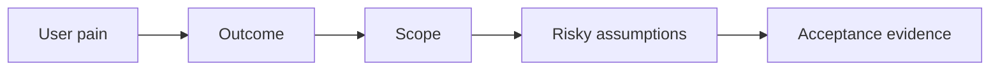

# 00 — Requirements: Build the Right Thing

> A perfectly engineered solution to the wrong problem is still a failure.

## Stop and answer

- [ ] Whose problem are we solving, and what are they unable to do today?
- [ ] What observable change will prove this feature helped them?
- [ ] Is this an experiment, prototype, internal tool, maintained feature, or production-critical system?
- [ ] What must be included now for the outcome to be useful?
- [ ] What is explicitly excluded from this iteration?
- [ ] Which users, platforms, regions, volumes, and accessibility needs are in scope?
- [ ] Which existing contracts, workflows, integrations, and behaviours cannot break?
- [ ] What constraints are fixed: time, budget, latency, technology, privacy, or compliance?
- [ ] Which assumption could make the whole design invalid?
- [ ] What is the cheapest credible test of that assumption before we write most of the code?

## Warning signs

- The requirement describes screens or endpoints but not a user outcome.
- “Everyone” is the target user and “better” is the success metric.
- Stakeholders agree on the feature name but imagine different behaviour.

## Evidence before code

- One-paragraph problem statement
- Measurable success and acceptance criteria
- Must-haves and explicit non-goals
- Constraints and unresolved assumptions
- Named decision-maker who can accept the result

## Ask an LLM or reviewer

> “Separate facts from assumptions in these requirements. Find ambiguity, missing users, hidden constraints, contradictory acceptance criteria, and the smallest experiments that could prove us wrong.”
