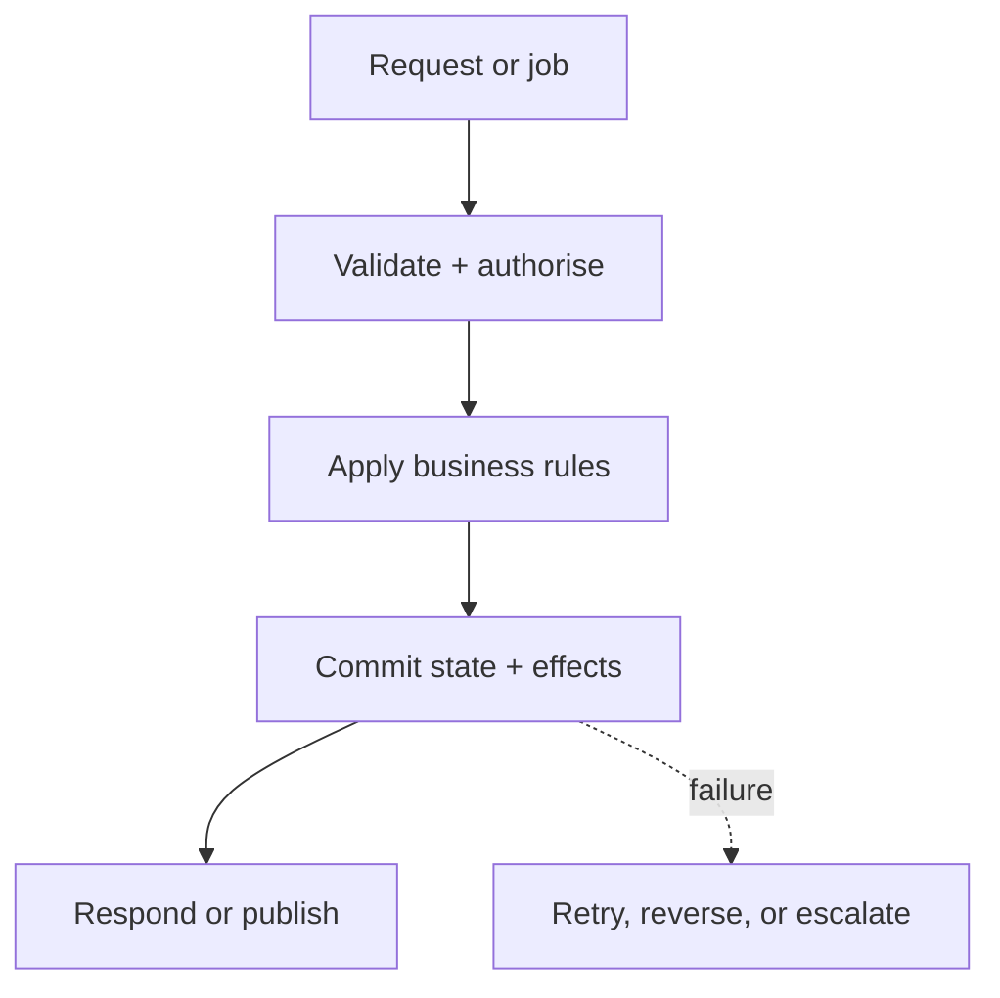

# 01 — Backend: Protect the Business Rules

> The backend is not just a set of endpoints. It is where trusted decisions and business invariants live.

## Stop and answer

- [ ] Which service or module owns this capability and its business invariants?
- [ ] What are the stable request, response, error, pagination, and job-status contracts?
- [ ] Where are authentication, authorisation, payload limits, and business validation enforced?
- [ ] Which calls may be repeated, and how will idempotency prevent duplicate effects?
- [ ] What are the timeout, retry, backoff, cancellation, and circuit-breaker rules for each dependency?
- [ ] What happens during concurrent updates, stale writes, reordered requests, or partial completion?
- [ ] Which operations must be synchronous, and which should become background work?
- [ ] How can failed work be inspected, retried, replayed, compensated, cancelled, or rejected?
- [ ] What happens if required configuration is missing, malformed, or changed during deployment?
- [ ] How can clients and connectors upgrade without breaking current consumers?

## Warning signs

- Authorisation exists only in the UI or gateway.
- Retrying the same request can charge, create, or notify twice.
- A dependency failure returns a generic 500 while leaving unknown state behind.

## Evidence before code

- Interface and error schemas
- Business-rule ownership
- Idempotency and concurrency strategy
- Dependency-failure matrix
- One documented end-to-end integration example

## Ask an LLM or reviewer

> “Attack this backend design with duplicate requests, stale data, concurrency, timeouts, partial failure, missing configuration, rate limits, and dependency changes. Show where business state could become invalid.”
