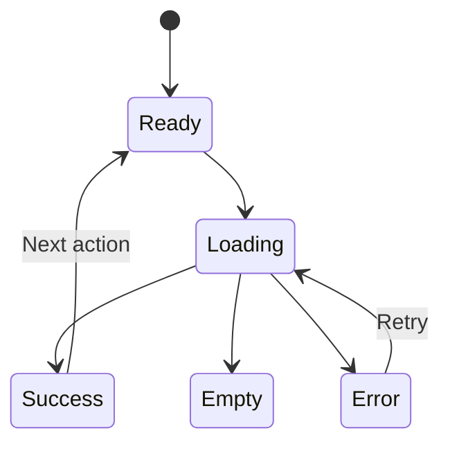

# 02 — Frontend: Design Every State, Not Just Success

> Users experience the states your mock-up forgot: slow, empty, stale, denied, interrupted, and failed.

## Stop and answer

- [ ] What is the shortest path from arrival to the intended user outcome?
- [ ] Which state belongs on the server, in the URL, in shared client state, in a form, or inside one component?
- [ ] What does the user see during loading, empty, partial, successful, invalid, denied, and failed states?
- [ ] How are double-clicks, repeated submissions, stale responses, navigation, and interrupted requests handled?
- [ ] Can the user understand and recover from an error without seeing technical language?
- [ ] Can every important action be completed by keyboard and understood by a screen reader?
- [ ] Does the flow work at high zoom, reduced motion, low vision, narrow screens, and low bandwidth?
- [ ] How will large lists, slow devices, old supported browsers, and weak networks affect the experience?
- [ ] Which server/client contract changes could silently break rendering or expose unsafe content?
- [ ] Are destructive, costly, privacy-sensitive, and irreversible actions explained and protected appropriately?

## Warning signs

- The design contains only the ideal screenshot.
- A disabled button is the only explanation for invalid input.
- Client-side state is treated as proof of identity, access, payment, or completion.

## Evidence before code

- Main journey and alternate paths
- UI state inventory
- Validation and recovery behaviour
- Accessibility acceptance criteria
- Browser, device, network, and performance budgets

## Ask an LLM or reviewer

> “Walk through this UI as a first-time user, keyboard-only user, mobile user, impatient repeat-clicker, slow-network user, and user with stale data. List missing states and irreversible mistakes.”
