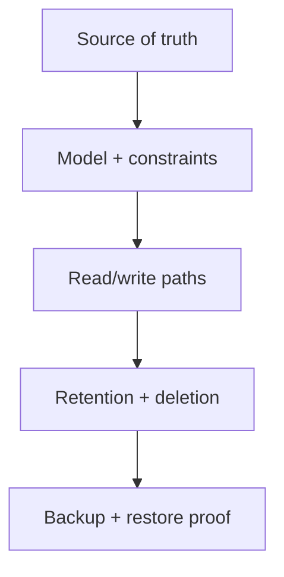

# 03 — Data: Know What Is True

> When two systems disagree, your architecture must already know which one wins.

## Stop and answer

- [ ] What is authoritative for each data item, and which copies are caches, projections, indexes, or derived views?
- [ ] What is the smallest model that correctly represents objects, ownership, relationships, states, and history?
- [ ] Which uniqueness rules, references, and invariants must the database enforce?
- [ ] How are concurrent updates, duplicates, stale versions, and late-arriving changes resolved?
- [ ] How will schema changes remain compatible, be backfilled, monitored, and rolled back?
- [ ] Which queries require indexes, pagination, limits, caching, batching, or archival?
- [ ] Which personal, confidential, financial, or regulated fields are collected, and why is each necessary?
- [ ] What consent, residency, retention, correction, export, deletion, and audit rules apply?
- [ ] What consistency is required for each decision, read, write, and derived view?
- [ ] What backup and recovery objectives apply, and when was a real restore last proven?

## Warning signs

- Several databases are called “the source of truth.”
- Business invariants exist only as comments or UI validation.
- The backup is monitored, but nobody has restored it.

## Evidence before code

- Data ownership map
- Model, constraints, and lifecycle
- Expected access patterns and query plans
- Safe migration and rollback plan
- Tested restore and data-repair path

## Ask an LLM or reviewer

> “Find contradictions in this data model. Test it against duplicates, concurrent edits, deletion requests, schema rollback, large growth, broken references, and disagreement between systems.”
