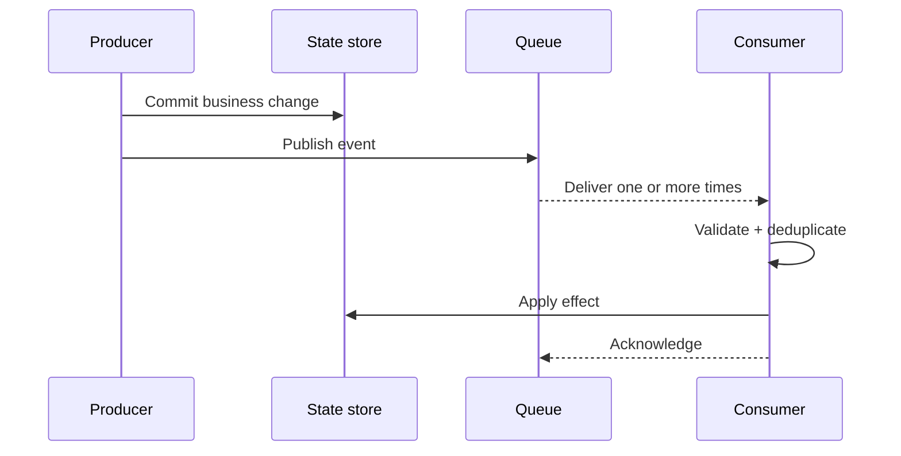

# 04 — Events: Assume Delivery Gets Weird

> Events can be late, duplicated, reordered, replayed, or never processed. Design for that before production teaches you.

## Stop and answer

- [ ] What business fact does the event represent, and is an event better than a direct call or transaction?
- [ ] Who produces it, who consumes it, and who owns its schema and meaning?
- [ ] Which identifier, version, timestamp, tenant, actor, correlation ID, and causation ID must it carry?
- [ ] Is delivery at-most-once, at-least-once, or effectively-once—and what does that mean for the business effect?
- [ ] What happens when an event arrives late, twice, out of order, or after the underlying record changes?
- [ ] What are the retry, backoff, expiry, dead-letter, poison-message, and replay rules?
- [ ] How are database changes and event publication kept consistent when one succeeds and the other fails?
- [ ] How can the schema change while old producers, stored events, and existing consumers remain active?
- [ ] How are webhook signatures, event permissions, freshness, and replay protection verified?
- [ ] How can an operator trace, repair, and safely replay one failed business transaction?

## Warning signs

- The event name describes a command, but consumers treat it as an immutable fact.
- “The queue guarantees exactly once” replaces consumer idempotency.
- Replaying an event can repeat a payment, email, entitlement, or inventory change.

## Evidence before code

- Event catalogue and owner
- Schema and compatibility policy
- Delivery, ordering, and idempotency rules
- Retry, dead-letter, and replay procedure
- Traceable example covering duplicate and out-of-order delivery

## Ask an LLM or reviewer

> “Break this event flow using duplicate, missing, late, reordered, forged, poisoned, and replayed messages. Show which business effects can happen twice or never happen.”
