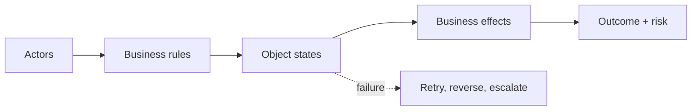

# 05 — Business Workflow: Trace What Actually Changes

> Code succeeds only when the business outcome is correct—not when the endpoint returns 200.

## Stop and answer

- [ ] Which customers, employees, administrators, partners, providers, and internal systems participate?
- [ ] Which business objects change: account, order, payment, booking, entitlement, document, or approval?
- [ ] What states can each object occupy, and which transitions are allowed, forbidden, or irreversible?
- [ ] What is the happy path from trigger to final business outcome, including hand-offs between actors?
- [ ] Which rules must remain true during concurrency, retries, partial failure, and manual correction?
- [ ] Which paths move money, grant access, consume inventory, create obligations, notify users, or expose data?
- [ ] What happens when a user abandons, repeats, skips, reverses, or completes steps out of order?
- [ ] Which failures require retry, refund, reversal, compensation, escalation, or human approval?
- [ ] How could a customer, insider, partner, or bot accidentally or deliberately abuse the workflow?
- [ ] Which outcome and risk metrics will reveal incorrect business behaviour after release?

## Warning signs

- The workflow starts at an API call instead of a business trigger.
- Success is defined by technical completion, not the user’s final state.
- Nobody owns refunds, reversals, stuck cases, or manual reconciliation.

## Evidence before code

- Actors and business objects
- Valid states and forbidden outcomes
- Happy, failure, retry, and recovery paths
- Invariants and material business effects
- Named owner for exceptions and manual operations

## Ask an LLM or reviewer

> “Act as a customer, operator, fraudster, finance owner, and support agent. Find missing states, skipped steps, duplicate effects, permission abuse, unrecoverable failures, and outcomes that look technically successful but are wrong for the business.”
