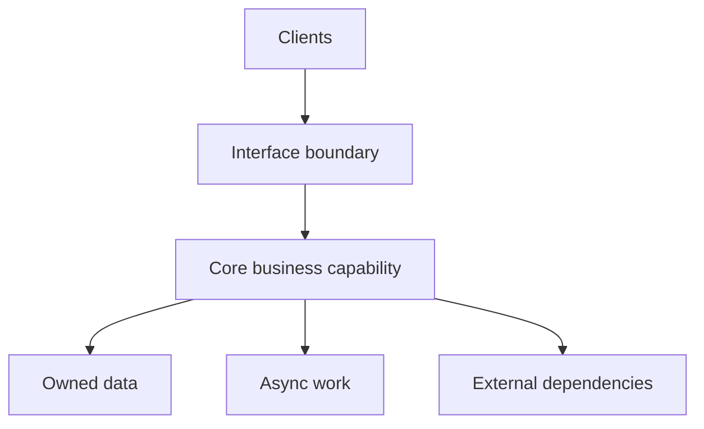

# 06 — System Design: Make Boundaries and Failure Visible

> Good architecture is not the most components. It is the clearest ownership with the smallest acceptable blast radius.

## Stop and answer

- [ ] What is the smallest architecture that meets today’s requirement without blocking expected change?
- [ ] Where are the system, ownership, trust, data, and external-dependency boundaries?
- [ ] Which component owns each business rule and each piece of state?
- [ ] What belongs in a synchronous request, background job, scheduled task, or event flow—and why?
- [ ] What latency, throughput, concurrency, availability, recovery, and cost targets matter?
- [ ] Where is strong consistency required, and where are stale reads or delayed processing acceptable?
- [ ] What degraded behaviour is safe when a dependency is slow, unavailable, rate-limited, or inconsistent?
- [ ] Which timeouts, queues, quotas, isolation boundaries, and kill switches contain failure?
- [ ] What breaks first at 2×, 5×, and 10× expected usage, and which single points of failure remain?
- [ ] Can another engineer understand, operate, replace, or evolve each component from recorded decisions?

## Warning signs

- Components are separated by technology, but business ownership is still ambiguous.
- Availability and scale are described as “high” without numbers.
- Every dependency failure becomes a full-system failure.

## Evidence before code

- Component and ownership map
- Request, event, and data paths
- Capacity and consistency assumptions
- Failure containment and degraded modes
- Decision record with rejected alternatives

## Ask an LLM or reviewer

> “Review this design for unnecessary components, unclear ownership, hidden coupling, inconsistent state, cascading failure, capacity limits, and expensive operations. Propose the simplest credible alternative.”
