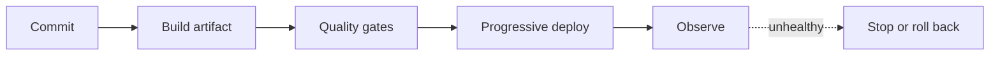

# 07 — DevOps: Design the Release and the Recovery

> “It works locally” is the start of deployment work, not the end of engineering.

## Stop and answer

- [ ] Where will the system run, and how does an approved commit become a traceable artifact?
- [ ] Can development, test, staging, and production be reproduced with explicit differences?
- [ ] How are configuration and secrets delivered, validated, scoped, and rotated?
- [ ] Which endpoints, ports, storage systems, and administration surfaces are reachable, and from where?
- [ ] Which health, readiness, and dependency checks control traffic and rollout decisions?
- [ ] How are application, worker, event-schema, and database changes ordered safely?
- [ ] What rollout strategy limits exposure, and what signal automatically pauses it?
- [ ] How quickly can a bad release be stopped or reversed if data has already changed?
- [ ] What scales automatically, and which quota, cost, dependency, or resource fails first?
- [ ] Can the environment be rebuilt after loss, and who owns releases, credentials, cost, and recovery?

## Warning signs

- Deployment and rollback are undocumented sequences known by one person.
- A health check says “up” while dependencies or business workflows are broken.
- Rollback assumes the database can move backward after irreversible writes.

## Evidence before code

- Build-to-deploy path
- Environment and configuration model
- Exposure and health-check inventory
- Rollout, stop, migration, and rollback plan
- Rebuild, restore, cost, and ownership proof

## Ask an LLM or reviewer

> “Simulate a bad release, failed migration, leaked configuration, unhealthy dependency, capacity spike, and lost environment. Identify where deployment cannot stop safely or recovery depends on tribal knowledge.”
