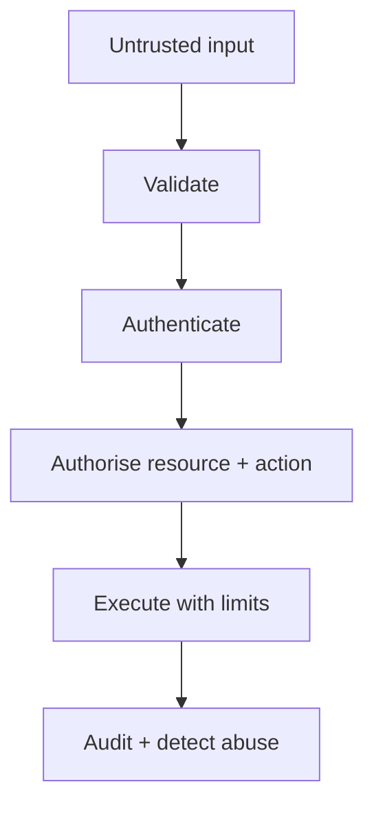

# 08 — Security: Distrust Every Boundary

> Ask not only “Can an attacker get in?” Ask “What trusted action can be abused after they do?”

## Stop and answer

- [ ] What are the most valuable assets, sensitive operations, likely attackers, and trust boundaries?
- [ ] Who may perform each action on each resource, and where is that decision enforced?
- [ ] How are files, URLs, text, queries, headers, rendered content, webhooks, and other inputs constrained?
- [ ] Where could credentials, personal data, confidential content, or tokens leak through logs, errors, analytics, caches, prompts, or exports?
- [ ] Are credentials narrowly scoped, separated by tenant/environment, short-lived where possible, rotatable, and auditable?
- [ ] How could retries, races, bulk actions, invitations, refunds, recovery flows, or quotas be abused?
- [ ] What privacy, consent, residency, retention, deletion, accessibility, licence, and sector obligations apply?
- [ ] Which vendors, dependencies, datasets, models, and build artifacts introduce supply-chain or data-sharing risk?
- [ ] What tamper-resistant evidence records access, approvals, state changes, administrator actions, and configuration changes?
- [ ] How will an incident be detected, contained, investigated, communicated, and recovered from?

## Warning signs

- Possession of a client token, email address, or hidden URL is treated as authorisation.
- Secrets are removed from source but still appear in logs, prompts, or build output.
- Rate limits control traffic volume but not costly or high-impact business actions.

## Evidence before code

- Assets, actors, entry points, and trust boundaries
- Resource-level permission matrix
- Abuse cases and blast-radius controls
- Data flow, vendor, licence, and compliance review
- Audit and incident-response plan

## Ask an LLM or reviewer

> “Threat-model this change as an unauthorised user, compromised account, malicious insider, automated abuser, forged webhook, poisoned dependency, and data-exfiltration attempt. Rank attack paths by impact and plausibility.”
