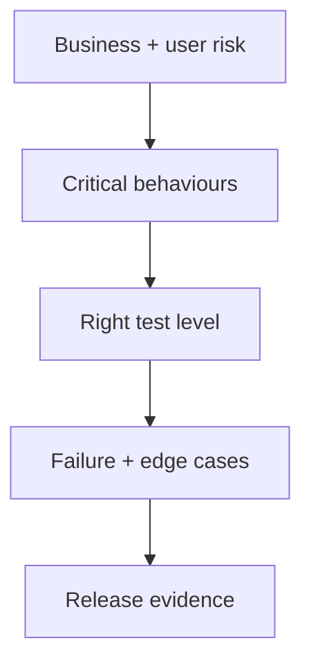

# 09 — Testing: Test Risk, Not Just Code

> A test suite is useful when it catches the failures you cannot afford to ship.

## Stop and answer

- [ ] Which wrong behaviour would create the greatest user, business, security, financial, or operational damage?
- [ ] Which rules need unit tests and which boundaries need contract, integration, end-to-end, load, security, or recovery tests?
- [ ] Are success, boundary, empty, malformed, denied, duplicate, concurrent, timeout, cancellation, and dependency-failure cases covered?
- [ ] Do tests verify the final business effect and persisted state—not only status codes, mocks, or snapshots?
- [ ] Are critical tests deterministic, isolated, repeatable, understandable, and independent of execution order?
- [ ] Where could mocks hide real database, queue, browser, network, clock, provider, or concurrency behaviour?
- [ ] Which lint, type, secret, dependency, licence, migration, and security checks must block integration or release?
- [ ] What realistic data volume, load, device, network, and fault injection is required?
- [ ] Which behaviours require a production-like environment, exploratory testing, accessibility review, or domain expert?
- [ ] If the core behaviour were deliberately broken, would the suite fail for the correct reason?

## Warning signs

- Coverage percentage is treated as proof of correctness.
- Tests confirm internal calls but never check the business outcome.
- Flaky tests are retried until green instead of diagnosed.

## Evidence before code

- Risk-ranked behaviour list
- Test level chosen for each important boundary
- Realistic fixtures and failure cases
- Blocking quality gates
- Named production-like and human checks

## Ask an LLM or reviewer

> “Given these requirements and workflows, produce a risk-ranked test strategy. Find missing boundary, failure, concurrency, permission, recovery, and abuse cases. Explain what mocks cannot prove.”
