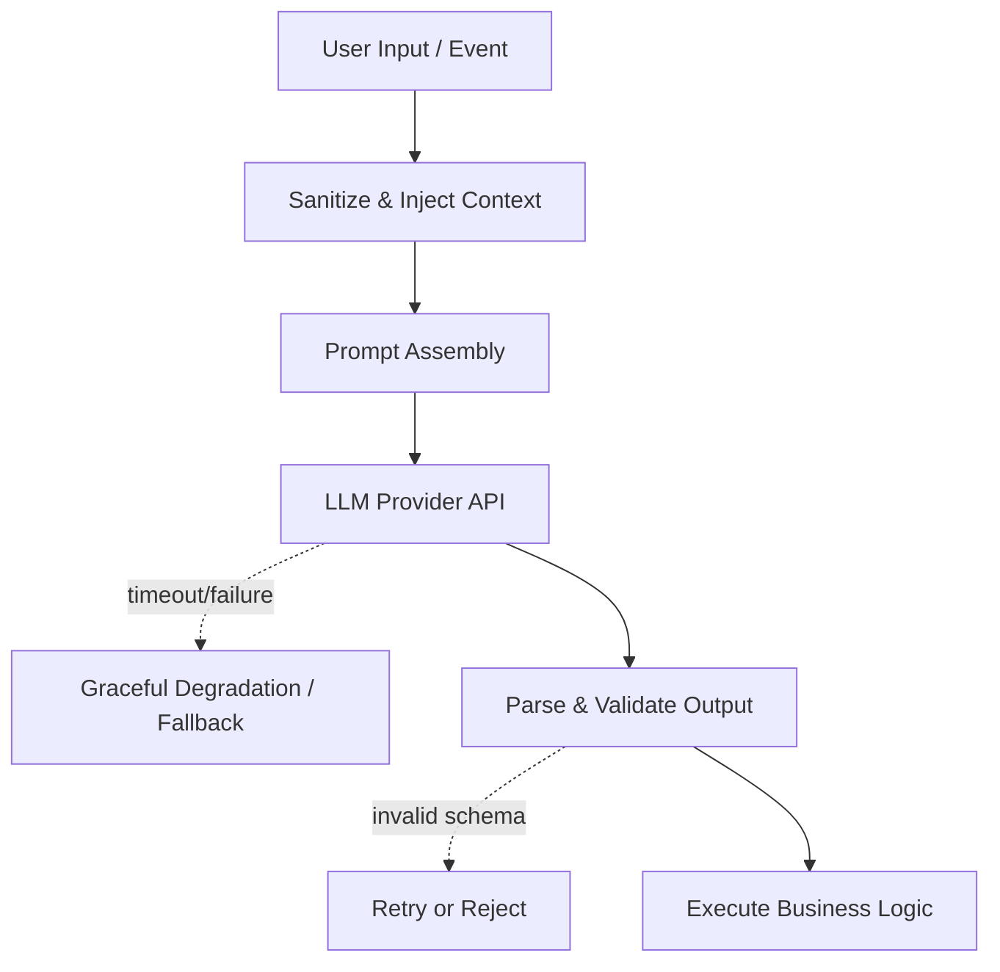

# 11 — LLM Integrations: Context, Safety, and Structured Output

> An LLM is not a deterministic function. It is an unbounded external dependency that requires strict input sanitization, runtime boundaries, and output validation.

## Stop and answer

- [ ] Which component is responsible for enforcing the prompt boundary and preventing prompt injection?
- [ ] How is the context window managed when user input, retrieved evidence, and conversation history exceed token limits?
- [ ] What is the exact fallback behaviour if the LLM provider API times out, rate-limits, or degrades in quality?
- [ ] Where is the LLM output explicitly parsed, typed, and validated before being passed to business logic?
- [ ] What are the exact recovery steps when the model hallucinates an invalid schema or incorrect reference?
- [ ] How are Personally Identifiable Information (PII) and sensitive tenant data scrubbed before leaving the network boundary?
- [ ] Which operations require a human-in-the-loop for approval before the LLM can execute an action?
- [ ] How are token usage, latency, and cost attributed back to a specific tenant or feature?
- [ ] What prevents the model from generating content that violates compliance or brand safety guidelines?
- [ ] How can the application upgrade to a newer model version without breaking the current prompt contracts?

## Warning signs

- The application blindly trusts and executes Markdown, JSON, or code generated directly by the LLM.
- There is no distinction in the prompt between system instructions and untrusted user input.
- A single LLM API failure results in a complete application crash instead of a graceful degradation.

## Evidence before code

- Fallback and retry strategy for the provider API
- Output validation schemas (e.g., Pydantic or Zod)
- Prompt injection and boundary testing plan
- Data sanitization policy for external API calls

## Ask an LLM or reviewer

> “Attack this integration with a 50-second timeout, a malicious user prompt that overrides instructions, and an output that is completely malformed JSON. Show where the system fails to contain the blast radius.”
