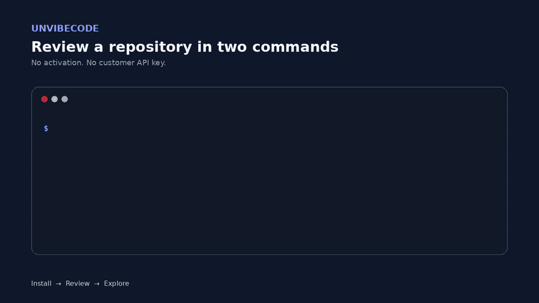
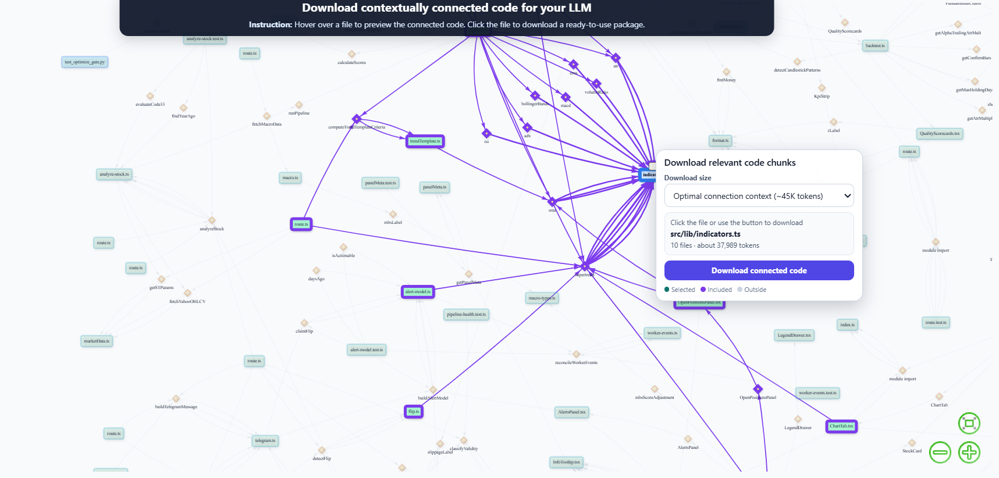
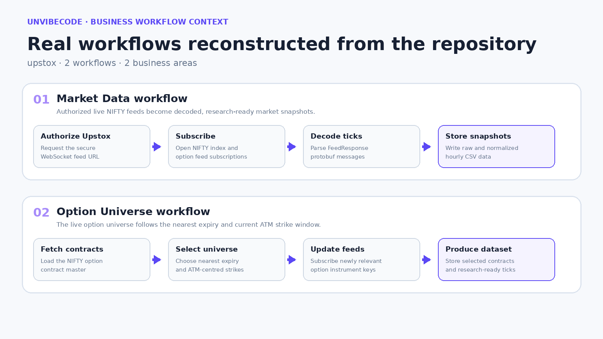
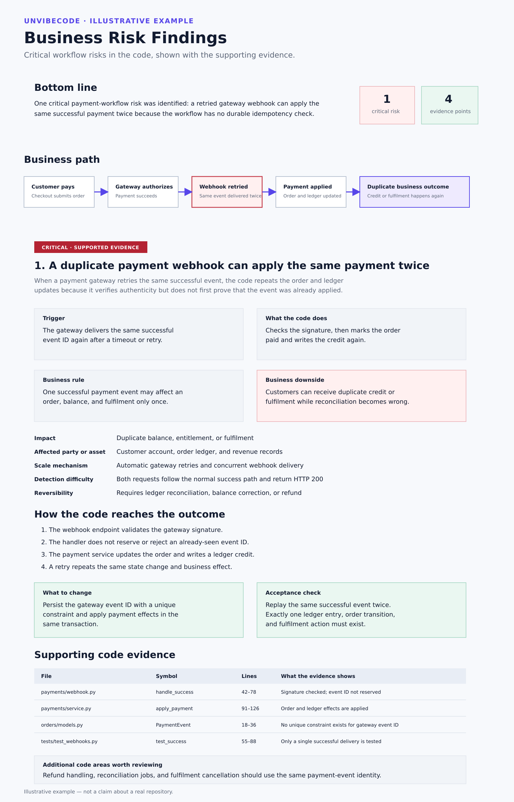

# UnvibeCode

**Unvibe complex code. Trace business workflows.**

Complex code hides connections, workflows, and business risks. **Unvibe it.**

[](https://github.com/FinanceFlash/unvibecode/actions/workflows/test.yml)
[](https://pypi.org/project/unvibecode/)
[](https://pypi.org/project/unvibecode/)
[](LICENSE)

**PyPI project:** [pypi.org/project/unvibecode](https://pypi.org/project/unvibecode/)



Explore connected code in an interactive graph, give LLMs the right context, trace business workflows, and identify critical business risks.

## Who UnvibeCode is for

UnvibeCode is useful when an important business workflow is distributed across multiple files and reviewers need more than isolated file summaries.

| Audience | Their concern | What UnvibeCode gives them |
| --- | --- | --- |
| Product managers | Missing states, edge cases, requirements, and failure paths | Business workflow maps showing decisions, state changes, material effects, and scenarios that require validation |
| Developers | Understanding where a workflow exists across unfamiliar or complex code | Connected entry points, functions, calls, dependencies, effects, and downloadable LLM-ready context |
| Engineering leaders | Prioritizing critical code paths and understanding the consequences of change | Connected workflow paths, affected components, supporting evidence, and risk-focused review priorities |
| Founders | Revenue, customer, operational, permission, and data-integrity risks | Business-risk summaries explaining the trigger, current behaviour, affected workflow, and potential impact |
| QA and test engineers | Determining what should be validated beyond the happy path | Evidence-backed failure paths and structured scenarios that can be converted into test cases |
| LLM users | Giving an LLM enough connected repository context without sending unrelated files | Complete repository context, smaller connected-code packages, and verified relationships |

## When to use UnvibeCode

Use UnvibeCode when you need to:

- Understand an unfamiliar, inherited, legacy, or LLM-generated codebase.
- Trace a business operation that crosses routes, services, state, databases, queues, and external APIs.
- Give an LLM connected repository context without manually selecting files.
- Review registration, payment, booking, subscription, approval, notification, or other multi-step workflows.
- Investigate failure paths involving retries, partial completion, authorization, concurrency, or external dependencies.
- Understand the potential business consequence of a code-level problem.
- Prepare for a significant change to a business-critical workflow.
- Produce a reusable repository-context package for later LLM analysis.

## Review your codebase in two commands

```bash
pip install unvibecode
python -m unvibecode review --repository "/path/to/repository"
```

Windows example:

```powershell
python -m unvibecode review --repository "D:\upstox"
```

No activation key. No OpenAI API key. The repository path is the only required input.

UnvibeCode displays live progress, opens the completed reports, and saves the results automatically under `./shipready_results`.

## One review. Four practical outputs.

### 1. Understand complex code connections

The **Connected Code Map for LLMs** shows how files, symbols, imports, and calls work together.

Hover over a file to preview it. Click the file to trace its connected code and download the relevant code as one compact, LLM-ready package.



### 2. Give LLMs the right repository context

Stop manually selecting files or pasting unrelated code into an LLM.

The **Complete Repository Context** organizes code into reusable chunks with filenames, line references, verified connections, and contextual selections. Use the complete ZIP later, or download a smaller connected-code package directly from the graph.

```text
complete_repository_context_for_llm.zip
├── manifest.json
├── chunks.jsonl
├── connections.jsonl
├── selections.jsonl
└── README.md
```

### 3. Trace code as business workflows

A file tree explains repository structure, but it does not explain how the software performs business operations.

The **Business Workflow Map** connects entry points, decisions, state changes, external calls, and business outcomes into understandable workflows.



### 4. Identify critical business workflow risks

The **Business Risk Findings** report identifies critical workflow risks in the code and shows the supporting evidence.

Each finding explains:

- What triggers the risk
- What the code currently does
- The affected business workflow
- The potential business impact
- What should change
- How to verify the correction
- The exact supporting code evidence

If no finding passes the evidence threshold, the report clearly records a no-findings outcome for the completed review scope.



## How UnvibeCode works

### 1. Map the repository locally

UnvibeCode scans supported source files and resolves meaningful file, symbol, import, and call relationships.

### 2. Build connected LLM context

Code is organized into reusable chunks and connected packages. Selecting a file retrieves the surrounding code needed to understand it without sending the entire repository to an LLM.

### 3. Reconstruct business workflows

Related code paths are interpreted as workflows containing triggers, decisions, state changes, external effects, and business outcomes.

### 4. Review critical business risks

Completed workflows are checked for failures that may affect customers, payments, permissions, data integrity, operations, or other important business outcomes.

### 5. Produce customer-ready results

For a supported repository, the automatically created results folder contains:

```text
shipready_results/
└── analysis_<timestamp>/
    └── customer_results/
        ├── 01_connected_code_map_for_llm.html
        ├── complete_repository_context_for_llm.zip
        ├── 02_business_workflow_map.html
        └── 03_business_risk_findings.html
```

## What UnvibeCode does not replace

UnvibeCode supports code understanding, workflow review, and evidence-based engineering investigation.

It does not replace:

- Unit, integration, end-to-end, load, or penetration testing.
- Manual code review by engineers familiar with the system.
- Security, privacy, legal, or regulatory assessment.
- Production monitoring and incident investigation.
- Validation of business requirements with the responsible product owner.

A reported scenario should be validated against the application's intended behaviour and runtime environment before being treated as a confirmed production defect.

## Repository-size behaviour

Supported repositories receive the complete code, workflow, and risk review.

Repositories above approximately two million estimated source tokens receive the Connected Code Map and Complete Repository Context. The deeper Business Workflow and Risk Review does not run above that threshold.

Read [How UnvibeCode works](docs/HOW_IT_WORKS.md) for details.

## Data processing

Repository parsing, dependency mapping, connected-context preparation, and report rendering run locally.

Structured context required for business workflow and risk analysis is securely sent to the hosted UnvibeCode service. Provider credentials remain server-side.

Review only repositories you are authorized to process.

Read the complete [data-processing explanation](docs/DATA_PROCESSING.md).

## Requirements

- Python 3.11 or newer
- Internet access for hosted business analysis
- Read access to the repository being reviewed

## Support and feedback

For installation problems, failed reviews, report-interpretation questions, public-repository review requests, collaboration enquiries, or general feedback:

- Open a [GitHub issue](https://github.com/FinanceFlash/unvibecode/issues) for reproducible package problems.
- Email [divya.singaravelu@iiml.org](mailto:divya.singaravelu@iiml.org) for product questions, public-repository review requests, or collaboration enquiries.
- Report security vulnerabilities through the process described in [SECURITY.md](SECURITY.md).

When requesting technical support, include:

- UnvibeCode version
- Python version
- Operating system
- Repository language and framework
- Command used
- Sanitized error message
- The report stage that failed

Do not email proprietary source code, credentials, access tokens, secrets, or unsanitized logs.

## Request a public-repository review

Maintaining or evaluating a public repository?

Email [divya.singaravelu@iiml.org](mailto:divya.singaravelu@iiml.org) with:

- The public GitHub repository URL
- The workflow or code area you want to understand
- The question you want the analysis to answer
- Permission to publish the resulting maps or findings, if applicable

Only submit repositories that you are authorized to analyse.

## Documentation

- [Quick start for Windows, macOS, and Linux](docs/QUICKSTART.md)
- [Understanding the four outputs](docs/OUTPUTS.md)
- [How UnvibeCode works](docs/HOW_IT_WORKS.md)
- [Data processing and privacy](docs/DATA_PROCESSING.md)
- [Troubleshooting](docs/TROUBLESHOOTING.md)
- [Public preview policy](docs/PUBLIC_PREVIEW.md)
- [Version history](CHANGELOG.md)

## Contributing, security, and license

- Read the [contribution guidelines](CONTRIBUTING.md) before proposing a change.
- Explore the [pre-built business workflow packs](prebuilt-workflow-paths/README.md) or contribute a new one using the MECE rules.
- Look for a focused starting point in [good first issues](https://github.com/FinanceFlash/unvibecode/labels/good%20first%20issue).
- Reuse and distribution are governed by the repository's [license](LICENSE).
