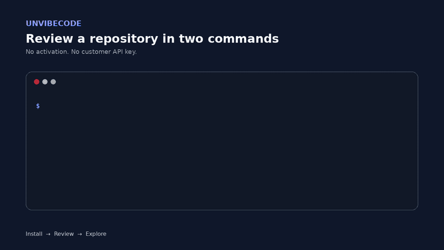
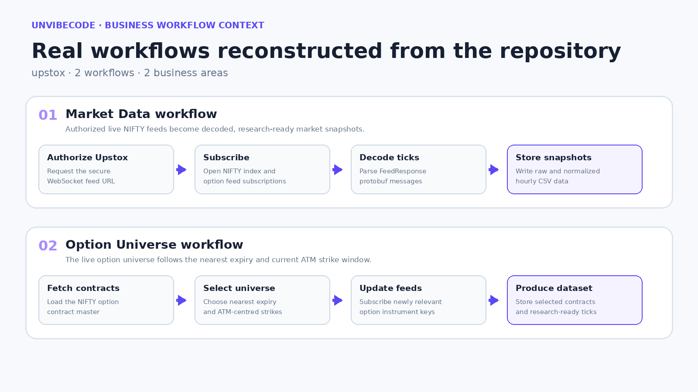
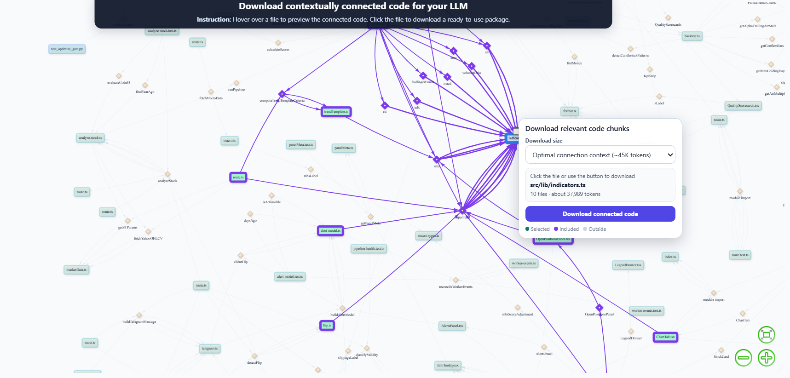
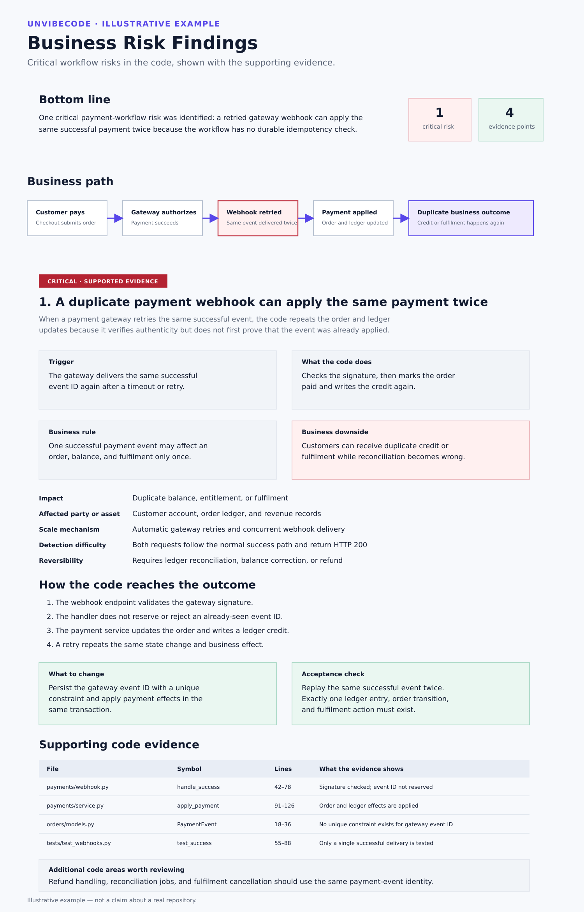
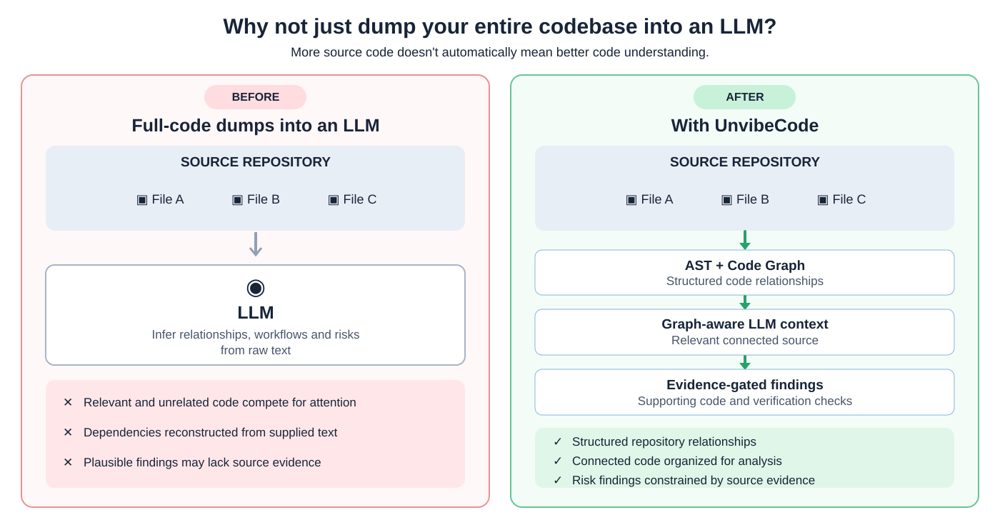

# UnvibeCode

## Reverse engineer a complex codebase into business workflows, connected code, edge cases, and evidence-backed risks.

**⭐ Hit Star to help increase UnvibeCode's visibility among developers.**

*Unvibe complex code. Trace what the business actually does.*



[](https://github.com/FinanceFlash/unvibecode/actions/workflows/test.yml)
[](https://pypi.org/project/unvibecode/)
[](https://pypi.org/project/unvibecode/)
[](LICENSE)

### Your LLM helped write 100,000 lines of code. Now how do you understand what it actually built?

Reading files one by one does not show the complete business workflow. Pasting a large repository into an LLM can also lose the connections between entry points, state changes, dependencies, edge cases, and business outcomes.

**UnvibeCode reverse-engineers a complex codebase into business workflows, connected code, edge cases, and evidence-backed risks.**

## Try UnvibeCode

Requires Python 3.11 or newer.

### Windows

```powershell
py --version
py -m pip install --upgrade unvibecode
py -m unvibecode --help
py -m unvibecode review --repository "D:\path\to\repository"
```

Example:

```powershell
py -m unvibecode review --repository "D:\Projects\customer-support-agent"
```

### macOS

```bash
python3 --version
python3 -m pip install --upgrade unvibecode
python3 -m unvibecode --help
python3 -m unvibecode review --repository "/path/to/repository"
```

Example:

```bash
python3 -m unvibecode review --repository "/Users/yourname/Projects/customer-support-agent"
```

### Linux

```bash
python3 --version
python3 -m pip install --upgrade unvibecode
python3 -m unvibecode --help
python3 -m unvibecode review --repository "/path/to/repository"
```

Example:

```bash
python3 -m unvibecode review --repository "/home/yourname/projects/customer-support-agent"
```

No activation key. No customer OpenAI API key. The repository path is the only required input.

## One repository review. Four connected outputs.

UnvibeCode helps developers understand **what a codebase does, how its components connect, and what could break** — without manually tracing every file.

### 1. Business Workflow Map — Understand what the system does

Reconstruct business workflows from source code. Explore execution paths, decisions, dependencies, state changes, and the implementation behind each workflow.

**Useful for:** onboarding, reverse engineering, understanding legacy applications, and exploring unfamiliar repositories.



### 2. Connected Code Map — Trace where behavior lives

Explore interactive relationships between source files, imports, symbols, and dependencies. Select a file, inspect its connections, and download focused code context for further investigation.

**Useful for:** debugging, dependency tracing, architecture exploration, and preparing connected code for AI assistants.



### 3. Business Risk Findings — Discover what could break

Identify potential business-impacting implementation defects supported by source evidence. Explore affected workflows, implementation behavior, potential impact, remediation, and verification checks.

**Useful for:** investigating business logic defects, reviewing AI-generated applications, and identifying fragile workflows.

Not every repository produces confirmed risk findings. UnvibeCode distinguishes supported findings from cases where evidence is insufficient.



### 4. Complete Repository Context — Take the analysis further

Download a normalized repository ZIP for code review, documentation, or further AI-assisted investigation. Need less code? Use the Connected Code Map to retrieve a focused context package around a selected file.

**Useful for:** engineering handoffs, repository exploration, and reusable source context.

---

## Why not just dump your entire codebase into an LLM?

**More source code doesn't automatically mean better code understanding.**




## What our users are saying

### Understanding complex code

> “The workflow and code maps helped me quickly trace relationships between routes, services, models, and database-related code.”

**Subhankar Nath**

### Finding a real bug

> “The Business Risk Findings report caught a real bug I didn't know about: my meditation-save endpoint always inserts a new row, but the model has a unique constraint on user + date, so a repeat save on the same day throws an unhandled error.”

**Rohit Sanju Patil**

---

### How does UnvibeCode compare?

| Tool | Primary strength | UnvibeCode difference |
|---|---|---|
| **[Aider](https://github.com/Aider-AI/aider)** | AI-assisted code editing | Repository-wide workflow and risk investigation without an editing task |
| **[Repomix](https://github.com/yamadashy/repomix)** | Repository packaging for AI | Interactive code maps, business workflows, and evidence-backed risks |
| **[Qodo PR-Agent](https://github.com/qodo-ai/pr-agent)** | Pull-request review | Understand existing application behavior beyond a proposed code change |
| **[CodeQL](https://codeql.github.com/)** | Static security and correctness analysis | Business workflow explanations connected to implementation and operational consequences |

---

## What's new in v0.3.8?

**A clearer, easier-to-explore repository review experience.**

- **Review results at a glance:** See available outputs, identified workflows, and supported business-risk summaries directly in the CLI.
- **Explore results while analysis continues:** Access the interim Connected Code Map before deeper business analysis finishes.
- **Open reports directly:** The CLI provides interim and final HTML report paths, with clickable links in supported terminals.
- **Cleaner progress updates:** Fewer repetitive messages and no intermediate elapsed-time estimates.
- **More useful final summary:** Find the generated outputs, key workflows, and full results location together.

[View UnvibeCode on PyPI](https://pypi.org/project/unvibecode/)

---

## When should you use UnvibeCode?

**Understanding an unfamiliar repository**

Discover business workflows, connected components, and implementation paths without manually opening every file.

**Reviewing AI-generated applications**

Understand what was actually implemented and investigate potential business logic defects.

**Debugging across multiple files**

Trace dependencies and surrounding code before changing a function in isolation.

**Investigating application risks**

Review source-backed findings and understand potential operational consequences.

**Preparing context for AI coding assistants**

Download complete repository context or focused connected code for further investigation.

---

## Supported source languages

Connected-code mapping and context preparation recognize:

| Language | File types |
|---|---|
| Python | `.py` |
| JavaScript | `.js`, `.jsx`, `.mjs`, `.cjs` |
| TypeScript | `.ts`, `.tsx` |
| Rust | `.rs` |
| PHP | `.php` |
| Ruby | `.rb` |
| HTML and CSS | `.html`, `.htm`, `.css` |

Analysis depth varies by language and repository structure. See [limitations](docs/LIMITATIONS.md) for details.

---

## Documentation

- [Quick Start](docs/QUICKSTART.md)
- [Understanding the Four Outputs](docs/OUTPUTS.md)
- [How UnvibeCode Works](docs/HOW_IT_WORKS.md)
- [Limitations and Responsible Use](docs/LIMITATIONS.md)
- [Data Processing and Privacy](docs/DATA_PROCESSING.md)
- [Troubleshooting](docs/TROUBLESHOOTING.md)
- [Public Repository Reviews](docs/PUBLIC_PREVIEW.md)

## Contributing

Contributions are welcome in documentation, testing, examples, and supported tooling.

- [Contribution Guidelines](.github/CONTRIBUTING.md)
- [Good First Issues](https://github.com/FinanceFlash/unvibecode/labels/good%20first%20issue)
- [Pre-built Workflow Packs](prebuilt-workflow-paths/README.md)

## Support and feedback

Found a problem or have a feature request? [Open a GitHub issue](https://github.com/FinanceFlash/unvibecode/issues).

For product questions, repository reviews, or collaboration, contact [divya.singaravelu@iiml.org](mailto:divya.singaravelu@iiml.org).

## License

See [LICENSE](LICENSE) for reuse and distribution terms.
