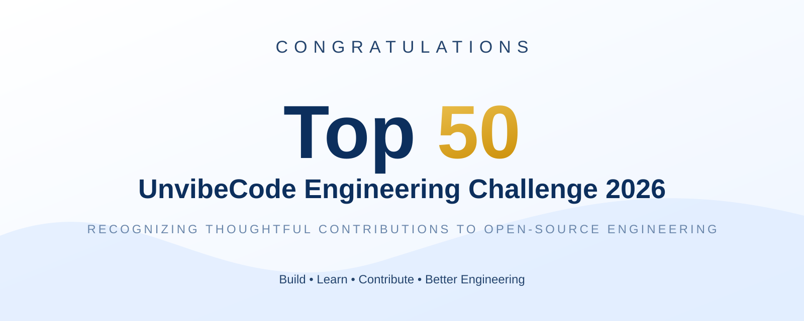

# Neha Hegde

## Top 50 — UnvibeCode Engineering Challenge 2026

**Credential ID:** UVC26-TOP50-045  
**Issued by:** Alphashots.ai  
**Issue date:** September 2026  
**Status:** Verified Top 50 Recognition  
**Recognition:** Ranked Top 50 — UnvibeCode Engineering Challenge 2026

---

## Recognition

Neha Hegde ranked among the **Top 50 participants** in the UnvibeCode Engineering Challenge 2026.

This recognition reflects the quality and relevance of the participant's contribution to reviewing and improving UnvibeCode as an open-source engineering project.

---

### What is UnvibeCode?

UnvibeCode reverse-engineers a complex codebase into business workflows, connected code, edge cases, and evidence-backed risks.

---

### Explore

[**Reverse engineer a complex codebase with UnvibeCode**](https://github.com/FinanceFlash/unvibecode)

[**AI Engineering Cheatsheet**](https://github.com/FinanceFlash/unvibecode/tree/main/AI%20Engineering%20Cheatsheet)

---

