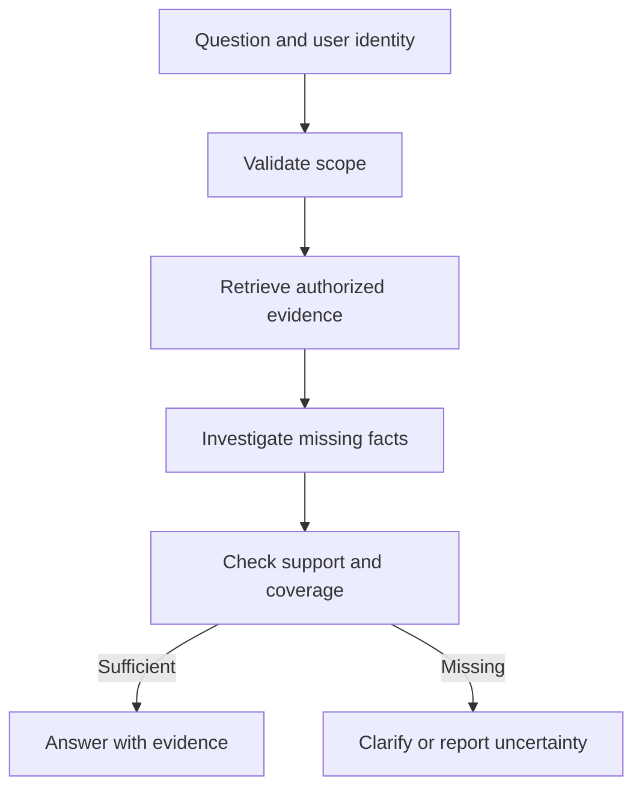

# Agentic AI engineering: a practical developer roadmap

You do not need to learn every agent framework before building something useful. You need to understand how a model chooses actions, how tools expose real capabilities, and how the application checks that the work actually succeeded.

Start with a small system you can inspect. Give it one meaningful task, a few well-defined tools, and explicit acceptance checks. Then introduce retrieval, persistence, or multiple agents only when the task needs them. Each addition should solve a measured limitation and come with a test that exposes its failure modes.

This roadmap adapts the topic coverage of *Complete Roadmap to Become an Agentic AI Engineer in 2026*, by Lamhot Siagian, dated January 19, 2026. Source page references below use the printed page numbers. The learning projects, completion gates, and corrections are editorial additions for developers building applications.

## Contents

1. What to keep and what to change
2. A build-first learning sequence
3. Corrections that matter in production
4. Choose a framework by requirements
5. A concrete project to develop in stages
6. Production debugging checklist
7. Frequently asked questions
8. Sources and companion guides

## 1. What to keep and what to change

The source covers Python, LLM concepts, frameworks, memory, tools, RAG, agents, and deployment. Its strongest advice is to use typed interfaces, narrow tool boundaries, explicit state, evaluation, and operational controls.

For implementation, change the learning order:

| Source emphasis | Developer-oriented treatment |
|---|---|
| Interview answers by topic | Build a capability and demonstrate its failure behavior |
| Framework selection before tools and RAG | Build a small tool-using system before choosing abstractions |
| LCEL and runnables as a separate advanced stage | Learn composition and state transitions first; framework syntax is optional |
| Evaluation discussed throughout | Establish a small evaluation suite with the first working feature |
| Memory as a major early capability | Add only the persistence or recall the task requires |
| Deployment near the end | Exercise restart, authorization, and failure handling during development |
| Multi-agent roles as an architectural option | Require a measurable reason for each split |

Python is a useful path through the source, not a mandatory language for all agent systems. Keep domain knowledge and existing team capabilities in the decision.

## 2. A build-first learning sequence

### Stage 1: Build reliable tool adapters

**Learn:** Typed request/response models, API clients, exceptions, async I/O, resource cleanup, configuration, and dependency management. The source covers these on pages 2–3 and 12–13.

**Build:** A read-only search tool with bounded inputs, request deadlines, pagination, and structured outcomes.

**Completion gate:** Distinguish invalid arguments, permission denied, rate limiting, timeout, successful-empty results, and truncated results. Demonstrate that credentials do not enter logs.

**Overlooked difficulty:** Async improves concurrency for I/O; it does not make blocking code non-blocking. A synchronous client inside an async handler can still stall other requests. Bound concurrency rather than launching every request at once.

### Stage 2: Connect one model to a bounded task

**Learn:** Tokens, context limits, instructions, structured outputs, tool selection, and model configuration. See source pages 4–5.

**Build:** A model that selects a read-only tool or asks for missing information. Validate its proposed arguments before execution.

**Completion gate:** The application rejects unknown tools, invalid values, unauthorized resources, and missing required inputs. A model's plausible explanation must not bypass validation.

**Overlooked difficulty:** Valid schema is only one layer. A customer identifier can be syntactically correct and still belong to another tenant.

### Stage 3: Add evaluation before adding autonomy

**Learn:** Independent expected outcomes, deterministic checks, semantic scoring, negative cases, and regression comparisons.

**Build:** A small suite covering successful tasks, ambiguous input, missing evidence, tool failures, and forbidden actions.

**Completion gate:** Known-wrong outputs fail for the intended reason. Record timeouts and grader failures instead of silently excluding them.

**Overlooked difficulty:** Exact prose snapshots are brittle. Test required facts, actions, and state; use snapshots for stable structured artifacts where appropriate.

### Stage 4: Build an explicit execution loop

**Learn:** State transitions, action/observation loops, stopping conditions, retry classes, and partial results. See source pages 8–9 and 16–17.

**Build:** A single agent that can investigate, inspect tool feedback, and revise its next action.

**Completion gate:** It terminates on success, missing prerequisites, exhausted budget, and repeated failure. It reports what remains unresolved.

**Overlooked difficulty:** A maximum step count bounds the run but does not detect lack of progress. Track repeated calls together with relevant state changes; do not block legitimate retries after transient failures.

### Stage 5: Add evidence retrieval if the task requires it

**Learn:** Parsing, structured lookup, lexical/dense retrieval, metadata, evidence selection, and answerability. See source pages 14–15.

**Build:** A document assistant using a small versioned corpus containing exceptions, tables, obsolete material, and unanswered questions.

**Completion gate:** Verify original-source values, required-evidence coverage, citation support, and appropriate abstention. Test access restrictions before retrieved material reaches the model.

**Overlooked difficulty:** Retrieval can succeed while context assembly drops the decisive exception. Measure evidence at parsing, retrieval, reranking, and final-context boundaries.

Do not introduce a vector database by default. Exact identifiers may belong in database queries; arithmetic belongs in code; small corpora may work with simpler search.

### Stage 6: Add durable state and selective memory

**Learn:** Checkpoints, artifacts, session state, reusable memory, provenance, retention, and conflict handling. See source pages 10–11.

**Build:** Pause a task, restart the worker, and resume using stored state and artifacts.

**Completion gate:** The resumed process identifies completed, unverified, and pending work. A correction supersedes outdated information within its proper scope.

**Overlooked difficulty:** A summary saying “completed” is not a verified execution record. Store actual outcomes separately from narrative progress. Test deletion and expiry across caches and retrieval indexes too.

### Stage 7: Add multiple agents only for a specific benefit

**Learn:** Dependency graphs, role contracts, context boundaries, shared-state ownership, merge policies, and root budgets.

**Build:** Compare the single-agent baseline with either parallel independent investigation or an independent verifier. Start with one change.

**Completion gate:** Demonstrate an improvement in required outcomes, cost, or latency under declared comparable budgets. Measure handoff omissions and duplicated work.

**Overlooked difficulty:** Four agents agreeing can mean four copies of one mistaken source. Preserve evidence origins and use external verification.

### Stage 8: Operate the application as a service

**Learn:** Authentication, queues, worker lifecycle, containers, configuration, tracing, release management, and recovery. See source pages 18–19.

**Build:** An API that creates a durable job and exposes job status, progress, and result retrieval. Use a UI only where it helps the intended user.

**Completion gate:** Demonstrate worker restart, reconnect, cancellation, rate limiting, isolation between users, and compatible resumption after a release.

**Overlooked difficulty:** A disconnected client is not necessarily a cancelled job. Reconnecting should retrieve the existing job rather than start duplicate work.

## 3. Corrections that matter in production

These qualifications strengthen the source's advice without discarding its useful foundations.

| Source topic | Important qualification | Implementation consequence |
|---|---|---|
| Low temperature or fixed seed; pp. 4, 6–7 | Reduced variability is not guaranteed determinism or correctness. Provider support varies. | Pin supported settings and record versions; replay recorded fixtures for deterministic debugging. [1] |
| Context overflow; p. 4 | Overflow handling depends on API and application. It may reject the request, truncate, or invoke application-managed compression. | Budget input and output explicitly; test actual behavior. |
| Tool schemas; pp. 2, 8 | Structure validation does not establish ownership, semantic correctness, or permission. | Validate business rules and authorization after parsing. |
| Prompt injection policy; p. 4 | Instructions and provenance tags are not an enforcement boundary. | Restrict capabilities, destinations, and accessible data in code. |
| Hallucination reduction and citations; pp. 4–5, 14–15 | A real citation can fail to support the claim; a grounded answer can still omit a condition. | Check support and completeness separately. |
| Suggested chunk sizes; p. 14 | A starting range is not an optimum for every corpus. | Evaluate evidence retention, table/footnote relationships, and fixed-token-budget retrieval. |
| Summarizing retrieved chunks; p. 14 | Compression can delete qualifiers or numbers. | Preserve evidence references and test information retention. |
| Retryable timeouts; pp. 8, 12 | A write may have committed before the timeout. | Reconcile uncertain effects and reuse stable operation IDs before retrying. |
| Keeping tools expensive; p. 13 | Raising an API's monetary cost does not itself teach an inference-time agent to avoid it. | Enforce budgets and tool policies; measure unnecessary calls. |
| Confidence scores; p. 16 | Model-declared confidence is not automatically calibrated. | Validate confidence against outcomes; use evidence status and abstention tests. |
| Framework graphs prevent runaway behavior; p. 6 | A graph can contain an unbounded loop. | Implement explicit termination, deadlines, and shared resource limits. |
| Framework choice; pp. 6–7 | Lifecycle changes matter. AutoGen's current repository reports maintenance mode and directs new users toward Microsoft Agent Framework. | Verify current releases and migration paths before selecting a stack. [2] |

## 4. Choose a framework by requirements

Select one primary runtime after building a minimal loop. Do not learn every framework as a prerequisite.

| Requirement | Prototype this before committing |
|---|---|
| Small inspectable agent loop | Can you understand and test tool execution without hidden behavior? |
| Explicit branching and state | Can you inspect transitions, validate state, and control termination? |
| Long-running work | Can a paused/crashed task resume without repeating unsafe actions? |
| Multiple workers | Can you control scope, state ownership, merge behavior, and root budgets? |
| Human review | Can work wait durably and revalidate authority on resume? |
| Provider portability | Can supported tool schemas and outputs survive a provider change under evaluation? |
| Operational support | Are releases, security fixes, migration guidance, and diagnostics adequate? |

Possible tools include smolagents, Google ADK, LangGraph, CrewAI, and Microsoft's agent tooling. This list is a set of candidates, not a ranking. Use the same acceptance tests to compare shortlisted options.

An adapter can reduce coupling, but providers still differ in tool behavior, context handling, streaming, structured-output support, and usage accounting. Switching providers remains a behavioral change to evaluate.

## 5. A concrete project to develop in stages

Build an internal document investigation assistant. Begin read-only; add a controlled write later to learn recovery.

| Increment | Deliverable | Failure to demonstrate |
|---|---|---|
| 1. Bounded answer | Answer from a supplied passage | Missing answer and omitted exception |
| 2. Retrieval | Find evidence in a small corpus | Wrong version, bad parsing, restricted document |
| 3. Tool loop | Reformulate a search when evidence is missing | Repeated searches and backend timeout |
| 4. Durable job | Resume after restart | Lost progress and stale artifacts |
| 5. Independent review | Detect unsupported claims and omissions | Fluent wrong answer and unnecessary rejection |
| 6. Optional parallel work | Investigate independent questions | Duplicate findings and conflicting outputs |
| 7. Controlled write | Create an authorized internal draft record | Lost response after commit and duplicate retry |

For each increment, keep a short engineering record: requirement, architecture change, test cases, observed failure, fix, cost/latency impact, and remaining limitation. This produces stronger interview evidence than memorizing framework terminology.

## 6. Production debugging checklist

| Symptom | First boundary to inspect |
|---|---|
| Confident wrong answer | Source correctness, evidence delivery, and generation |
| Endless searching | Tool outcome semantics and progress/termination checks |
| Duplicate record | External commit versus acknowledgement/checkpoint |
| Missing worker findings | Shared writes and merge behavior |
| Old preference reappears | Memory scope, precedence, and invalidation |
| Cost spike | Descendant budgets, retries, and oversized context |
| Failure only after deployment | Tool/state versions and runtime permissions |
| Reconnect starts work again | Client request identity and durable job lookup |
| Answer exposes another user's data | Retrieval authorization and cache scoping |

Trace the first incorrect transition. Do not simultaneously change models, prompts, retrieval, and orchestration unless the evidence justifies it; otherwise the cause of improvement remains unclear.

## 7. Frequently asked questions

### Must I master transformer internals before building agents?

Understand tokens, context, generation limits, and tool calling first. Deeper model internals help with specialized work, but do not replace API, state, testing, and recovery skills.

### Should I start with a framework?

Use one if it removes necessary plumbing, but understand its execution model. Implement or inspect a minimal tool loop so you know what the framework is doing.

### Is RAG required for every agent?

No. Some agents use databases, code, or operational APIs. Add document retrieval when the task needs evidence from a corpus.

### Does memory need embeddings?

No. Current job state and stable fields often fit structured storage. Embeddings are useful when semantic lookup is needed, not as a substitute for explicit state.

### Are mocks enough to test tools?

Mocks help isolate logic. Add integration tests against controlled environments to expose real authentication, pagination, timeout, and schema behavior.

### Can I reproduce a model failure exactly?

Not always. Preserve inputs, settings, tool responses, and versions. Use recorded responses to replay application logic, and repeated live trials to measure model variability.

### Does a successful API response prove the task succeeded?

No. Verify the intended state or artifact. A request can succeed while targeting the wrong record or omitting a required change.

### Should every failed check trigger another agent?

No. Fix deterministic defects in code. Use a bounded model repair when interpretation is needed. Stop when evidence or authority is missing.

### When is a learning project production-ready?

When its declared scope has acceptance evidence, controlled authority, observable failures, bounded resource use, and tested recovery. A cloud deployment and attractive UI do not establish those properties.

## 8. Sources and companion guides

1. [OpenAI: Reproducible outputs and limits of determinism](https://cookbook.openai.com/examples/reproducible_outputs_with_the_seed_parameter). Historical endpoint-specific example; confirm support for the model you deploy.
2. [Microsoft AutoGen repository and maintenance guidance](https://github.com/microsoft/autogen). Lifecycle checked September 27, 2026.
3. [UnvibeCode: Agent engineering guide](https://github.com/FinanceFlash/unvibecode/blob/main/skills/unvibecode-agent-engineering/AGENT_ENGINEERING_GUIDE.md).
4. [UnvibeCode: Evaluation engineering guide](https://github.com/FinanceFlash/unvibecode/blob/main/skills/unvibecode-evaluation-engineering/EVALUATION_ENGINEERING_GUIDE.md).
5. [smolagents: Building good agents](https://github.com/huggingface/smolagents/blob/main/docs/source/en/tutorials/building_good_agents.md).
6. Lamhot Siagian. *Complete Roadmap to Become an Agentic AI Engineer in 2026*. January 19, 2026, pp. 1–20.
