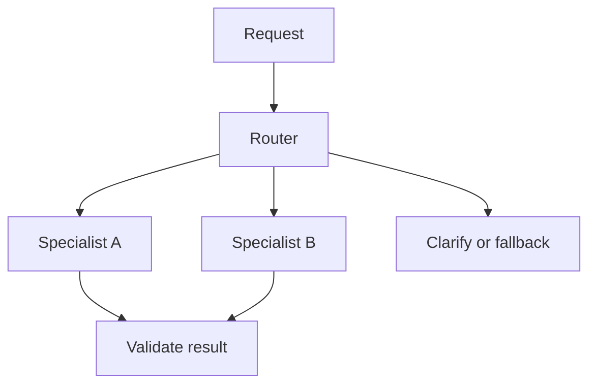
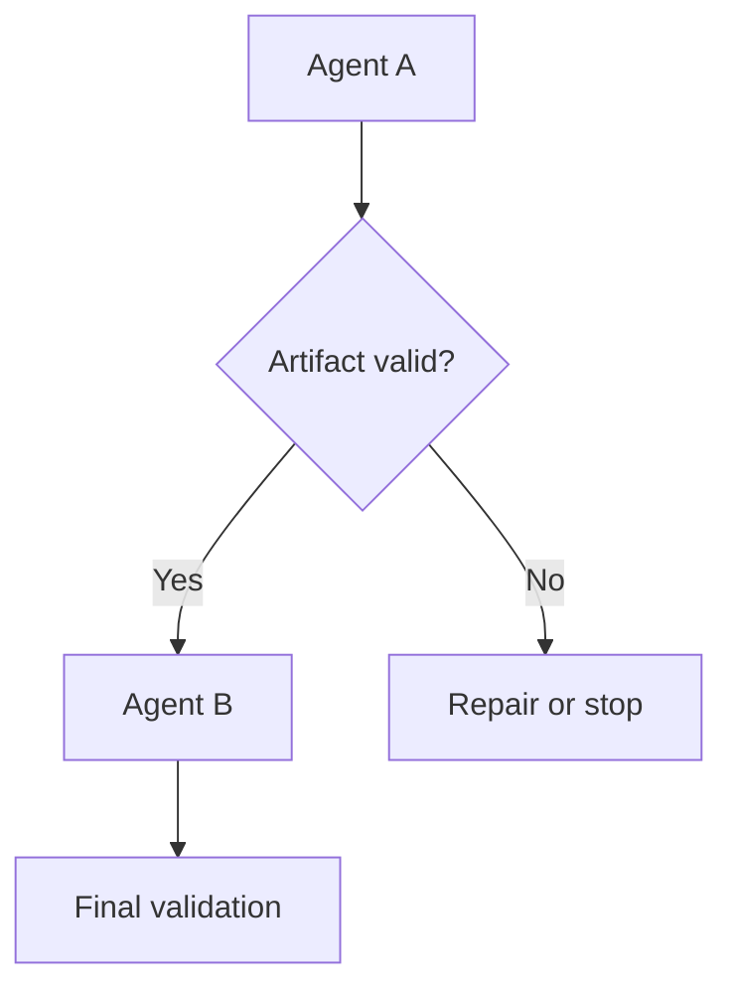
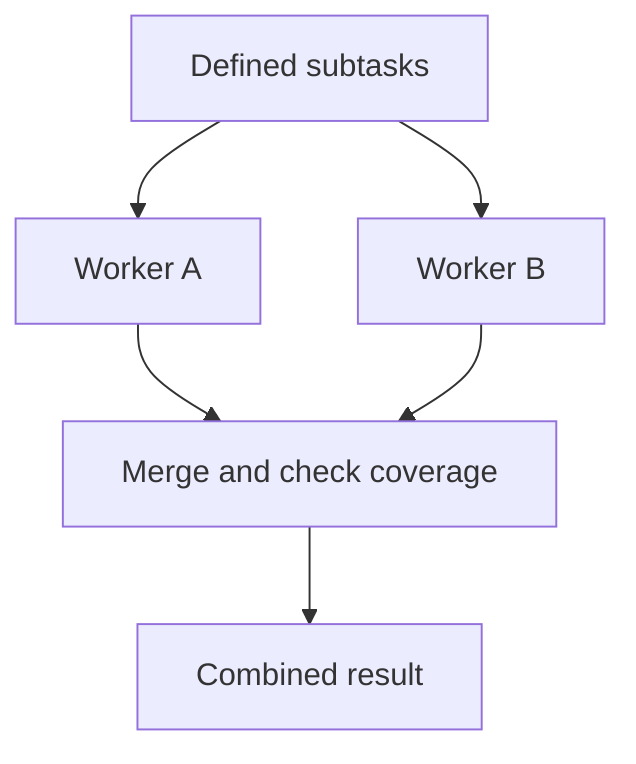
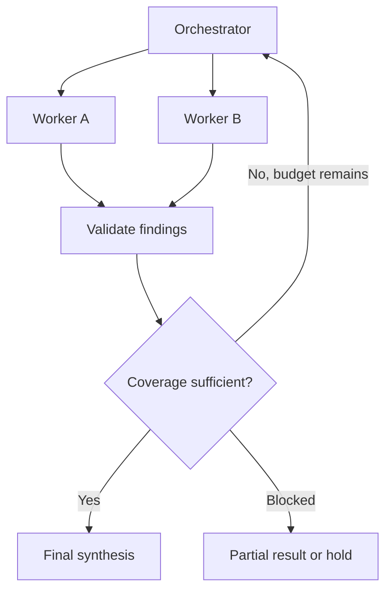
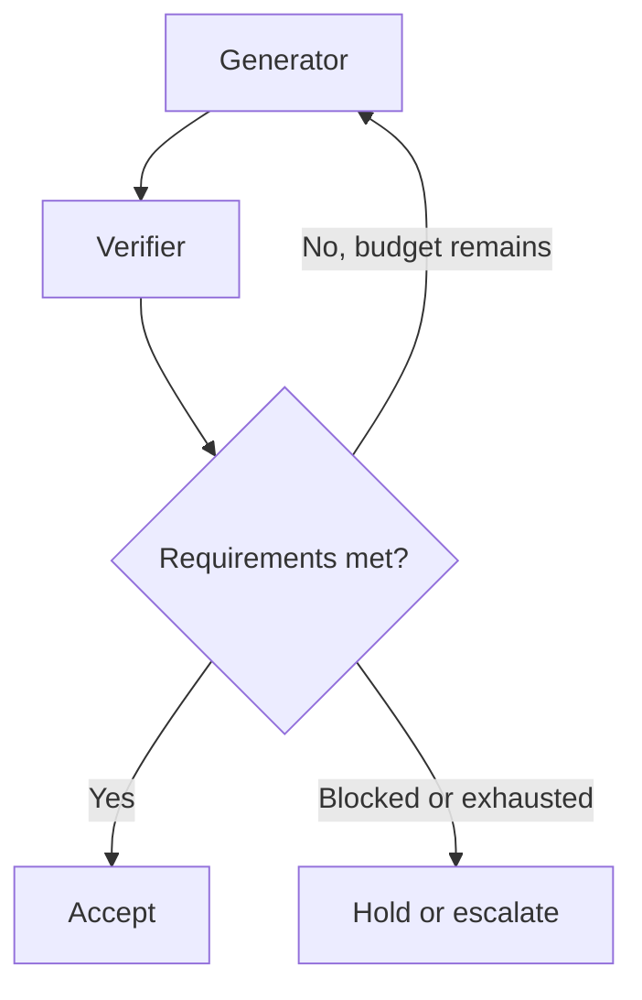
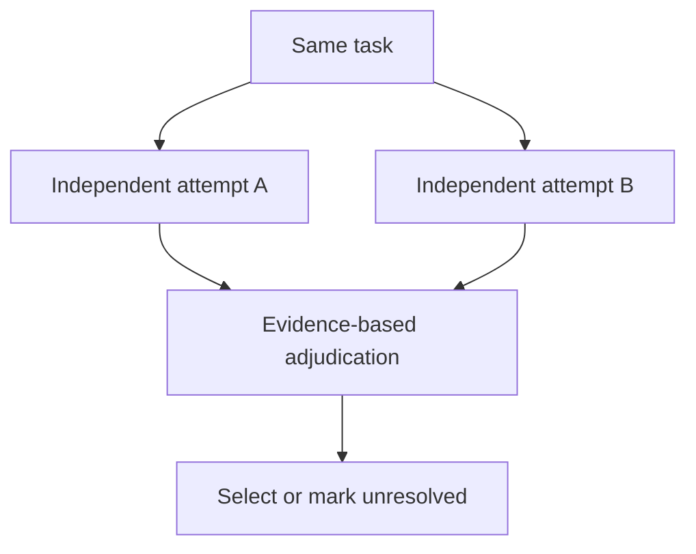
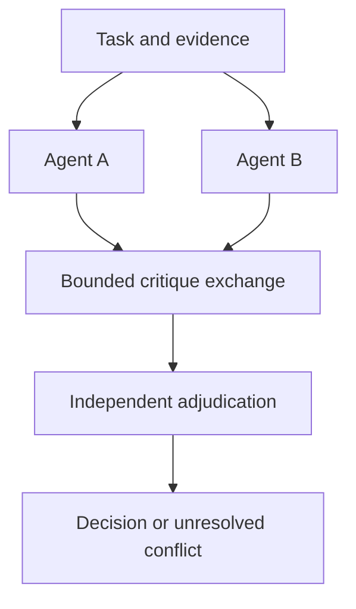

# Agent engineering: single agents, multi-agent systems, and production harnesses

Building an agent that completes a convincing demo is a useful first step. The harder work begins when it must handle incomplete information, tool failures, changing requirements, and a restart halfway through an action. Multiple agents add another question: did dividing the work improve the outcome, or just create more communication?

Good agent design starts with the work. Decide what must be accomplished, what evidence establishes success, and which decisions genuinely require exploration. Then choose the smallest architecture that can meet those requirements. A capable model helps, but the surrounding software determines what it can access, how it acts, and whether its progress survives interruptions.

This guide covers principles, a practical design process, coordination patterns, and production failures you can reproduce in tests.

## Contents

1. Components and responsibilities
2. Eight design principles
3. Design from the task
4. Seven coordination patterns
5. Build the harness
6. Production failures and recovery tests
7. Evaluate and release
8. Frequently asked questions
9. Further reading

## 1. Components and responsibilities

| Component | Responsibility |
|---|---|
| Agent | Chooses actions using a goal, available context, and tool feedback |
| Tool | Reads information, performs computation, or changes external state |
| Harness | Constructs context, runs the loop, executes tools, manages state, enforces limits, and handles recovery |
| Orchestrator | Assigns work, manages dependencies, gathers results, and advances execution; can be code or an LLM |
| Workflow | Defines stages, transitions, gates, and terminal outcomes |
| Multi-agent system | Coordinates multiple agents with separate responsibilities or execution contexts |

A model call is not automatically an agent. A fixed sequence of model calls can remain a conventional workflow. Likewise, parallel API requests do not require separate autonomous workers.

## 2. Eight design principles

### 2.1 Use the minimum autonomy required

Use code for known rules, model calls for bounded interpretation, and agent loops for tasks whose next steps depend on discoveries. Add multiple agents when independent work or distinct context boundaries justify them. smolagents recommends reducing unnecessary agency; Anthropic recommends simple, composable designs. [1,2]

**Design check:** Identify the decision that cannot reasonably be predetermined. If every transition is already known, start with a workflow.

### 2.2 Define responsibilities through contracts

Specify inputs, owned scope, excluded scope, permitted actions, expected artifacts, and completion conditions. A title such as “senior researcher” does not define a boundary.

**Design check:** Can a worker finish its assignment without guessing what another worker owns? Can the coordinator detect missing coverage?

### 2.3 Treat tools as interfaces the model must learn

Document purpose, parameters, units, return values, side effects, and recoverable errors. Keep overlapping tools distinguishable. Provide only the capabilities needed for the task. smolagents emphasizes usable tool interfaces and placing tool instructions in tool descriptions. [1]

**Design check:** Could a developer unfamiliar with the tool use it correctly from its schema and description alone?

### 2.4 Give each decision the context it needs

Provide relevant evidence, constraints, current state, and unresolved questions. Preserve source identifiers and qualifiers when compressing. Store large artifacts separately and retrieve relevant portions. Google treats isolation, persistence, and compression as explicit context-design choices. [3]

**Design check:** Does the next agent receive evidence, or merely another agent's conclusion?

### 2.5 Define completion through observable outcomes

Check behavior, facts, artifacts, or external state. Do not accept “done” as a completion signal without verification. Use semantic review when direct checks cannot cover the requirement.

**Design check:** What observation would prove this result wrong? If none is defined, the acceptance criterion is too vague.

### 2.6 Bound the entire execution

Set deadlines, cost limits, retry policies, maximum delegation depth, and stopping conditions. Apply limits across descendants and concurrent work. Give the system explicit paths for blocked, partial, failed, and cancelled outcomes.

**Design check:** Can the system stop usefully when success becomes impossible?

### 2.7 Enforce authority and recovery outside the prompt

Validate identity, ownership, arguments, and permitted operations at execution time. Scope credentials and isolate executable code. Record external operations so retries can be reconciled.

**Design check:** Would an incorrect model decision still be blocked by the application? Would a lost response cause a duplicate action?

### 2.8 Make decisions inspectable and improvements measurable

Record versions, task ownership, tool outcomes, artifact references, state transitions, cost, and termination reasons. Mask sensitive data and restrict trace access. Compare architecture changes against a simpler baseline.

**Design check:** Can you distinguish wrong reasoning from missing context, tool failure, or orchestration failure without rerunning the original interaction?

## 3. Design from the task

### Step 1: Define the outcome

| Field | What to write |
|---|---|
| Deliverable | Answer, report, code change, or completed action |
| Acceptance | Required facts, tests, constraints, and external state |
| Available information | Documents, APIs, databases, repository, conversation |
| Authority | Read, propose, edit, execute, publish |
| Limits | Deadline, cost, tool calls, retries |
| Blocked behavior | Clarify, return partial findings, escalate, or stop |

For repository repair, “produce a patch” is weaker than “reproduce the defect, fix it, pass relevant regressions, and preserve the required interface.” The latter identifies the tools and evidence needed.

### Step 2: Classify operations before assigning agents

| Operation | Starting implementation |
|---|---|
| Known validation, calculation, or transition | Code |
| Bounded classification, extraction, or drafting | One model call |
| Investigation with unpredictable next steps | Agent with tools |
| Independent investigations | Parallel workers |
| External mutation | Authorized tool execution with recovery controls |

Do not turn every operation into a job title. Document generation may need drafting and verification calls, without autonomous planning, editing, and publishing agents.

### Step 3: Draw dependencies

For each proposed boundary, ask:

1. Can the parts run independently?
2. Do they need different context, tools, or permissions?
3. Can an artifact preserve everything the next stage needs?
4. Can the artifact be checked before use?

Keep tightly coupled investigation together when each decision depends on accumulated findings. Separate work at stable evidence boundaries: a verified requirements list, research dossier, patch, or calculation result.

### Step 4: Choose a starting architecture

| Task | Starting architecture | Keep deterministic | Add agents when… |
|---|---|---|---|
| Classification and extraction | Fixed pipeline with bounded model calls | Schema, normalization, persistence | Difficult inputs need adaptive inspection |
| Support | Router and bounded specialist loop | Identity, authorization, transaction checks | Domains need different context/tools |
| Code repair | Coding agent followed by independent verification | Tests, workspace isolation, change recording | Investigation branches or edits are independent |
| Comparative research | Parallel research and synthesis | Deduplication, storage, deadline handling | Unpredictable research branches emerge |
| Long-form writing | Requirements, drafting, verification | Section checks, export, reference checks | Sections have separable context and contracts |
| Data analysis | Analyst with computation tools | Queries, calculations, invariants | Independent hypotheses warrant separate investigations |
| Incident investigation | Lead investigator with bounded read-only workers | Access, change approval, execution limits | Logs and subsystems can be inspected independently |

### Step 5: Define agent and handoff contracts

Example application configuration; the runtime must implement these controls:

```yaml
agent: patch_reviewer
goal: Find verified defects introduced by the patch
inputs: [patch, relevant_files, acceptance_criteria, test_results]
allowed_actions: [read_files, run_isolated_tests]
prohibited_actions: [modify_production, merge_changes]
output:
  - finding
  - file_location
  - supporting_evidence
  - severity
  - unresolved_questions
stop_when:
  - required_checks_complete
  - budget_exhausted
  - essential_information_unavailable
```

Worker outputs should include `task_id`, artifact version, input versions, evidence references, unresolved issues, and terminal status. Separate `COMPLETE` from `PARTIAL`, `BLOCKED`, and `FAILED`.

### Step 6: Compare with a baseline

Compare the proposed design with one agent or a fixed workflow using the same cases and declared total budgets. Measure task success, critical failures, cost per success, latency, information lost at handoffs, and recovery behavior. Introduce one architectural change at a time where practical.

## 4. Seven coordination patterns

These are architectural choices, not universal performance rankings. Google evaluated 180 agent configurations and found that task properties strongly affected whether coordination helped. Its results do not imply that every sequential workflow fails or every parallel team succeeds. [4]

### 4.1 Router to specialist

Use when requests have distinguishable categories requiring different capabilities. The router can be rules, a classifier, or an LLM.



**Build:** Define categories, ambiguity handling, and fallback. **Watch:** Misrouting and missing tools. **Measure:** Confusion matrix and downstream success. Routing is an established engineering pattern in Anthropic's guide. [2]

### 4.2 Sequential pipeline

Use when stages are known and intermediate artifacts are sufficient for downstream decisions.



**Build:** Typed artifacts, evidence references, versions, and checks between stages. **Watch:** Lost conditions and assumptions. **Measure:** Handoff fidelity and end-to-end success.

Google documents sequential orchestration. Its separate scaling study found deterioration on tested sequential planning tasks; avoid fragmenting connected reasoning merely to create specialists. [3,4]

### 4.3 Parallel workers and merger

Use when subtasks can proceed independently.



**Build:** Separate output namespaces, explicit coverage, conflict handling, and a policy for missing workers. **Watch:** Duplicate work, races, and slow branches. **Measure:** Coverage, total cost, and latency including merge time.

Google's scaling research supports parallelization when tasks are decomposable, with substantial variation across tasks. [4]

### 4.4 Dynamic orchestrator and workers

Use when the required subtasks emerge during investigation.



**Build:** Root-owned budgets, bounded delegation, a task ledger, and evidence checks. **Watch:** Overdelegation and unsupported claims entering synthesis. **Measure:** Useful completed work versus coordination overhead.

Anthropic documents this pattern in its production research system. [5]

### 4.5 Generator, verifier, revision

Use when explicit feedback can improve an artifact.



**Build:** Independent criteria, specific defects, executable checks where available, and a revision limit. **Watch:** Shared assumptions and endless polishing. **Measure:** Corrected errors, newly introduced errors, and false rejection.

Anthropic's evaluator–optimizer guidance makes clear criteria and useful feedback prerequisites. [2]

### 4.6 Independent candidates and adjudication

Use when alternative attempts at the same task are worth the extra cost.



**Build:** Keep initial attempts independent and compare against tests or evidence. **Watch:** Correlated errors disguised as agreement. **Measure:** Improvement over a single attempt at equal total budget. Parallel voting is documented by Anthropic. [2]

### 4.7 Bounded peer debate

Use when explicit disagreement can expose errors beyond independent attempts.



**Build:** Evidence-linked objections, limited rounds, and an unresolved outcome. **Watch:** Persuasion replacing evidence and correct answers being revised into wrong ones. **Measure:** Net error correction and cost versus independent attempts.

Multi-agent debate research reports benchmark improvements, not a general guarantee that consensus establishes truth. [6]

## 5. Build the harness

### 5.1 Assign responsibilities to software components

| Component | Application responsibility |
|---|---|
| Context builder | Select authorized evidence, current constraints, and relevant artifacts |
| Tool gateway | Validate schema, identity, ownership, destination, and permitted operation |
| Scheduler | Enforce dependencies, concurrency, deadlines, and task ownership |
| Budget manager | Reserve and reconcile root-level cost across descendants |
| State/checkpoint store | Persist progress and resume compatible execution |
| Operation ledger | Record intended writes, outcomes, and uncertain effects |
| Artifact store | Preserve evidence and generated outputs with versions |
| Verifier | Apply acceptance criteria and request specific rework |
| Trace/report layer | Record outcomes and diagnostic evidence with privacy controls |

A framework may provide abstractions for several rows. Confirm their actual guarantees; application-level authorization, semantic acceptance, and downstream idempotency still need implementation.

### 5.2 Separate context, state, and memory

| Information | Placement |
|---|---|
| Immediate instructions and evidence | Model context |
| Large documents, patches, reports | Versioned artifacts |
| Ownership, deadlines, retries, status | Application state |
| External actions and uncertain outcomes | Operation ledger |
| Verified reusable preferences/facts | Governed memory with provenance and scope |

LangGraph distinguishes thread-scoped checkpoints from cross-thread stores. Neither by itself proves an external action happened exactly once. [8]

### 5.3 Use explicit terminal outcomes

A useful status model includes `RUNNING`, `WAITING`, `CANCEL_REQUESTED`, `COMPLETE`, `PARTIAL`, `BLOCKED`, `FAILED`, and `CANCELLED`. Define transitions in code. A completed worker is not proof that the overall task met its requirements.

Reserve budget for synthesis and reporting before launching workers. An exhausted research budget should still allow the system to explain what it found and what remains unknown.

## 6. Production failures and recovery tests

The cases below describe failure mechanisms and tests to build. Where an engineering team reports an observed failure, the relevant source is identified.

### 6.1 Delegation duplicates work and leaves gaps

**Symptom:** Several workers produce good reports, but an essential area is absent. Anthropic reports overlapping investigations from vague assignments. [5]

**Repair:** Define scope and exclusions, track required coverage, and deduplicate tasks before spawning them. A count of successful workers is not a coverage metric.

**Test:** Return overlapping findings from two workers and omit one required topic. The coordinator must identify both conditions.

### 6.2 Parallel results overwrite each other

**Symptom:** All workers succeed, but the final output contains only the last worker's findings. ADK documentation warns about shared-state concurrency. [9]

**Repair:** Write to per-worker namespaces and merge explicitly. Use conditional updates for shared records. Isolate overlapping repository edits and assign an integration owner.

**Test:** Randomize completion order and delay writes. Every accepted result must survive. Locks address races; conflicting conclusions still need a resolution policy.

### 6.3 An action succeeds but its response disappears

**Symptom:** A retry duplicates a refund, ticket, or notification.

**Repair:** Assign a stable operation ID before execution. Reuse it across retries; require downstream idempotency where available. Reconcile uncertain outcomes before reissuing writes. A local ledger alone cannot atomically guarantee exactly-once effects in an unrelated service.

**Test:** Crash after external commit but before the response or checkpoint is saved. On recovery, assert one logical effect. If the downstream service offers neither deduplication nor reconciliation, pause uncertain writes instead of claiming safe retries.

### 6.4 Cancellation leaves work in flight

**Symptom:** The UI says “cancelled,” but a dispatched action completes afterward. Google's runtime documents asynchronous cancellation and continuing in-flight work. [10]

**Repair:** Distinguish cancellation requested from cancellation completed. Stop new dispatch, propagate cancellation, and check immediately before writes where possible. Reconcile committed effects; cancellation is not rollback.

**Test:** Cancel before dispatch, during a blocking call, and after commit. The final report must describe what actually happened.

### 6.5 Compaction loses execution truth

**Symptom:** The next session reads “authentication implemented” and skips a failed migration or untested path. Anthropic reports incomplete handoffs and premature completion in long-running coding agents. [7]

**Repair:** Persist intended work, actual artifacts, execution results, verified outcomes, and remaining tasks separately. Restart from those records rather than narrative confidence.

**Test:** Clear conversation context and resume using persisted artifacts. The agent must identify unfinished work without repeating verified work unnecessarily.

### 6.6 Tool failures masquerade as missing evidence

**Symptom:** An empty result means either “nothing found” or “backend timed out,” so the agent gives a false no-data answer.

**Repair:** Distinguish successful-empty, permission-denied, partial, stale, and failed outcomes. Return pagination/truncation information and retry guidance.

```json
{
  "status": "error",
  "error_code": "UPSTREAM_TIMEOUT",
  "retryable": true,
  "results": null
}
```

**Test:** Inject each outcome. Check that permission failures do not trigger endless retries and timeouts are not treated as evidence of absence.

### 6.7 Every worker obeys its budget, but the request overspends

**Symptom:** Descendants and retries exceed the root request's cost or deadline. Anthropic reports excessive spawning and continued searching in early versions. [5]

**Repair:** Atomically reserve budget before launching work, account for descendants, cap depth/concurrency, and release unused reservations. Include tool charges and final synthesis.

**Test:** Trigger simultaneous nested delegation and retries. The whole tree must respect the root limit.

### 6.8 A deployment breaks a paused run

**Symptom:** A resumed task uses a renamed tool or incompatible state schema. Anthropic describes keeping deployment versions running concurrently to avoid disrupting active agents. [5]

**Repair:** Record workflow, prompt, tool-schema, state-schema, and model configuration versions. Resume under compatible behavior or run an explicit migration. Recheck current authority and time-sensitive approvals.

**Test:** Pause, deploy, resume, then test rollback with an active run. Preserve old checkpoints for diagnosis.

### 6.9 Repeated claims look like independent confirmation

**Symptom:** One worker guesses a fact; another repeats it; the coordinator treats agreement as verification.

**Repair:** Preserve claim origin, source version, evidence, and whether the claim was observed or inferred. Count evidence origins rather than repeating agents.

**Test:** Insert one plausible unsupported claim into a worker result. Verify that synthesis checks it or preserves uncertainty.

### 6.10 A slow worker blocks the entire request

**Symptom:** Most work is finished, but one optional branch determines total latency.

**Repair:** Mark required versus optional dependencies. Set deadlines, collect partial results, and identify missing coverage explicitly. Do not apply majority/quorum completion when every branch is necessary. Cancel obsolete work and ignore late results from superseded task versions.

**Test:** Delay an optional branch and then a required branch. The system should handle the two cases differently.

### 6.11 Handoffs expand authority accidentally

**Symptom:** A read-only worker asks a more privileged agent to perform an action the original requester could not authorize.

**Repair:** Bind execution to the original user/tenant and approved task scope. Validate authority at the tool boundary. Worker messages and retrieved text cannot grant permissions.

**Test:** Send a worker request containing an unauthorized destination or resource. The privileged tool must reject it even if the coordinator forwards it.

### 6.12 A reviewer approves an incomplete result

**Symptom:** The reviewer checks only claims present and misses a required section or exception.

**Repair:** Supply requirements independently of the candidate. Combine executable checks with semantic review. Separate factual correctness, completeness, and presentation quality.

**Test:** Remove one required item from an otherwise strong answer. The review must fail the missing requirement without demanding a specific phrasing.

## 7. Evaluate and release

MAST groups observed multi-agent failures into specification/system design, inter-agent misalignment, and verification/termination. Use these as coverage categories, not as a substitute for application-specific tests. [11]

| Dimension | Measure |
|---|---|
| Outcome | Attempts satisfying all mandatory requirements / attempted tasks |
| Critical errors | Attempts with predefined serious failures / attempted tasks |
| Efficiency | Total cost of all attempts / successful tasks |
| Latency | End-to-end distribution, with timeout treatment declared |
| Coordination | Duplicate work, missing coverage, invalid handoffs, unresolved conflicts |
| Recovery | Injected-failure cases recovered without prohibited or duplicate effects |
| Evaluation health | Missing grades, flaky fixtures, outdated labels |

Compare candidate architectures on paired cases, with declared tools, permissions, retries, and budgets. Keep judge settings stable. Report uncertainty and important task slices. An extra reviewer is valuable only if its error reduction justifies its cost and false rejections.

Before release, demonstrate a successful path, a blocked path, a budget-exhausted path, a cancellation, and a restart around an external action. Check both final outcomes and prohibited intermediate effects.

Use a compact design record:

```text
Outcome and acceptance checks:
Operations requiring adaptive decisions:
Operations implemented in code:
Dependencies and independent work:
Agent contracts and evidence artifacts:
Permissions and state ownership:
Budgets, termination, cancellation, and recovery:
Baseline, alternative, and measured results:
Known limitations and release scope:
```

## 8. Frequently asked questions

### Where should I start when an agent works in a demo but fails in production?

Find the first divergence from the expected outcome. Check whether the required information reached the model, the chosen tool received valid arguments, the tool actually succeeded, and the result survived the handoff. Repair that boundary before changing the entire prompt or adding agents. See section 6 for reproducible failure tests.

### What is the difference between an agent framework, a harness, and an orchestrator?

A framework supplies reusable building blocks. A harness is the running system around the model, including context, tools, limits, and recovery. An orchestrator controls dependencies and delegation. An application may use a framework to implement both its harness and orchestrator.


### Does a complex task need multiple agents?

No. Complexity can require many steps without independent work. Start with one agent when reasoning is tightly connected, then split only where context, permissions, or concurrency justify it.

### Are sequential agents a bad design?

No. Sequential stages work when each produces sufficient, checkable artifacts. Avoid splitting a continuous investigation into summaries that discard the basis for subsequent decisions.

### Should the orchestrator always be an LLM?

No. Use code for known dependencies and transitions. Use an LLM when discovering and revising the decomposition is itself part of the task.

### Does each agent need a different model?

No. Separate roles and contexts can use the same model. Different models may change cost or error correlation, but evaluate the resulting system rather than assuming diversity improves reliability.

### Should all agents see the entire conversation?

Usually not. Supply the requirements, evidence, constraints, and artifacts relevant to each task. Preserve enough provenance to inspect conclusions. Do not copy confidential context into workers that call external search services.

### Is agreement between agents proof?

No. Agents can share sources, assumptions, and model biases. Verify against evidence, executable behavior, or authoritative records.

### Can a critic make the generator reliable?

Only to the extent that the critic's checks are valid and sufficiently independent. Measure errors caught and errors introduced; cap revision loops.

### Do checkpoints prevent duplicate external actions?

No. Checkpoints preserve execution state. External effects require stable operation identities, downstream deduplication where available, and reconciliation of uncertain outcomes.

### Can the system return before every worker finishes?

Yes, when unfinished work is optional and the result clearly identifies missing coverage. Required dependencies must complete or produce a blocked/partial outcome according to the task contract.

### What does the framework not decide for me?

Your acceptance criteria, scope of authority, source reliability, state ownership, budget policy, and acceptable recovery behavior. Confirm how its primitives support those requirements.

### How do I decide whether a step needs an agent or one model call?

Use one model call when the input is sufficient and the required output is bounded. Use an agent when observations must determine the next action. A known sequence of extraction, validation, and storage can stay a fixed workflow even if extraction uses an LLM.

### Why do agents repeat the same search or tool call?

The previous result may be missing from context, errors may be ambiguous, or the loop may lack a progress condition. Track normalized calls together with relevant state versions. Stop or change strategy when repeated calls produce no new evidence; allow repetition when the underlying state changed or a transient failure justifies a retry.

### How should two agents update the same file or record?

Prefer separate outputs and one integration owner. If shared writes are required, use version checks or transactions and resolve conflicts explicitly. A lock prevents simultaneous access but does not determine which competing edit is correct.

### What must an agent handoff include?

Include the task ID, input versions, output artifact, evidence references, constraints, unresolved questions, and completion status. Transfer enough evidence for the next stage to check the conclusion. Avoid forwarding only a persuasive summary.

### Should a timeout trigger an automatic retry?

Only after considering the operation. A bounded read retry may be appropriate. A timed-out write may already have succeeded: reuse its operation ID and reconcile the external state before repeating it. A changed payload is a new decision, not necessarily the same retry.

### What should happen when the user cancels a running task?

Stop new dispatch, propagate cancellation, and report in-flight actions separately. Wait for or reconcile uncertain effects before claiming execution stopped. If an action already committed, use an explicitly authorized compensation process where available; cancellation alone does not undo it.

### How can I control cost when agents spawn other agents?

Give the root request one budget and atomically reserve portions for descendants, retries, tools, and final synthesis. Cap concurrency and delegation depth. Per-worker limits alone do not cap the cost of the whole task tree.

### Can a paused agent resume after a deployment?

Only under compatible workflow, tool, and state schemas or an explicit migration. Record versions and test resume across releases. Revalidate permissions and expiring approvals instead of treating an old checkpoint as current authorization.

### How do I stop a writer–critic loop from endlessly revising?

Give the critic explicit requirements and require each rejection to identify an unmet criterion. Cap iterations and detect repeated feedback without improvement. Return a blocked or partial result when constraints cannot be satisfied; do not let style preferences drive unlimited revisions.

### What should I log to investigate failures?

Record task and parent IDs, versions, tool outcomes, artifact references, state transitions, retries, cost, latency, and termination reasons. Keep evidence needed for diagnosis with access controls and retention limits. Do not collect secrets or unrestricted conversation content merely because tracing is enabled.

### How do I know whether more agents improved the system?

Compare against one agent or a fixed workflow on paired tasks with comparable total budgets. Measure success, critical errors, cost per successful task, latency, and handoff failures. Extra output, more tool calls, or agent agreement are not improvement metrics by themselves.

### Does structured output make an agent reliable?

It makes output easier to validate and process. Valid JSON can still contain wrong facts, missing requirements, or an unauthorized action. Validate schema, meaning, and execution effects separately.

## 9. Further reading

1. [smolagents: Building good agents](https://github.com/huggingface/smolagents/blob/main/docs/source/en/tutorials/building_good_agents.md) and [Introduction to agents](https://github.com/huggingface/smolagents/blob/main/docs/source/en/conceptual_guides/intro_agents.md).
2. [Anthropic: Building effective agents](https://www.anthropic.com/engineering/building-effective-agents).
3. [Google Cloud: Choose a design pattern for your agentic AI system](https://docs.cloud.google.com/architecture/choose-design-pattern-agentic-ai-system).
4. [Google Research: Towards a science of scaling agent systems](https://research.google/blog/towards-a-science-of-scaling-agent-systems-when-and-why-agent-systems-work/) — January 2026; [research paper](https://arxiv.org/abs/2512.08296).
5. [Anthropic: How we built our multi-agent research system](https://www.anthropic.com/engineering/multi-agent-research-system) — June 2025.
6. [Multi-agent debate research and implementation](https://github.com/composable-models/llm_multiagent_debate) — ICML 2024.
7. [Anthropic: Effective harnesses for long-running agents](https://www.anthropic.com/engineering/effective-harnesses-for-long-running-agents) — November 2025.
8. [LangGraph: Persistence](https://docs.langchain.com/oss/python/langgraph/persistence).
9. [Google ADK: Parallel agents](https://github.com/google/adk-docs/blob/main/docs/agents/workflow-agents/parallel-agents.md).
10. [Google Cloud: Use an ADK agent, including cancellation behavior](https://docs.cloud.google.com/gemini-enterprise-agent-platform/scale/runtime/use-an-adk-agent).
11. [Why Do Multi-Agent LLM Systems Fail?](https://arxiv.org/abs/2503.13657) — MAST, 2025.
