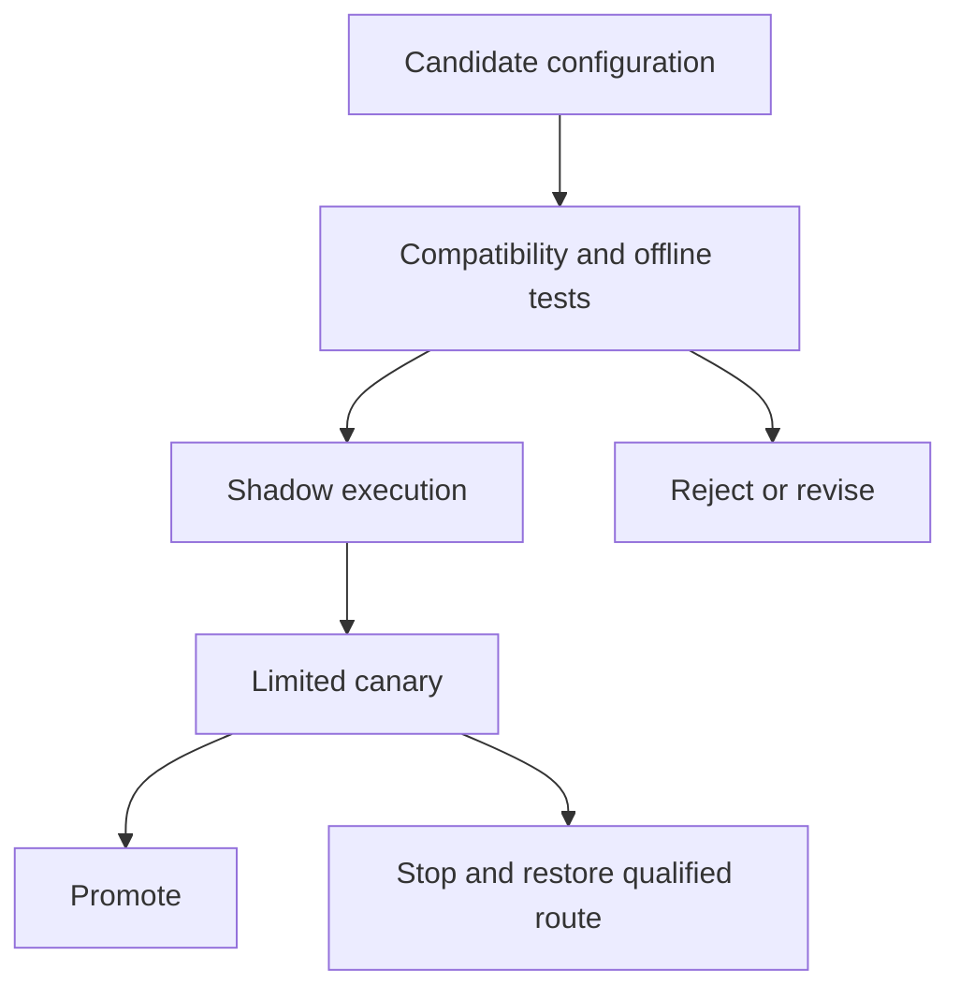

# AI Operations: Deployment, Serving, and Maintenance

## Scope

This guide covers day-to-day operations for applications using model APIs or managed inference endpoints: serving, routing, releases, recovery, RAG updates, and model or evaluator changes.

**Training, fine-tuning, and low-level inference optimization—such as GPU scheduling and KV-cache tuning—are outside scope.** Basic token limits, latency, quotas, and costs are covered.

## 1. Keep the application reliable every day

Running an AI application means looking after more than the model. On an ordinary day, you might investigate slow answers, refresh a document index, check an unexpected cost increase, or help a customer whose agent stopped halfway through a task. You also need to decide whether a new model is worth adopting and whether yesterday's configuration still works well today.

AI Operations brings these responsibilities into a repeatable routine. It helps you decide what to check, which changes can wait, when to intervene, and how to restore service without losing work or repeating an action. A small team can begin with clear ownership, a few task-specific checks, bounded execution, and a tested fallback.

The aim is to make daily work manageable: catch meaningful changes early, release improvements with evidence, and give failures a clear recovery path. You do not need to adopt every new model or add infrastructure before there is a concrete need.

The [observability guide](https://github.com/FinanceFlash/unvibecode/blob/main/skills/unvibecode-ai-observability/AI_OBSERVABILITY_IMPLEMENTATION_GUIDE.md) explains how to detect and investigate problems. This guide explains the operating decisions that follow: deploy, defer, switch, recover, and maintain.

## 2. Establish ownership and operating contracts

| Area | Define before production |
| --- | --- |
| Task | Acceptance criteria, completion evidence, allowed degradation |
| Serving | Deadlines, concurrency, queue capacity, cancellation behavior |
| Providers | Approved routes, quotas, credentials, data-handling constraints |
| Changes | Release owner, evaluation gates, canary and rollback procedure |
| External actions | Authorization, operation identity, idempotency or reconciliation |
| Data | Source freshness, index versions, deletion and refresh ownership |
| Incidents | Escalation owner, emergency controls, recovery verification |

A small team may assign several responsibilities to one person. The important requirement is that each decision has an owner and an executable procedure.

Define service objectives per task. Interactive chat and an overnight research job should not share the same deadline. Measure cost per completed task as well as per call; retries and checks can reverse an apparent model-price saving.

## 3. Deploy a qualified configuration

Treat the deployment unit as a combination of task, model, provider route, prompt, generation settings, tool contract, and guardrail policy. Record evidence for that combination instead of saying only “Model X passed.”

Maintain a small registry:

| Field | Purpose |
| --- | --- |
| Configuration ID | Stable reference for release and rollback |
| Task eligibility | Task types, languages, context sizes, allowed actions |
| Model/provider policy | Explicit model ID and approved backend routes |
| Prompt/settings versions | Instructions, output limits, supported controls |
| Tool and output schemas | Compatibility requirements |
| Data constraints | Retention, geography, credentials, authorization boundaries |
| Qualified fallback | Tested alternative and available capacity |
| Qualification record | Dataset, evaluator, results, date, owner |
| Lifecycle | Candidate, qualified, active, restricted, retired |

Pin explicit versions where available. Record when a provider exposes only an alias. Version pinning reduces uncertainty; it does not guarantee identical outputs or unchanging service behavior.

Keep secrets outside configuration files. Separate development, staging, and production credentials, quotas, and external destinations. Staging must not send real customer notifications or modify production business records.

## 4. Serve requests within explicit limits

### Admission and queueing

Authenticate requests, check tenant quotas, validate input size, and determine whether the task can complete within its budget. Use bounded concurrency and bounded queues. Return a clear busy response or durable job ID when work cannot begin promptly.

Separate interactive traffic from long research jobs and background evaluations. One expensive task should not occupy all available workers. Account for request quotas and token throughput where providers enforce both.

### Deadlines and retries

Give each task an overall deadline. Each model or tool attempt receives only part of the remaining budget. Avoid retry layers multiplying attempts across the SDK, gateway, and worker.

Retry transient failures with bounded backoff and jitter, respecting provider retry guidance. Do not repeatedly retry invalid schemas, oversized context, or authorization failures. A timeout during an external write requires reconciliation, not an automatic repeat.

### Streaming and cancellation

Distinguish stopping display, stopping generation, and cancelling external work. Persist job status when work may continue after disconnection. If a stream fails after partial text is emitted, record that state; do not silently append a different model's answer as if it were one uninterrupted response.

### Caching

Distinguish provider prompt-prefix caching from application answer caching. Answer-cache keys need the relevant task inputs, scope, source versions, and configuration version. Recheck access when serving cached content. Invalidate entries after applicable policy or source changes. Avoid caching authorization decisions or volatile transaction status as ordinary answers.

## 5. Operate routing and fallbacks safely

There are two separate fallback layers: changing the provider serving a model and changing the model itself. Both can affect latency, features, cost, and data handling.

OpenRouter documents provider selection and ordered model fallback [1, 2]. Its model fallbacks can be triggered by errors including rate limits, context errors, and moderation refusals. Define application policy before relying on those defaults. A safety block must not become a reason to bypass the application's safety requirements through another route.

| Situation | Response |
| --- | --- |
| Transient service failure | Retry within the task budget or use a qualified alternative |
| Capacity exhaustion | Shed load, queue eligible work, or use reserved fallback capacity |
| Unsupported parameter or schema | Correct configuration; do not silently drop required behavior |
| Quality regression | Restrict the affected task route and investigate |
| No acceptable fallback | Defer, provide a limited result, or escalate according to the task contract |

A fallback must satisfy tool support, schema, context capacity, permissions, and quality requirements. Availability alone is insufficient. Model-provider choices may also share an upstream dependency; two names do not necessarily provide independent resilience.

Use a circuit breaker for sustained provider failures and controlled probes before restoring traffic. Quality-driven route changes need minimum evidence and stable thresholds to avoid oscillating between models because of noisy scores.

## 6. Handle a changing model and tool ecosystem

### Classify the change

| Change | Example | Process |
| --- | --- | --- |
| New opportunity | A new model or routing technique | Candidate evaluation |
| Unexpected regression | Existing configuration fails more often | Incident diagnosis and containment |
| Forced migration | Model or API retirement | Scheduled replacement with deadline |
| Measurement change | New judge or rubric | Separate evaluator qualification |
| Integration change | SDK or tool-schema update | Contract and recovery testing |

Monitor provider notices and assign a migration owner. Provider-recommended replacements are starting candidates, not evidence of compatibility with your tasks. Anthropic publishes lifecycle states and retirement information [3]; use the corresponding official source for each dependency.

### Run stable probes and current-workload tests

Keep a fixed set of known cases and a separate refreshed production sample. Run both through the actual intended route, with controlled inputs and versioned scoring. Cover structured outputs, tool arguments, abstention, important languages, and long-context tasks.

| Observation | First investigation |
| --- | --- |
| Fixed probes and production deteriorate | Model/provider route, prompt, settings, evaluator, dependencies |
| Probes stable; production deteriorates | Traffic mix, new task types, changing sources |
| One provider route deteriorates | Route-specific service and compatibility |
| Judge scores change; exact outcomes stable | Evaluator calibration |
| Only long inputs fail | Truncation, context limits, timeouts, configuration |

These patterns guide investigation; they do not establish cause. Match task groups and inspect sample sizes. Repeat stochastic cases where variation matters. Keep critical deterministic failures separate from average quality scores.

### Introduce new evaluators independently

A tool such as Jev changes the measurement system, not merely its cost. Langfuse describes Jev as a decision model for narrow typed questions, with choice, score, and yes/no outputs [4].

Evaluate it against human-reviewed labels on the same frozen application outputs used by the existing evaluator. Compare false positives, false negatives, disagreements, cost, and latency. Start in shadow mode without release or blocking authority. Promote it only for validated criteria, and re-establish thresholds when the score meaning changes.

Check adapter contracts: Langfuse documents that Jev's yes/no result does not expose the same separate confidence field as its other output types [4]. Do not assume a uniform result schema. Treat probability calibration as something to measure rather than assuming a reported number is accurate confidence.

Avoid changing the answer model and evaluator together. Keep a bridge comparison so improvements cannot be explained solely by easier grading.

### Bound exploration work

Review promising candidates on a schedule and cap evaluation spend. Prioritize a candidate when it addresses a measured quality, latency, cost, capacity, or lifecycle problem. A new benchmark result alone does not require changing production.

## 7. Release changes through explicit gates

| Gate | Required evidence |
| --- | --- |
| Compatibility | Tools, schemas, limits, data policy, and error handling work |
| Task quality | Acceptance criteria hold across important task groups |
| Operations | Load, cancellation, timeout, and recovery behavior are acceptable |
| Economics | Total task cost meets budget, including retries and checks |
| Canary | Real-traffic outcomes remain acceptable with sufficient coverage |
| Rollback | Previous compatible configuration and capacity are available |

Shadow runs must isolate writes and comply with the same data-sharing restrictions as production. Use stable task or session assignment for canaries where changing behavior mid-workflow would invalidate comparison. Keep a control group when feasible and define stop conditions before starting.

Record the application, prompt/model configuration, dataset, evaluator, and routing versions. Langfuse's experiment comparison guidance supports version metadata [5]. Do not choose a canary percentage or duration solely by convention; required exposure depends on risk, traffic, and failure frequency.

Retain the previous configuration during the observation period. A routing switch cannot undo an already-sent email or restore an incompatible database migration.

## 8. Operate RAG, memory, and long-running agents

### RAG updates

Build new indexes beside the active one. Validate parsing, retrieval, source freshness, access filters, and deletion handling before switching a versioned pointer. Keep queries and documents on compatible embedding configurations. A new embedding model or chunking strategy can require a full rebuild and retrieval requalification.

Budget backfills separately from interactive requests. Preserve a rollback path and account for source changes that occur while a rebuild is running. Do not declare the new index current merely because the batch finished.

### Workflow and memory changes

Version checkpoints, tool contracts, and memory policies. Decide whether existing runs finish on the old version, migrate, or stop with a recovery procedure. Drain workers deliberately instead of terminating them during external writes.

Use operation IDs and external receipts for side effects. LangGraph documents that interrupt resumption reruns the containing node, which can repeat earlier side effects [6]. A checkpoint is not an exactly-once execution guarantee.

Revalidate credentials, artifacts, approvals, and source freshness on resume. Bind approval to the specific action and artifact version. Memory updates and background jobs must not restore superseded or deleted information.

## 9. Production failures and operating responses

| Failure | Why the obvious response fails | Operating response and test |
| --- | --- | --- |
| Cheap model degrades on long documents | Replacing it globally changes healthy tasks | Restrict that task segment; compare controlled cases and requalify |
| Fallback quota is exhausted | A configured backup is not reserved capacity | Load-test fallback, define shedding, and cap admitted work |
| Multiple retry layers amplify an outage | Every layer assumes another attempt is inexpensive | Enforce total deadline/attempt budget; simulate provider outage |
| Gateway silently changes providers | Model name alone hides route differences | Constrain required routes and inspect served-route metadata where available |
| Check service fails | Silent allow may violate the task policy | Predetermine fallback per check; test timeout, error, and unavailable states |
| Tool action commits before timeout | Retrying duplicates the business action | Reconcile by operation ID before repeating |
| User cancels while workers continue | UI cancellation does not stop remote execution | Propagate cancellation, track remaining work, reconcile side effects |
| Answer cache serves another project's facts | Query text is an insufficient key | Include scope and recheck permissions; test tenant isolation |
| New embedding index returns poor matches | Embedding compatibility and retrieval behavior changed | Build and qualify a separate index before switching |
| New evaluator reports improvement | The scoring standard changed | Compare evaluators on frozen reviewed cases before promotion |
| Rollback breaks pending workflows | Old code cannot read new state | Test compatibility and migration with paused runs |
| New provider violates data requirements | Emergency fallback expands the allowed data boundary | Restrict alternatives in advance; defer if none is permitted |

Keep emergency controls scoped: disable a tool, route, source, model configuration, or background job without shutting down healthy work unnecessarily. Exercise those controls before an incident.

## 10. Recover from an incident

1. Identify affected tasks, routes, versions, and external actions.
2. Contain the behavior through a scoped switch, load shedding, or temporary deferral.
3. Preserve necessary evidence under the retention policy.
4. Reconcile uncertain external outcomes before replaying work.
5. Restore a qualified compatible configuration or apply a verified repair.
6. Reopen traffic gradually and verify task outcomes, quality, cost, and backlog recovery.
7. Assign follow-up work with an owner and acceptance test.

Separate queued work that is still useful from expired requests. Recovery traffic must not overload the restored provider. Use bounded replay, stable operation identity, and a deadline for abandoning work that can no longer meet its purpose.

### What becomes a regression test?

Convert a confirmed failure into a test when the expected behavior and triggering conditions can be stated. Preserve sanitized input, relevant versions, and a measurable outcome. A duplicate action needs a crash-and-recovery test; route incompatibility needs a contract test; degraded long-document answering needs task-specific quality cases. Add nearby benign cases when a safety repair could overblock. If the original failure cannot be reproduced, distinguish representative tests from reproduction and retain monitoring for recurrence.

## 11. Worked example: a small model starts underperforming

A support application uses a low-cost configuration for policy answers and a stronger qualified configuration for complex cases. Long-policy answers begin failing while short answers remain stable.

**Detect:** Fixed long-context probes regress through one route. Current production samples show the same pattern. The evaluator version has not changed.

**Investigate:** Check source versions, truncation, provider selection, generation settings, and recent integration changes. Do not attribute the failure to model weights without evidence.

**Contain:** Disable that configuration for long-policy tasks. Use the qualified alternative within its capacity; queue or defer excess work under the task contract. Preserve short-task routing if it remains healthy.

**Compare:** Evaluate the old configuration, the fallback, and a new candidate on matched cases using unchanged grading. Record task quality, total cost, and latency. A newly available judge runs separately on frozen outputs.

**Release:** If the candidate passes, shadow it without customer-visible actions, then canary eligible tasks. Stop if critical checks fail or task-specific quality falls beyond the predeclared limits.

**Maintain:** Update eligibility and qualification records. Keep the regression cases, review fallback capacity, and retire the degraded configuration only when the evidence and migration plan justify it.

## 12. Start with a manageable operating routine

| Trigger | Action |
| --- | --- |
| Every release | Contract tests, regression gates, compatibility and rollback checks |
| Scheduled production probes | Verify critical behavior through active routes |
| Regular operational review | Inspect task failures, quotas, costs, backlogs, and evidence gaps |
| Provider lifecycle notice | Assign migration owner and qualification deadline |
| Candidate review | Evaluate changes addressing a concrete need within a budget |
| Periodic recovery exercise | Fail a dependency, pause a worker, and verify restoration |

Choose frequency according to exposure and traffic. A small team needs a maintained registry, tested fallback, bounded execution, and working recovery controls more than a large collection of dashboards.

## 13. Frequently asked questions

**Does a newer model automatically replace the old one?** No. Qualify the complete configuration against your task requirements before promotion.

**Can version pinning prevent all changes?** No. It helps identify intended versions, but service behavior, routing, external data, and nondeterministic generation still require monitoring.

**Should the router automatically chase the highest score?** Not without task eligibility, stable measurements, capacity checks, and controlled promotion. Otherwise noise can produce unstable routing.

**Can we fall back after any refusal?** Apply the application's safety and authorization policy consistently. Do not use fallback to evade a required restriction.

**What if no acceptable model is available?** Use the predefined degraded mode: defer, narrow the task, or request human handling. Do not silently substitute an unqualified configuration.

**Is a cheaper evaluator always worth adopting?** Only if its error profile, coverage, integration, and operating cost meet the criterion's requirements. Validate it independently of the model being judged.

**What is included for inference?** Endpoint availability, token budgets, quotas, latency, output limits, routing, caching policy, and task-level cost. GPU and KV-cache optimization are outside scope.

**Does this guide cover training?** No. Dataset preparation, training algorithms, fine-tuning jobs, and training infrastructure require a separate guide.

**Can rollback reverse external actions?** No. Already-committed actions need reconciliation or explicit compensating operations where supported and authorized.

**What should be automated first?** Configuration validation, task regression tests, dependency probes, budget limits, and reversible route switches. Keep consequential external actions under explicit runtime controls.

## References

1. OpenRouter. [Provider routing](https://openrouter.ai/docs/guides/routing/provider-selection).
2. OpenRouter. [Model fallbacks](https://openrouter.ai/docs/guides/routing/model-fallbacks).
3. Anthropic. [Model deprecations](https://platform.claude.com/docs/en/about-claude/model-deprecations).
4. Langfuse. [Jev-as-a-judge in Langfuse Evaluators](https://langfuse.com/blog/2026-09-22-running-evals-with-jev). September 22, 2026.
5. Langfuse. [Compare experiments](https://langfuse.com/docs/evaluation/experiments/compare-experiments).
6. LangGraph. [Interrupts](https://docs.langchain.com/oss/python/langgraph/interrupts).
7. UnvibeCode. [AI Observability in Production](https://github.com/FinanceFlash/unvibecode/blob/main/skills/unvibecode-ai-observability/AI_OBSERVABILITY_IMPLEMENTATION_GUIDE.md).
8. UnvibeCode. [Context, Memory, and State Engineering](https://github.com/FinanceFlash/unvibecode/blob/main/skills/unvibecode-context-memory-state/CONTEXT_MEMORY_STATE_ENGINEERING_GUIDE.md).
